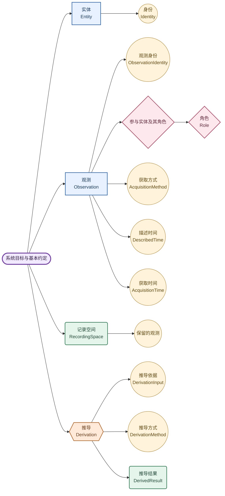

# 系统设计地图（For Human）

本文只能由**人类**撰写，Agent 请勿修改。

本文从系统目标出发建立上层信息模型。

**定义**说明术语含义。**约定**说明模型采用的原则。**推论**说明依据目标和约定得出的结论。

## 系统目标（SystemGoal）

**忠实保留观测及其必要上下文，为未来提出的问题提供依据。**

“忠实”要求保留取得的信息及其已知局限。

“必要上下文”指理解观测含义及其局限所需的信息。这些信息一并保留在观测中。

未来的问题不预先固定。

## 基础概念

本模型采用两个基础概念：[实体（Entity）](human/entities/README.md)与[观测（Observation）](human/observations/README.md)。

## 基本约定

1. **参与约定**：观测涉及实体。一份观测可以涉及多个实体，同一个实体可以参与多份观测。
2. **身份约定**：实体身份用于区分实体。观测身份用于区分观测。名称相同不足以证明是同一个实体。内容相同不足以证明是同一份观测。
3. **证据约定**：实体指认和关系依据已有观测建立。如果依据不足，保留未知。同一性判断可以随新证据修正。
4. **保留约定**：保留观测中的信息及理解这些信息所需的已知说明。推导结果应能追溯到所用观测及每一步推导方式。推导结果可以重新推导。原观测中的信息保持不变。

## 阅读树（显示主要属性）

树的层级表示阅读深度。跨分支链接表达概念之间的关联。同一个概念的正文保留在一个位置。

每个节点文档说明该概念的含义、属性及必要约定。属性先写在所属节点中。属性内容较多，并需要解释自身细节时，再拆为下一级节点。父节点保留属性说明及链接。

信息表达示例与操作约定分别说明。示例用于解释概念，操作约定说明怎样处理该节点。

| 节点 | 属性或说明 |
| --- | --- |
| [实体](human/entities/README.md) | 身份 |
| [观测](human/observations/README.md) | 观测身份、参与实体及其角色、获取方式与时间 |
| [记录空间](human/recording-space.md) | 保留哪些观测，以及怎样选择其中一部分 |
| [推导](human/derivation/README.md) | 推导依据、推导方式与推导结果 |
| [实体发现](human/derivation/entity-discovery.md) | 根据观测建立实体指认 |
| [程序模型](human/program/README.md) | `IEntity`、`EntityId`、`ITimed` 与当前观测程序草案 |

## 上层英文命名

英文名称与节点的中文定义对应。概念名称保留表中的拼写。文件路径使用小写单词及连字符。更深层的英文名称在所属节点首次出现时定义。

| 中文 | 英文 | 含义 |
| --- | --- | --- |
| 系统目标 | SystemGoal | 整体目标 |
| 实体 | Entity | 可以被指认的事物 |
| 观测 | Observation | 取得的一份信息 |
| 身份 | Identity | 区分并认出同一事物 |
| 实体身份 | EntityIdentity | 实体的身份 |
| 观测身份 | ObservationIdentity | 一份观测的身份 |
| 角色 | Role | 实体在观测或观测所描述关系中的作用 |
| 实体间关系 | EntityRelationship | 观测表达的实体之间的关系 |
| 获取方式 | AcquisitionMethod | 信息怎样得到 |
| 描述时间 | DescribedTime | 信息描述的时刻或区间 |
| 获取时间 | AcquisitionTime | 来源取得信息的时间 |
| 记录空间 | RecordingSpace | 共同保留的一组观测构成的整体 |
| 推导 | Derivation | 根据观测或已有推导结果形成新信息 |
| 推导依据 | DerivationInput | 某次推导实际采用的信息 |
| 推导方式 | DerivationMethod | 从依据形成结果所采用的规则或步骤 |
| 推导结果 | DerivedResult | 推导形成的结果 |
| 实体发现 | EntityDiscovery | 建立实体指认的过程 |
| 实体指认 | EntityIdentification | 实体发现形成的判断结果 |
| 实体汇总描述 | EntityDescription | 根据观测形成的实体描述 |
| 观测更正 | ObservationCorrection | 保留原观测并关联新的更正信息 |

身份（Identity）用于区分事物并判断同一性。标识（Identifier）是用于识别的符号或编号。

观测保留来源提供的原始信息。实体发现形成实体指认（EntityIdentification）。观测通过实体身份关联已识别的参与实体。

## 当前层级与下一步

当前按广度优先逐项检验已展开的节点。根图显示主要属性，详细说明通过节点文档进入。

| 节点 | 已展开内容 |
| --- | --- |
| 身份与观测身份 | [标识及其含义与适用范围](human/entities/identity.md#标识identifier)、[同一性判断](human/entities/identity.md#同一性判断identityjudgment) |
| 角色 | [角色的含义与示例](human/observations/roles.md) |
| 观测 | [参与实体及其角色](human/observations/README.md#参与实体及其角色)、[获取方式](human/observations/README.md#获取方式acquisitionmethod)、[两种时间](human/observations/README.md#描述时间与获取时间)及[实体间关系](human/observations/README.md#实体间关系entityrelationship) |
| 记录空间 | [保留的观测及选择范围](human/recording-space.md#保留的观测) |
| 推导依据 | [观测与已有推导结果](human/derivation/input.md) |
| 推导方式 | [实际采用的规则或步骤](human/derivation/method.md) |
| 推导结果 | [追溯关系与结果示例](human/derivation/result.md) |

已完成本轮领域模型的检验，继续推导[程序模型](human/program/README.md)。当前确认 `IEntity` 与 `ITimed` 两个核心接口。`EntityId` 包装 UUIDv7；观测也是实体，并使用同一个标识。

[实体发现的程序流程](human/derivation/entity-discovery.md#程序流程)已明确复用、创建与保留未知三种行为。观测的时间边界分别保留已知值，未知边界为 `null`。角色属于参与关联；具体状态由业务信息表达。当前程序草案采用 Observation、ObservationSchema、Observer 与 Relation，不设 Data 基类。下一步结合[场景检验](human/program/model-check/README.md)确认历史内容的指向与关系表达。
