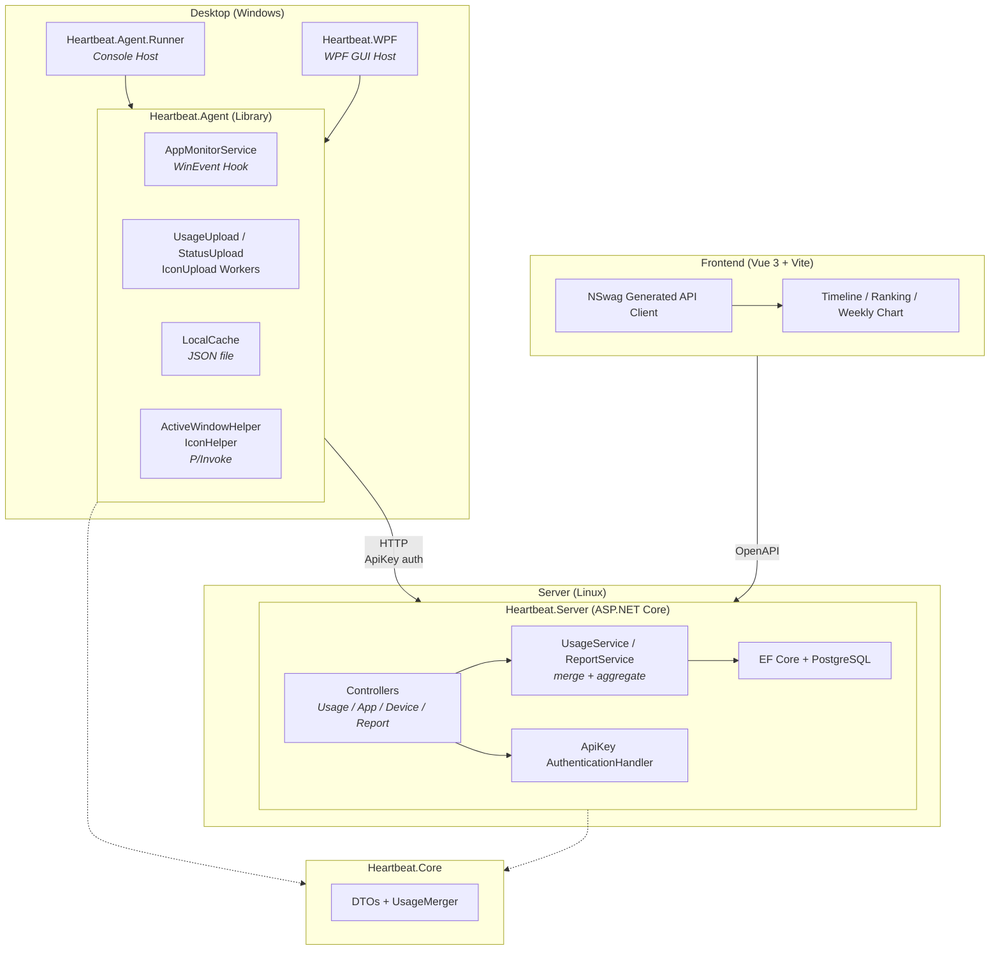

# Heartbeat

Personal Windows PC app usage monitor.
https://heartbeat.shenxianovo.com

## Architecture



## Tech Stack

| Layer | Technology |
|---|---|
| Backend | ASP.NET Core (.NET 10), EF Core, PostgreSQL |
| Desktop Agent | .NET 10 (Windows), Generic Host, WinEvent Hooks (P/Invoke) |
| Desktop GUI | WPF (.NET 10) |
| Frontend | Vue 3, TypeScript, Vite |
| API Client | Auto-generated via OpenAPI / NSwag |
| Shared | Heartbeat.Core (.NET Class Library) |
| CI/CD | GitHub Actions |
| Deployment | Linux systemd service + static frontend hosting |

## Project Structure

```
Heartbeat
├─ desktop
│  ├─ Heartbeat.Agent/          # Monitoring & upload library     .NET Class Library
│  ├─ Heartbeat.Agent.Runner/   # Console host                   .NET Console
│  └─ Heartbeat.WPF/            # GUI host                       WPF
├─ server
│  └─ Heartbeat.Server/         # REST API server                ASP.NET Core
├─ frontend/                    # Dashboard web app              Vue 3 + Vite
├─ shared
│  └─ Heartbeat.Core/           # Shared DTOs & utilities        .NET Class Library
├─ deploy/                      # Deployment scripts & systemd
└─ docs/                        # Documentation
   ├─ adr/                      # Architecture Decision Records
   ├─ api.md                    # API documentation
   └─ db.md                     # Database ER diagram
```

## Architecture Decision Records (ADR)

See [`docs/adr/`](./docs/adr/) for all architecture decisions ([template](./docs/adr/adr-template.md)).

## Documentation

- [API Design](./docs/api.md)
- [Database Design](./docs/db.md)