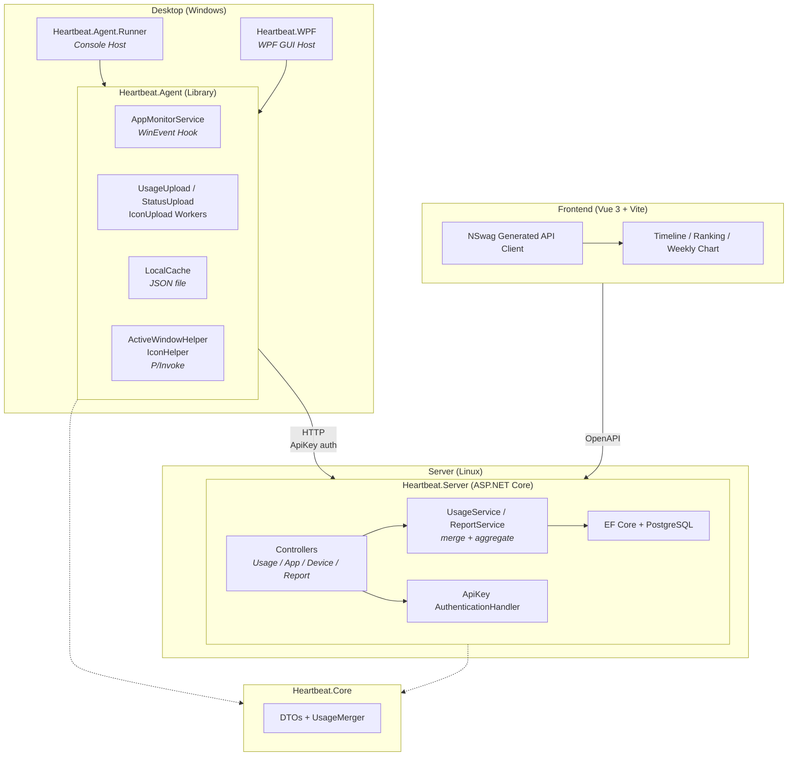

# Heartbeat

Personal Windows PC app usage monitor.
https://shenxianovo.com/heartbeat/

## Architecture



## Tech Stack

| Layer | Technology |
|---|---|
| Backend | ASP.NET Core (.NET 10), EF Core, PostgreSQL |
| Desktop Agent | .NET 10 (Windows), Generic Host, WinEvent Hooks (P/Invoke) |
| Desktop GUI | WPF (.NET 10) |
| Frontend | Vue 3, TypeScript, Vite |
| API Client | Auto-generated via OpenAPI / NSwag |
| Shared | Heartbeat.Core (.NET Class Library) |
| CI/CD | GitHub Actions |
| Deployment | Linux systemd service + static frontend hosting |

## Project Structure

```
Heartbeat
├─ desktop
│  ├─ Heartbeat.Agent/          # Monitoring & upload library     .NET Class Library
│  ├─ Heartbeat.Agent.Runner/   # Console host                   .NET Console
│  └─ Heartbeat.WPF/            # GUI host                       WPF
├─ server
│  └─ Heartbeat.Server/         # REST API server                ASP.NET Core
├─ frontend/                    # Dashboard web app              Vue 3 + Vite
├─ shared
│  └─ Heartbeat.Core/           # Shared DTOs & utilities        .NET Class Library
├─ deploy/                      # Deployment scripts & systemd
└─ docs/                        # Documentation
   ├─ adr/                      # Architecture Decision Records
   ├─ api.md                    # API documentation
   └─ db.md                     # Database ER diagram
```

## Architecture Decision Records (ADR)

| # | Decision | Date | Commit |
|---|---|---|---|
| [001](./docs/adr/001-server-side-usage-merging.md) | Server-Side Usage Record Merging | 2026-02-26 | `328b754` |
| [002](./docs/adr/002-event-driven-window-tracking.md) | Event-Driven Foreground Window Tracking via WinEvent Hooks | 2026-02-27 | `0ad53dc` |
| [003](./docs/adr/003-generic-host-lifecycle.md) | Adopt .NET Generic Host for Desktop Client Lifecycle | 2026-03-03 | `b851b7c` |
| [004](./docs/adr/004-apikey-header-authentication.md) | Custom ApiKey Authentication via HTTP Header | 2026-03-04 | `877851d` |
| [005](./docs/adr/005-extract-agent-library.md) | Extract Heartbeat.Agent as Reusable Class Library | 2026-03-18 | `8bc6966` |
| [006](./docs/adr/006-dedicated-report-endpoints.md) | Redesign API with Dedicated Report Endpoints | 2026-03-05 | `04120cc` |
| [007](./docs/adr/007-disable-prod-auto-migration.md) | Disable Auto-Migration in Production | 2026-03-19 | `0bcc0db` |
| [008](./docs/adr/008-local-cache-offline-retry.md) | Local JSON Cache with Offline Retry for Usage Upload | 2026-03-03 | `b851b7c` |

> ADR template: [`docs/adr/adr-template.md`](./docs/adr/adr-template.md)

## Documentation

- [API Design](./docs/api.md)
- [Database Design](./docs/db.md)