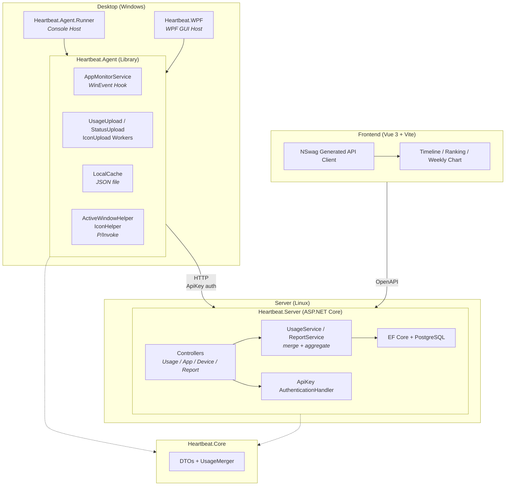

# Heartbeat

Personal Windows PC app usage monitor.
https://heartbeat.shenxianovo.com

## Architecture



## Tech Stack

| Layer | Technology |
|---|---|
| Backend | ASP.NET Core (.NET 10), EF Core, PostgreSQL |
| Desktop Agent | .NET 10 (Windows), Generic Host, WinEvent Hooks (P/Invoke) |
| Desktop GUI | WPF (.NET 10) |
| Frontend | Vue 3, TypeScript, Vite |
| API Client | Auto-generated via OpenAPI / NSwag |
| Shared | Heartbeat.Core (.NET Class Library) |
| CI/CD | GitHub Actions |
| Deployment | Linux systemd service + static frontend hosting |

## Project Structure

```
Heartbeat
├─ desktop
│  ├─ Heartbeat.Agent/          # Monitoring & upload library     .NET Class Library
│  ├─ Heartbeat.Agent.Runner/   # Console host                   .NET Console
│  └─ Heartbeat.WPF/            # GUI host                       WPF
├─ server
│  └─ Heartbeat.Server/         # REST API server                ASP.NET Core
├─ frontend/                    # Dashboard web app              Vue 3 + Vite
├─ shared
│  └─ Heartbeat.Core/           # Shared DTOs & utilities        .NET Class Library
├─ deploy/                      # Deployment scripts & systemd
└─ docs/                        # Documentation
   ├─ adr/                      # Architecture Decision Records
   ├─ api.md                    # API documentation
   └─ db.md                     # Database ER diagram
```

## Architecture Decision Records (ADR)

See [`docs/adr/`](./docs/adr/) for all architecture decisions ([template](./docs/adr/adr-template.md)).

## Local End-to-End Verification

Verify local changes end-to-end **before pushing** — spins up Postgres + backend + frontend
from local source (not the published images), so you see *your* changes running against a
clean database. Your real desktop Agent points at this local stack, giving a full loop:
keypress/window-switch → local DB → local dashboard.

Auth uses the real Auth platform (backend validates JWTs against it; the Agent exchanges its
real API key). Nothing about auth is stubbed — only Postgres/backend/frontend are local.

**Prerequisites:** Docker Desktop running.

### 1. One-time setup

```powershell
Copy-Item .env.local.example .env.local
# .env.local is gitignored; the defaults already point at the real Auth platform.
```

### 2. Start the local stack

```powershell
docker compose -f compose.local.yml --env-file .env.local up --build
```

- Frontend + API: <http://localhost:8080> (nginx reverse-proxies `/api/` to the backend)
- Schema auto-migrates on startup (ADR-013), so no manual migration step.
- Rebuild after code changes: re-run the same command (`--build` rebuilds changed layers).

### 3. Point the desktop Agent at the local stack

Edit `%LOCALAPPDATA%\Heartbeat\config.json`:

- Set `ApiBaseUrl` to `http://localhost:8080` (was the production URL).
- Leave `AuthServiceBaseUrl` and `ApiKey` unchanged (auth still goes to the real platform).

Then run the Agent (`Heartbeat.WPF` or `Heartbeat.Agent.Runner`). Use the keyboard, switch
windows, then open <http://localhost:8080> — data should appear within an upload interval.

### 4. Regenerate the API client (when server DTOs/endpoints changed)

The backend runs in Development here, so it exposes the OpenAPI document:

```powershell
nswag openapi2tsclient /input:http://localhost:8080/openapi/v1.json /output:frontend/src/api/client.ts
```

### 5. Tear down

```powershell
docker compose -f compose.local.yml down
```

The database is not persisted (no volume), so every run starts clean. **Remember to restore
`ApiBaseUrl` in the Agent's config.json** to the production URL when done.

## Architecture Decision Records (ADR)

## Documentation

- [API Design](./docs/api.md)
- [Database Design](./docs/db.md)