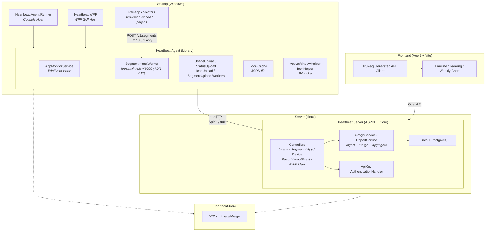

# Heartbeat

Personal Windows PC app usage monitor.
https://heartbeat.shenxianovo.com

## Architecture



## Tech Stack

| Layer | Technology |
|---|---|
| Backend | ASP.NET Core (.NET 10), EF Core, PostgreSQL |
| Desktop Agent | .NET 10 (Windows), Generic Host, WinEvent Hooks (P/Invoke) |
| Desktop GUI | WPF (.NET 10) |
| Frontend | Vue 3, TypeScript, Vite |
| API Client | Auto-generated via OpenAPI / NSwag |
| Shared | Heartbeat.Core (.NET Class Library) |
| CI/CD | GitHub Actions |
| Deployment | Linux systemd service + static frontend hosting |

## Project Structure

```
Heartbeat
├─ desktop
│  ├─ Heartbeat.Agent/          # Monitoring & upload library     .NET Class Library
│  ├─ Heartbeat.Agent.Runner/   # Console host                   .NET Console
│  └─ Heartbeat.WPF/            # GUI host                       WPF
├─ server
│  └─ Heartbeat.Server/         # REST API server                ASP.NET Core
├─ frontend/                    # Dashboard web app              Vue 3 + Vite
├─ shared
│  └─ Heartbeat.Core/           # Shared DTOs & utilities        .NET Class Library
├─ deploy/                      # Deployment scripts & systemd
└─ docs/                        # Documentation
   ├─ adr/                      # Architecture Decision Records
   ├─ api.md                    # API documentation
   └─ db.md                     # Database ER diagram
```

## Architecture Decision Records (ADR)

See [`docs/adr/`](./docs/adr/) for all architecture decisions ([template](./docs/adr/adr-template.md)).

## Local End-to-End Verification

Verify local changes end-to-end **before pushing** — spins up Postgres + backend + frontend
from local source (not the published images), so you see *your* changes running against a
clean database. Your real desktop Agent points at this local stack, giving a full loop:
keypress/window-switch → local DB → local dashboard.

Auth uses the real Auth platform (backend validates JWTs against it; the Agent exchanges its
real API key). Nothing about auth is stubbed — only Postgres/backend/frontend are local.

**Prerequisites:** Docker Desktop running.

### 1. One-time setup

```powershell
Copy-Item .env.local.example .env.local
# .env.local is gitignored; the defaults already point at the real Auth platform.
```

### 2. Start the local stack

```powershell
docker compose -f compose.local.yml --env-file .env.local up --build
```

- Frontend + API: <http://localhost:8080> (nginx reverse-proxies `/api/` to the backend)
- Schema auto-migrates on startup (ADR-013), so no manual migration step.
- Rebuild after code changes: re-run the same command (`--build` rebuilds changed layers).

### 3. Point the desktop Agent at the local stack

Set the `HEARTBEAT_API_BASE_URL` environment variable before launching the Agent — it
overrides the upload target **for that process only, without touching config.json**
(auth still goes to the real platform via the unchanged `AuthServiceBaseUrl`):

```powershell
$env:HEARTBEAT_API_BASE_URL = "http://localhost:8080"
# then launch the Agent from the same shell:
dotnet run --project desktop/Heartbeat.Agent.Runner
# or run Heartbeat.WPF from this shell
```

Closing the shell reverts everything — no config to restore. Use the keyboard, switch
windows, then open <http://localhost:8080>; data should appear within an upload interval.

### 4. Regenerate the API client (when server DTOs/endpoints changed)

The backend runs in Development here, so it exposes the OpenAPI document at
`/openapi/v1.json` (nginx proxies `/openapi/` to the backend; in production the backend
simply doesn't serve it). Requires the NSwag CLI
(`dotnet tool install --global NSwag.ConsoleCore`):

```powershell
nswag openapi2tsclient /input:http://localhost:8080/openapi/v1.json /output:frontend/src/api/client.ts
```

**Then verify types and rebuild the frontend image:**

```powershell
cd frontend; npx vue-tsc -b; cd ..          # type-check against the regenerated client
docker compose -f compose.local.yml --env-file .env.local up -d --build frontend
```

Client conventions (see `frontend/src/api/index.ts`):

- Query endpoints return typed responses because their controller actions return
  `ActionResult<T>` (or `Task<T>`) — the OpenAPI schema is inferred from the return type,
  so NSwag generates typed methods. An action typed `IActionResult` produces a schema-less
  `200` and NSwag emits `Promise<void>`; avoid it for anything the frontend reads.
- The `fetchPublic*` wrappers call the generated client methods directly. The **only**
  exceptions are the daily/weekly report wrappers, which hand-build the query string so the
  browser's local timezone offset survives in the `date` parameter (the server's
  `DateRange.Day/Week` needs it to fix "today"/"this week" boundaries — see
  `shared/CONTEXT.md`). `usage`/`segments` use UTC instants, which are unaffected.

### 4b. Feed plugin segments through the local ingest hub (ADR-017)

The Agent opens a loopback ingest hub (`http://127.0.0.1:48200/v1/segments`, `ingestPort`
in config.json) that per-app collectors (browser extension, VSCode plugin, …) POST folded
segments to; the hub forwards them through the same offline-cache + upload pipeline as
system usage. To exercise it without a real collector, POST a segment yourself while the
Agent is pointed at the local stack:

```powershell
$body = @{ segments = @(@{
  source = "browser"; identityKey = "https://example.com/page"; appName = "msedge"
  title = "Example"; startTime = (Get-Date).ToUniversalTime().AddMinutes(-5).ToString("o")
  endTime = (Get-Date).ToUniversalTime().ToString("o")
  attributes = @{ url = "https://example.com/page" }
}) } | ConvertTo-Json -Depth 5
Invoke-RestMethod -Uri http://127.0.0.1:48200/v1/segments -Method Post `
  -ContentType application/json -Body $body
```

`source = "system"` is rejected by the hub — that name is reserved for the built-in
collector so plugins can't pollute the mutually-exclusive stats track. The segment shows up
under the app's replay modal (stats page → click an app) within an upload interval.

### 5. Tear down

```powershell
docker compose -f compose.local.yml down
```

The database is not persisted (no volume), so every run starts clean.

## Running Tests

Server and shared tests use [Testcontainers](https://dotnet.testcontainers.org/) to spin up
a throwaway Postgres — **Docker Desktop must be running** or every DB-backed test fails
immediately with `DockerUnavailableException`:

```powershell
dotnet test                                        # everything
dotnet test server/Heartbeat.Server.Tests          # server services (needs Docker)
dotnet test desktop/Heartbeat.Agent.Tests          # agent state machine & ingest hub (no Docker)
dotnet test shared/Heartbeat.Core.Tests            # merger / validation / DateRange (no Docker)
```

## Documentation

- [API Design](./docs/api.md)
- [Database Design](./docs/db.md)