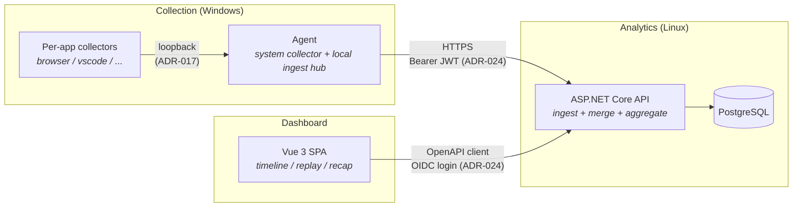

# Heartbeat

Personal Windows PC app usage monitor.
https://heartbeat.shenxianovo.com

记录 PC 上的数字活动(前台应用、浏览器页面、输入事件),回答"x年前的今天我在做什么"。
单用户自部署系统,定位与边界见 [CONTEXT-MAP.md](./CONTEXT-MAP.md)。

## Architecture

三个领域上下文 + 一个共享内核(详见 [CONTEXT-MAP.md](./CONTEXT-MAP.md)):



鉴权:外部自建 Auth 平台签发 JWT——前端走 OIDC 授权码 + PKCE,Agent 用 ApiKey
换取 session JWT,服务端双 scheme 接受(见 [ADR-024](./docs/adr/024-oidc-jwt-authentication.md))。

## Tech Stack

| Layer | Technology |
|---|---|
| Backend | ASP.NET Core (.NET 10), EF Core, PostgreSQL |
| Desktop Agent | .NET 10 (Windows), Generic Host, WinEvent Hooks (P/Invoke) |
| Desktop GUI | WPF (.NET 10) |
| Collectors | Browser extension (TypeScript + Vite);vscode 等规划中 |
| Frontend | Vue 3, TypeScript, Vite |
| API Client | Auto-generated via OpenAPI / NSwag |
| Shared | Heartbeat.Core (.NET Class Library) |
| CI/CD | GitHub Actions |
| Deployment | Docker Compose(`compose.yml` + `.env`,前端 nginx 反代后端) |

## Project Structure

```
Heartbeat
├─ desktop
│  ├─ Heartbeat.Agent/          # Monitoring & upload library     .NET Class Library
│  ├─ Heartbeat.Agent.Runner/   # Console host                   .NET Console
│  └─ Heartbeat.WPF/            # GUI host                       WPF
├─ collectors
│  └─ browser/                  # Browser extension collector    TypeScript + Vite
├─ server
│  └─ Heartbeat.Server/         # REST API server                ASP.NET Core
├─ frontend/                    # Dashboard web app              Vue 3 + Vite
├─ shared
│  └─ Heartbeat.Core/           # Shared DTOs & utilities        .NET Class Library
└─ docs/                        # Documentation
   ├─ adr/                      # Architecture Decision Records
   ├─ development.md            # Local E2E verification & tests
   ├─ api.md                    # API conventions (导读)
   └─ db.md                     # Database design (导读)
```

## Documentation

- [Development Guide](./docs/development.md) — 本地端到端验证、测试、API client 重生成
- [API 导读](./docs/api.md) — 鉴权与调用方约定;端点真相源是 OpenAPI
- [数据库导读](./docs/db.md) — 设计意图;schema 真相源是实体类与迁移
- [CONTEXT-MAP](./CONTEXT-MAP.md) + 各上下文 `CONTEXT.md` — 领域术语表
- [ADRs](./docs/adr/) — 架构决策记录([template](./docs/adr/adr-template.md))
