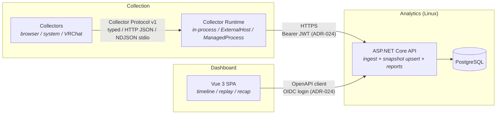

# Heartbeat

Personal cross-platform desktop activity monitor.
https://heartbeat.shenxianovo.com

记录桌面设备上的数字活动(前台应用、浏览器页面、输入事件),回答"x年前的今天我在做什么"。
单用户自部署系统,定位与边界见 [CONTEXT-MAP.md](./CONTEXT-MAP.md)。

## Architecture

三个领域上下文 + 一个共享内核。完整模块、Transport Binding 与协议关系见 [系统架构与协议图](./docs/architecture/system-overview.md)，领域边界见 [CONTEXT-MAP.md](./CONTEXT-MAP.md)。


```mermaid
graph LR
    subgraph Collection["Collection"]
        Collectors["Collectors<br/><i>browser / system / VRChat</i>"]
        Agent["Collector Runtime<br/><i>in-process / ExternalHost / ManagedProcess</i>"]
        Collectors -- "Collector Protocol v1<br/>typed / HTTP JSON / NDJSON stdio" --> Agent
    end

    subgraph Analytics["Analytics (Linux)"]
        API["ASP.NET Core API<br/><i>ingest + snapshot upsert + reports</i>"]
        DB[("PostgreSQL")]
        API --> DB
    end

    subgraph Dashboard["Dashboard"]
        Web["Vue 3 SPA<br/><i>timeline / replay / recap</i>"]
    end

    Agent -- "HTTPS<br/>Bearer JWT (ADR-024)" --> API
    Web -- "OpenAPI client<br/>OIDC login (ADR-024)" --> API
```

鉴权:外部自建 Auth 平台签发 JWT——前端走 OIDC 授权码 + PKCE,Agent 用 ApiKey
换取 session JWT,服务端双 scheme 接受(见 [ADR-024](./docs/adr/024-oidc-jwt-authentication.md))。

## Tech Stack

| Layer | Technology |
|---|---|
| Backend | ASP.NET Core (.NET 10), EF Core, PostgreSQL |
| Desktop Agent | .NET 10 (Windows/macOS), Generic Host, platform observers |
| Desktop GUI | Avalonia 12 (.NET 10) |
| Collectors | Browser extension (TypeScript + Vite);vscode 等规划中 |
| Frontend | Vue 3, TypeScript, Vite |
| API Client | Auto-generated via OpenAPI / NSwag |
| Shared | Heartbeat.Core (.NET Class Library) |
| CI/CD | GitHub Actions |
| Deployment | Docker Compose(`compose.yml` + `.env`,前端 nginx 反代后端) |

## Project Structure

```
Heartbeat
├─ collection
│  ├─ hub
│  │  ├─ Heartbeat.Collection.Hub/          # Reusable runtime, projection and upload
│  │  └─ Heartbeat.Collection.Headless/     # Headless host + management API
│  ├─ protocol
│  │  └─ Heartbeat.Collection.CollectorProtocol/ # Collector-side protocol client
│  ├─ desktop
│  │  ├─ Heartbeat.Collector.System/        # Platform-neutral system Collector
│  │  ├─ Heartbeat.Desktop.UI/              # Shared Avalonia presentation
│  │  ├─ Heartbeat.Desktop.Updater.Velopack/# Update adapter
│  │  ├─ Heartbeat.Desktop.Windows/         # Windows tray app + adapters
│  │  └─ Heartbeat.Desktop.Mac/             # macOS menu-bar app + adapters
│  └─ collectors
│     ├─ Heartbeat.Collector.Browser/        # Browser extension (TypeScript)
│     ├─ Heartbeat.Collector.Reference.ManagedProcess/ # Deterministic protocol fixture
│     └─ Heartbeat.Collector.VRChat/         # Account Collector (.NET)
├─ server
│  └─ Heartbeat.Server/         # REST API server                ASP.NET Core
├─ frontend/                    # Dashboard web app              Vue 3 + Vite
├─ shared
│  └─ Heartbeat.Core/           # Shared DTOs & utilities        .NET Class Library
└─ docs/                        # Documentation
   ├─ adr/                      # Architecture Decision Records
   ├─ development.md            # 日常本地开发路径
   ├─ api.md                    # API 调用方约定
   ├─ db.md                     # 数据库设计导读
   └─ runbooks/                 # 低频、高风险操作
```

## Documentation

- [Development Guide](./docs/development.md) — 启动本地栈、运行 Agent、验证与测试
- [系统架构与协议图](./docs/architecture/system-overview.md) — 当前模块、身份层级、Transport Binding 与 schema 校验链
- [兼容债务账本](./docs/architecture/compatibility-debt.md) — 当前仍服务的旧数据/客户端、退出门槛与验证
- [Collector Fact Contracts](./collection/contracts/README.md) — 5 个 schema 的单一来源与演进检查
- [Collector Protocol Conformance](./collection/protocol/conformance/README.md) — 跨语言生命周期、ACK、重试、Gap 与 drain 行为语料
- [API 导读](./docs/api.md) — 鉴权、调用方与客户端生成约定；端点真相源是 OpenAPI
- [数据库导读](./docs/db.md) — 数据设计意图；schema 真相源是实体类与迁移
- [Runbooks](./docs/runbooks/) — 本地数据 smoke、生产数据刷新与 App Catalog 运维
- [CONTEXT-MAP](./CONTEXT-MAP.md) + 各上下文 `CONTEXT.md` — 领域术语表
- [ADRs](./docs/adr/) — 架构决策记录([template](./docs/adr/adr-template.md))
