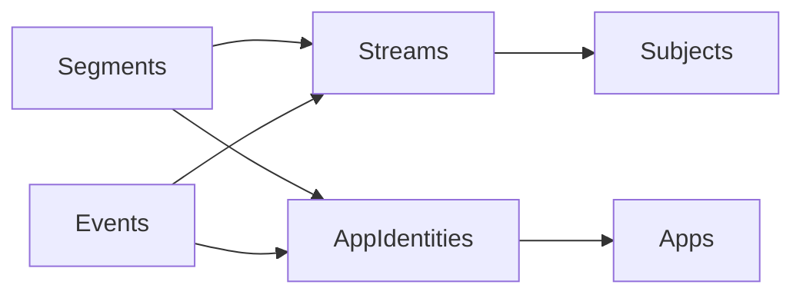

# ADR-055: 按 Fact 家族持久化

## Status: Accepted（核心家族模型）

2026-09-10 更新：仓库实施记录已确认下述分表迁移上线，后续必须追加迁移，不能再替换 NativeFactCustody。
[ADR-056](056-observation-objects-and-contexts.md) 已确认直接观测对象的业务模型，重开本 ADR 的
Stream → Subject 归属设计；统一对象登记及通用关系表退回待评估，家族表、时间、单份 Payload 与正常修订决定保持。
新关系尚未实现；旧字段与身份衔接核对见[存储候选](../architecture/observation-storage-design.md)，不作为当前实施基线。
下文按当时阶段保留的“未部署”描述不代表当前发布状态。

2026-09-09：Owner 已确认核心 Fact 模型并授权替换迁移。当前已实现两张家族表、摄入与 SQL 查询，
替换未部署的 NativeFactCustody；其他关联存储字段继续沿用既有实现。本声明不代表真实资源演练或部署完成。

统一 Fact 的摄入、身份与正常修订语义，不要求统一物理表。Segment、Event 按家族持久化，
公共元数据和验证规则继续共享；优先演进已有数据结构，避免把全部历史复制进通用 `Facts`
之后，再维护两份完整活动/输入记录。Measurement 保持既有范围，等待真实 Collector 再实现。

这将替代 ADR-054 的“通用 Facts + 完整查询投影”物理布局；原生协议、Owner/Subject 隔离、
重试/正常修订和旧缓存确定性关联继续纳入设计。Owner 随后明确取消撤回与 Fact Schema 治理机制，
时间保留现有 timestamptz，不要求 100ns 精度；这些决定替代旧 ADR 中对应的预留能力。

## 原因与边界

- 早先线上克隆后继续运行本地客户端的库含 218,562 条活动和 1,869,909 条输入。
  原迁移触发 30 秒命令超时；该混合基线的独立副本在
  PostgreSQL 512MiB/0.75 CPU 限制下又暴露 OOM，保留旧布局的对照实验使数据库从约 361MiB
  增至约 2.7GiB。优化旧布局的实验不是新分表方案的验收证据。
- 2026-09-09 拆开刷新与启动后重新取得未迁移的线上快照：最后迁移为
  `20260829100458_AskingWindowIdentity`，220,146 条活动、1,891,698 条输入，约 365 MiB。
  只读核对确认无 Facts/FactStreams；后续分表演练使用此原始基线，不沿用混合库数量。
- 统一布局方便用一套实体更新 Fact，却使完整内容、历史整行档案与查询投影重复存储；
  按家族分表将承担公共映射和跨类型查询的维护成本，换取独立约束、索引与更少的完整记录副本。
- Segment/Event 的家族语义宽于 ActivitySegment/InputEvent。已支持的自定义 Payload
  必须仍可被完整保管，不能在存储重构中被静默丢弃；家族存储与产品展示资格分别建模。
- 升级前数据库备份与逐条永久原始档案是不同承诺；无损历史迁移不自动要求永久复制旧整行。
  Owner 已明确沿用最新修订语义，不保存被替换版本，也不保存永久整行 `LegacyRecord`。
- GitHub 最近成功 Analytics 部署使用 `6e472249`，引入通用迁移的 `31216d4` 尚在本地未推送
  的提交中。主升级路径按旧表直接迁入分表设计；本次线上 dump 中的迁移历史也确认了这一前提。

## 已确认取舍

1. 每条事实只保留一份完整 Payload；独立查询列必须有明确用途，并按下方逐项决定取舍。
2. 不保存旧修订或永久整行 LegacyRecord；合法修订取代旧内容。删除 Fact 撤回能力及仅为它服务的墓碑机制。
3. 一次性升级允许最多 10 分钟停写/停服；Collector 暂存未确认上传，不要求零停机。
4. 保留最近两份成功升级前备份；失败升级的备份保留到排障结束。成功核对后清理更旧的成功备份。
5. Owner 授权改进不合适的数据库表/字段命名；必须提供完整旧→新映射，不能把语义变化冒充改名。

## 逐项审阅决定（2026-09-09）

本节是本轮对话已确认决定的权威记录。遵循奥卡姆剃刀：核心是 Fact 模型，
不为没有实际用途的协议预留能力增加字段或状态。未列为确定的字段继续逐项讨论，
不能将早期完整字段提案视为整体获批。决定已记录不代表代码或数据库已修改。

| 项目 | 已确认决定 |
| --- | --- |
| 物理布局 | Segment、Event 按家族存储，不再建通用 Facts 表复制完整内容。表名确定为 Segments（原 ActivitySegments）和 Events（原 InputEvents），不加 Facts 后缀。 |
| 关联表命名 | FactStreams 改名为 Streams，FactSubjects 改名为 Subjects；事实经 StreamId → Streams → SubjectId → Subjects 关联观测对象。 |
| 采集实例 | Streams 保留 CollectorInstanceId，标识该流的具体生产者；与表示采集来源类型的 Source 区分，只在流上存储，不逐条复制到事实。 |
| 时间 | StartTime、EndTime、Timestamp 保留原名和 timestamptz 类型，不改 bigint，不要求 100ns 精度。后续内容比较需适配微秒精度。 |
| 数据库主键 | 保留 Id，不改为 RowId，作为稳定的数据库记录主键。 |
| 事实身份 | 保留独立 FactId，与 OwnerId + StreamId 一起构成事实身份。 |
| 修订 | 保留 Revision，初始统一为 1；迁移记录和新建记录不以 0/1 区分，只保存最新版本。正常乱序保护与同版本幂等/冲突校验继续保留。 |
| 撤回 | 删除 Fact 撤回功能，取消 RecordState 及仅为撤回存在的墓碑机制；独立任务已完成并合入本地提交 e82193c。 |
| 观测时间 | 不增加 ObservedAt 存储字段。 |
| 区间终态 | Segment 表不增加 IsFinal；保留 StartTime / EndTime 表达当前区间，通过 Revision 更新。不将协议中的终态标志自动搬入存储。 |
| 来源 | Segment 表保留 Source，Event 表也增加 Source；两种家族都需要表达 system、browser、vrchat.account 等采集来源。Event 不等于输入事件。 |
| 观测对象归属 | 两张事实表不存 DeviceId，也不重复存 SubjectId；统一经 StreamId → Stream → Subject 关联观测对象。Subject 可以是 Machine（Device）、Account 或 Person，机器特有信息留在设备信息中。迁移与查询需相应调整，不能仅删除外键后丢失归属。 |
| 内容 | 字段名确定为 Payload，两张家族事实表每条记录各存一份 JSON；原 Attributes 合入 Payload，不另留完整副本。 |
| Payload 所属 | 只放逐条事实所在家族表；Subject、Stream 等元数据表不复制逐条 Payload。允许必要的查询列，具体列继续审阅。 |
| 标题 | 标题只存于 Payload，不保留独立 Title 列；活动查询从 Payload 读取标题，不维护重复内容。 |
| 输入事件内容 | EventType、CodeSet、Code 全部放进 Payload，不在 Event 表重复建立输入专用列。历史编码体系和值原样保留，输入统计从 Payload 读取。 |
| 应用关联 | 两张事实表保留可选 AppIdentityId，关联已有平台应用身份。结合经 Stream 得到的 Subject，表达同一机器上的同一应用；System 与应用内部 Collector 的事实仍各自独立。不能将同一应用关联误当作同一窗口或进程。该关联可随 Fact 变化，不能一律只放 Stream。 |
| 应用产品 | 事实表不再独立存 AppId，通过 AppIdentity → App 获取应用产品。原始快照的 38 条差异已核对为早期大小写归一后的重复 App 残留；现有查询已优先采用 AppIdentity 路径，且不存在有 AppId 却缺 AppIdentityId 的记录。迁移保留既有 AppIdentity 关联，核对证据见实施 issue。 |
| 活动分组 | 原 IdentityKey 改名为 Payload.activityKey，表达采集器定义的活动分组（例如规范化 URL），不承担应用关联或 Fact 身份。同一个 activityKey 可以对应多条不同时间的 Fact。 |
| 事实摘要 | 不增加 SnapshotHash，也不以其他字段名存储同类事实内容哈希；同版本内容一致性直接比较已保存的事实内容。 |
| Fact Schema | 删除 Fact Payload 的 Schema 注册、版本、哈希、格式及演进校验体系，不存 SchemaRevision，不创建 FactSchemas，不用另一套通用规则系统替代。独立任务已完成，原提交 feb85bb 已以 ff3a152 整合到实施分支。 |
| 必要检查 | Schema 删除不意味着取消核心正确性：保留认证归属、Subject/Stream 关联、基本身份/Revision/JSON/时间合法性、尺寸限制、原子写入、乱序和同版本幂等/冲突保护。其他领域的安全与文件完整性校验不属于 Fact Schema 删除范围。 |
| Measurement | 本次不预建表，出现真实需求后再设计自己的家族表与内容。 |

## 本轮确定的核心 Fact 模型

Owner 要求先确定 Fact 模型，其余内容慢慢讨论。本节只汇总上述已确认决定，不增加新字段。

| 字段 | Segments | Events | 含义 |
| --- | --- | --- | --- |
| Id | 有 | 有 | 稳定数据库主键 |
| OwnerId | 有 | 有 | 数据归属 |
| StreamId | 有 | 有 | 关联数据流，再由流关联 Subject |
| FactId | 有 | 有 | 流内事实身份 |
| Revision | 有 | 有 | 从 1 开始，只保留最新版本 |
| Source | 有 | 有 | system、browser、vrchat.account 等来源 |
| AppIdentityId | 可空 | 可空 | 明确的平台应用关联；经 AppIdentity 获取 App |
| StartTime | timestamptz | 无 | 区间起点 |
| EndTime | timestamptz | 无 | 当前区间终点 |
| Timestamp | 无 | timestamptz | 事件发生时间 |
| Payload | JSON | JSON | 唯一一份事实内容，包括适用的 title、activityKey、输入类型及编码等 |

Segments 共 10 列，Events 共 9 列。各表以 Id 为主键，以 (OwnerId, StreamId, FactId)
标识唯一事实；正常修订、乱序保护和同版本内容一致性规则保留。不创建通用 Facts 表。
时间按现有微秒精度处理。事实归属通过 Stream → Subject，应用关系通过 AppIdentity → App。
同一 Subject + AppIdentity 可关联不同 Collector 对同一应用的观察，但不据此合并事实或重复计时。

本轮不继续扩展 Streams/Subjects 其余字段，最后讨论的服务端 OutputId 不纳入核心 Fact 模型。
迁移身份衔接、App 映射结果的回归、详细约束/索引、完整历史数据 diff 与受限资源演练在后续实施中处理，
不能因旧代码已有字段就自动加入上述核心模型。旧提案的样例不作为当前目标验收依据。

撤回与 Fact Schema 删除已整合；分表迁移已通过独立完整备份的逐行核对、受限数据库/Analytics
启动和重启演练。实际整机资源/磁盘预算、部署与现场升级仍待完成，详见实施跟踪。

旧的完整存储提案已按 Owner 要求删除，避免未确认字段继续影响设计。
后续其他存储细节再继续逐项审阅；最终迁移映射和真实数据 diff 以本轮核心模型为基础整理。

## 实施中的责任衔接（2026-09-09）

终态由 Collection/Runtime 持久保管并校验；Analytics 保留协议字段的基本合法性检查，
不保存 IsFinal，不进行跨请求的终态不可重开检查，也不将其纳入同 Revision 内容比较。
这是不增加终态字段的明确结果，替代 ADR-054 的服务端终态承诺；Segment 起点和 Event
发生时间仍固定，所有正常修订规则按数据库微秒精度执行。Gap 的 tick 精度保持原样。

旧表原地改名与转换，历史行 Id 保留；不创建别名表或逐条历史档案。活动 Payload 的已知
identityKey 在持久化/比较前统一为 activityKey，旧 Runtime 快照保持原样。
Down 拒绝有损逆转换，恢复采用升级前完整备份并保管新增事实。
具体映射、重放与兼容退出边界见下方实施记录。

## References

- [第一步：旧字段映射与身份衔接](../../.scratch/native-analytics-facts/migration-mapping.md) — 实施建议与验收边界，不扩展已确认核心字段。
- [ADR-054](054-native-analytics-fact-ingest.md)
- [实施跟踪](../../.scratch/native-analytics-facts/PRD.md)
- [最近成功的 Analytics 部署](https://github.com/shenxianovo/Heartbeat/actions/runs/34182998353)
