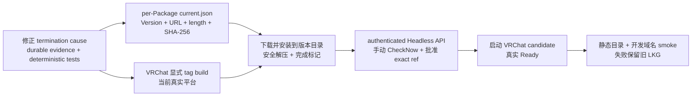
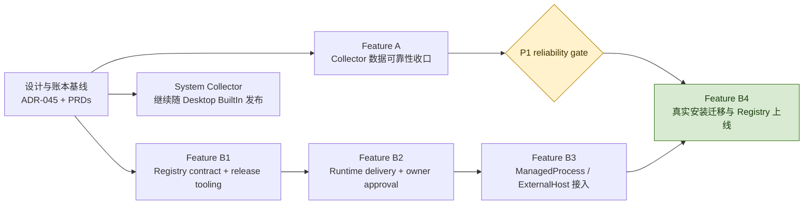
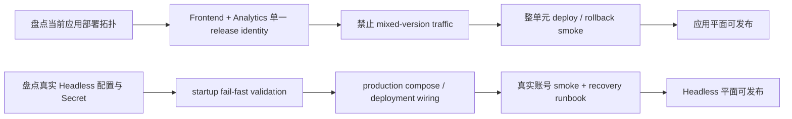
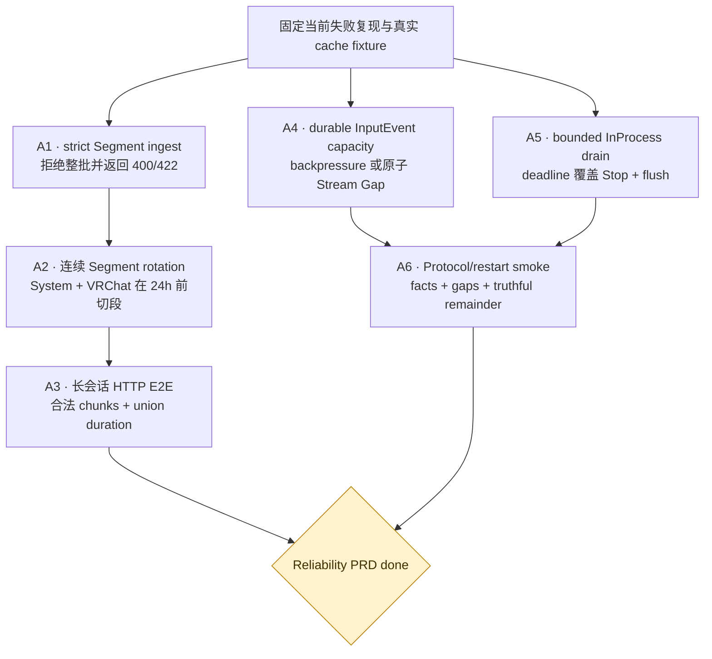

# Collector 独立交付实现路线图

本文把 [ADR-045](../adr/045-independent-web-delivery-for-collector-packages.md) 的实现拆成两个已有
tracker 的 feature，并固定它们之间与各自内部的依赖顺序：

- [Collector 数据可靠性收口](../../.scratch/collector-reliability-closeout/PRD.md)
- [Collector Package Registry](../../.scratch/collector-package-registry/PRD.md)

箭头表示“右侧开始或完成前必须满足左侧条件”，不是要求所有工作串行。没有依赖箭头的节点可以并行。
Analytics + Dashboard 原子发布、Headless production configuration 是扫描发现的独立应用/运维平面
风险，不塞进这两个 Collection feature；它们必须在对应平面实际发布前单独 closeout。

> **当前开发路径（2026-08-31）**：ADR-047 已把 Feature B 第一条纵切缩减为 unsigned VRChat
> ManagedProcess delivery。下面 ADR-045 的生产目标仍保留作 later scope；当前 Agent 只执行“termination
> truth gate → 最小 index/tag pipeline → 版本目录安装 → exact ref approval → VRChat Ready → 开发域名
> smoke”，不得自行恢复签名、channel、solver、原子安装 journal、Browser 或全平台矩阵。

## Feature 之间的实现顺序

Registry contract、release tooling 和 Runtime delivery module 可以在可靠性修复期间开发；任何会改变
真实用户安装的 migration/rollout 必须等待 P1 reliability gate。System 始终走 Desktop BuiltIn
Delivery，不等待 Web Registry。

应用与运维平面的发布门禁与上图并行，不阻塞纯 contract/local implementation，但阻塞各自的生产发布：

这两条并行线目前是扫描结论，不冒充已建立的 implementation feature；开始实现时应分别建立 tracker，
并以真实 deployment state 为输入。

## Feature A：Collector 数据可靠性收口

数据真实性分成两条可并行 lane。Segment lane 先修服务端 truthful outcome，再用相同 strict contract
验证长时段旋转；Protocol lane 可以同时处理 InputEvent capacity 和有界 drain。四项全部完成后执行
跨进程 restart/replay smoke，才关闭 gate。

对应 tracker：

1. [strict Segment ingest](../../.scratch/repository-understanding/issues/05-strict-segment-ingest-outcomes.md)
2. [连续 Segment rotation](../../.scratch/collector-reliability-closeout/issues/01-rotate-continuous-segments.md)
3. [durable InputEvent capacity](../../.scratch/collector-reliability-closeout/issues/02-durable-input-capacity.md)
4. [bounded InProcess drain](../../.scratch/collector-reliability-closeout/issues/03-bounded-inprocess-drain.md)

其中 A1 → A2 是推荐的 tracer 顺序：先让下游拒绝结果可信，再证明上游永远生成合法 chunk。A4、A5
不依赖 Segment 代码，可以与 A1/A2 并行。

## Deferred production target

签名、channel、完整平台矩阵、Browser ExternalHost、离线目录、cache GC、生产迁移与运维演练只保留在
[ADR-045](../adr/045-independent-web-delivery-for-collector-packages.md) 作为未来目标，不进入当前 roadmap。
VRChat MVP 完成后必须重新 grill，不能从旧图直接恢复这些范围。
