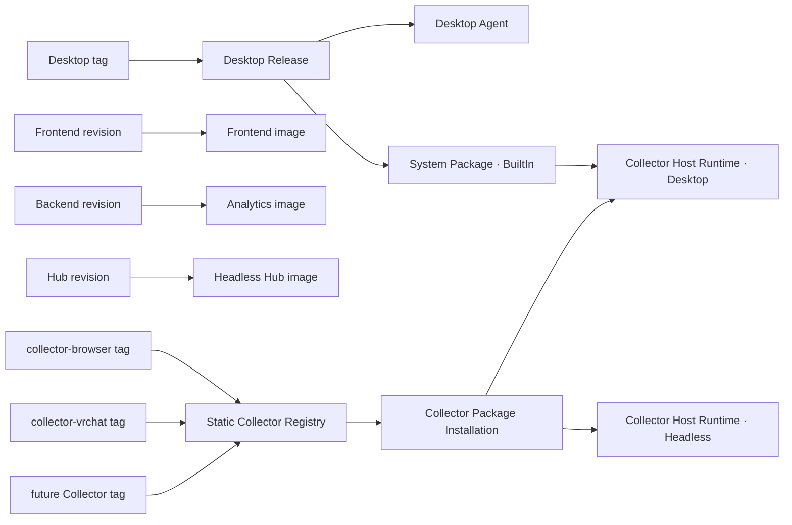
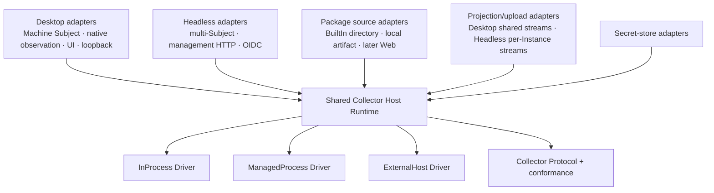
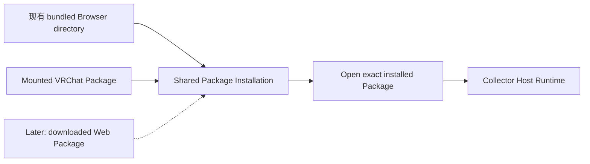
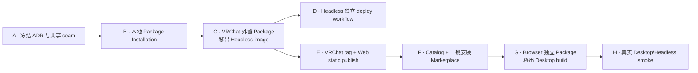

# Collector Host Runtime 与独立交付目标架构

本文记录 [ADR-048](../adr/048-shared-collector-host-runtime-and-independent-release-units.md) 的目标拓扑和
实现顺序。它取代已经撤回的 Registry 候选批准/LKG 切换路线；可靠性地基仍由 ADR-040/046 与现有
Collector Protocol conformance tests 承担。宿主组合边界以
[ADR-049](../adr/049-named-optional-collectors-outside-host-composition.md) 为准：具名可选 Collector 不进入
Host composition，宿主只组合通用 seam 加上 System BuiltIn。

## 目标

- Desktop 独立构建、发布和下载；System Collector 随 Desktop Release。
- Frontend、Analytics Backend、Headless Hub 各自构建和部署。
- Browser、VRChat 与未来非 BuiltIn Collector 各自显式构建为 Collector Package，并经静态 Web 路径
  独立发布。
- Desktop 与 Headless 复用同一个宿主无关 Collector Host Runtime；宿主差异只存在于 adapter。
- 当前只做显式精确 Installation 与启动，不建设自动更新控制面。

## 发布拓扑

发布单元之间不互相重建：Collector 发布不触发 Host 发布，Headless 发布不触发 Backend，Frontend image
不携带 Registry 文件。相同域名只由反向代理组合访问路径。

## 共享 Runtime 的 seam

现有 `CollectorRuntime` 已由 Desktop 与 Headless 复用；待收敛的是其外层 Host 编排。目标 module 的
interface 只暴露“安装/打开精确 Package、配置 Instance、启动/停止 Activation、读取 Runtime State”，
并隐藏 Package 目录、Execution Driver 与协议生命周期细节。

### Runtime 共同拥有

- Collector Installation、Instance、Activation 与 Runtime State；
- Package loader 与 Artifact Descriptor 选择；
- InProcess、ManagedProcess、ExternalHost Driver；
- Protocol handshake、Ready、Fact/Gap、ACK、drain 与生命周期所有权。

### 宿主 adapter 保留

- Desktop 的平台观察、输入 hook、图标、UI、Machine identity 和通用 ExternalHost loopback 监听；
- Headless 的多 Subject 配置、owner-only management HTTP 与 OIDC；
- Desktop 的共享 device 上传流与 Headless 的 per-Instance 上传流；
- 数据路径、部署配置和 Secret 持久化选择。

投影/上传只有在共同 interface 足够小且不需要 `if desktop/headless` 分支时才继续下沉。共享 Runtime 不是
把两个 composition root 合并，也不是要求两个宿主拥有相同 UI 或 Subject 拓扑。

## Collector 矩阵

| Collector | Package 发布 | Delivery | Driver | 默认宿主 | Runtime 实际拥有的动作 |
|---|---|---|---|---|---|
| System | Desktop tag | BuiltIn | InProcess | Desktop | 构造、启动、停止 |
| Browser | 独立 Collector tag | Web | ExternalHost | Desktop | 安装 Package、接受/拒绝连接、撤销 lease；不启动浏览器 |
| VRChat | 独立 Collector tag | Web | ManagedProcess | Headless | 安装 Package、启动/终止子进程 |
| 后续 Collector | 独立 tag 或 BuiltIn | 按 Package 决定 | 按 Artifact Descriptor | Desktop/Headless | 只执行所选 Driver 真正拥有的动作 |

统一 Protocol 是语义统一，不是 transport 统一。三类 Driver 必须继续通过相同 conformance vectors。

上表是目标态。Browser 一行的"默认宿主 = Desktop"当前不成立：ADR-049 之后宿主不再持有 Browser
runtime、protocol handler、安装目录或 UI 条目，通用 ExternalHost 的安装与连接能力尚未实现，因此 Desktop
没有任何 Browser 接入路径。

## 第一条小功能：外置本地 VRChat Package

第一条 tracer 不接 Web、不做更新状态机，而是让真实 Package 生命周期先脱离 Host image：

1. 提取共享 `Collector Package Installation` module，接收一个本地精确 Package，完成现有
   manifest/artifact/hash 校验并记录 Installation。
2. Desktop Browser 当前 bundled import 改用该 module，保持用户行为不变。
3. Headless 从挂载目录安装并启动 VRChat Package；Headless image 不再构建或携带 VRChat。
4. Headless 与 VRChat 分别构建后，证明“只替换 VRChat Package + 重启 Headless”无需重建 Hub image。

这条功能有两个真实调用者，形成真实 seam；后续 Web delivery 只新增 Package source adapter：

2026-09-02 更新：这条 tracer 的两个调用者只剩一个。Desktop 的 Browser bundled import 已随宿主解耦删除
（ADR-049），`CollectorPackageInstallations` 目前只有 Headless 的 VRChat 启动在用；Desktop 侧的 Installation
调用者要等通用 ExternalHost 安装入口才会回来。

### 明确不进入第一条 tracer

- channel、SemVer solver、后台检查或通知；
- owner approval、offer、候选稳定窗口、LKG 自动切换；
- Ed25519、密钥轮换、撤回、第三方市场；
- 安装 journal、断电恢复、cache GC；
- Browser 独立 Web 发布和 UI 安装入口。

## 后续实现顺序

- B/C 已落地：共享 Installation module 建立，VRChat Package 与 Headless image 分开构建，Headless
  从只读挂载目录安装后再启动。
- D 只改变部署单元，不依赖 Web Registry，可与 E 并行。
- E 已完成：专属 tag workflow 生成确定性 zip 与不可变 `release.json`，向同域静态目录追加精确 Version；
  VRChat 0.2.0 已真实发布并经公网逐字节复核。F 按 ADR-050 增加 Registry Catalog 与一键安装 Marketplace；
  普通 `main` 验证不发布用户可见 Package。
- G 已完成宿主侧的全部：Desktop 构建与产物不含 Browser，宿主也不再认识 Browser——Hub 与两个平台 head
  没有它的 runtime、protocol handler、安装目录、平台知识或 UI 条目（ADR-049）。剩下的是通用 ExternalHost
  的安装与连接能力，加上 Collector tag 与可下载 Package（依赖 E/F）；在这两者到位前 Browser 没有任何宿主
  接入路径。
- G 复用已经证明的 Installation/Web seam，只增加通用 ExternalHost 的真实安装与用户 reload 动作。

## 当前差距

- Desktop Release 已独立，且不再构建或携带 Browser Package：两个 Desktop head 与其测试项目都不再 import
  Browser 的 package target，Desktop Release 也不再安装 node、构建 Browser 或跑 Collector contracts
  （Browser 的构建与契约验证留在 `collector-contracts.yml`）。System 作为 BuiltIn 由 publish target 进入
  `dotnet publish` 产物，Desktop Release 另有产物断言（System 在、Browser 不在）与打包后的 startup smoke。
- Browser 目前是"有独立发布单元、无宿主接入能力"：它的扩展代码、Package 构建 target 与 npm 测试留在
  `collection/collectors/Heartbeat.Collector.Browser`，并继续由 `collector-contracts.yml` 验证，但宿主里没有
  任何 Browser 接入路径——Browser 专属 runtime 与 protocol handler 已删除，`/v1/collector-protocol/browser`
  不再存在（默认 ExternalHost handler 一律 404），`CollectorPackages/Browser` 默认路径与 UI 卡片也随之删除。
  手工侧载不再能让它连上宿主。通用 ExternalHost 安装/连接是后续 issue（issue 09 的已知残留之一）。
- `facts.segment/v1` 已统一走 ActivitySegment 投影：Package 自有 JSON Schema 先验证 payload，通用 projector
  再要求共同 `identityKey`，Hub 不再按 schema id / major 列出 Browser、VRChat 或测试 Collector。Hub.Tests
  也不再构建 Browser 或引用 VRChat 产品；VRChat ManagedProcess E2E 由 Collector 自身测试拥有。
- Headless Hub 可以零 Collector Instance 启动；单个配置项的 Package 缺失、损坏或初始化失败被隔离成管理面
  快照里的 `Failed` + `StatusDetail`，不再终止整个 Hub。已有 mapping 的恢复过程同样逐 Instance 隔离；
  `StatusDetail` 来自真实 `CollectorRuntimeFailure`（code / message / exit code）；Instance 没建起来时
  `PackageVersion` 与 `PackageContentHash` 是 `null`；`Initialized` readiness signal 让零 Instance 场景不再靠
  固定睡眠等待。
- Frontend 与 Backend workflow 已独立；Backend workflow 不再构建、推送或重启 Headless。
- Analytics 启动只预插 System BuiltIn 的 Observation Depth 声明；非 BuiltIn Collector 通过运行时上报，
  已有数据库声明继续由通用生效路径读取。
- Headless image 已不再构建或携带 VRChat Package：Package 由 `scripts/build-vrchat-package.sh`
  单独构建到宿主目录，compose 以只读方式挂到 `/package-source`，Headless 安装后再运行。VRChat 专属
  tag workflow 与不可变 Web Release 已实现，0.2.0 已真实发布；Headless 还不会从 Web 下载。
- 共享 `CollectorPackageInstallations` 已就位，但当前只剩 Headless 的 VRChat 启动一个调用者：Desktop 侧的
  Browser bundled import 已随宿主解耦删除，Desktop 要等通用 ExternalHost 安装入口才会重新成为调用者。
  `HeadlessFleetManager` 的 Fleet 编排和各宿主 projection/upload 装配仍未收进共享 Host Runtime interface。
- 静态 Collector Registry 的精确 Version 布局、生产 Caddy 路由与 VRChat tag workflow 已落地；0.2.0 已
  公网可读。Catalog Latest 与 Host Marketplace 正在按 ADR-050 实现：Latest 只用于首次发现，不能成为已安装
  或运行版本权威。旧 approval/LKG 实现已撤回，不能恢复为当前能力。
- Headless 独立 deploy workflow 仍不存在；服务器也尚未 provision 外置 Package 来源，因此 Backend deploy
  已停止顺带重启 Headless，避免在缺少 Package 时静默失败。真实服务器上的「只替换 Package + 重启」
  smoke 同样还没有承接人。

## 验收边界

目标完成需要同时证明：

- 四个 Host/application release unit 可独立构建和部署；
- 宿主组合只含通用 seam 与 System BuiltIn，任何具名可选 Collector 的增删都不改宿主代码、UI 或 smoke；
- System 只随 Desktop Release；
- Browser/VRChat 各自 tag 能产生独立 Package；
- 同一个共享 Installation module 被 Desktop 与 Headless 使用；
- VRChat Package 更新不重建 Headless，Browser Package 更新不重建 Desktop；
- 三类 Driver 继续通过统一 Protocol conformance；
- 真实 Desktop Browser 与 Headless VRChat smoke 成功。
