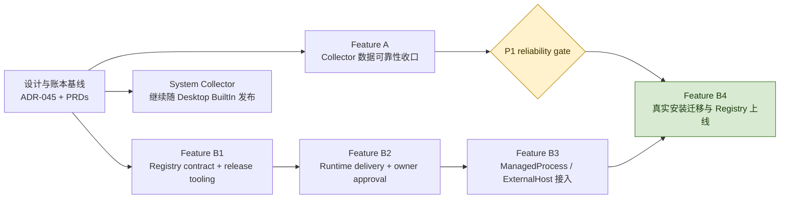
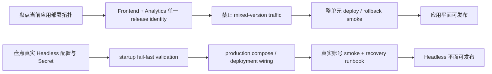
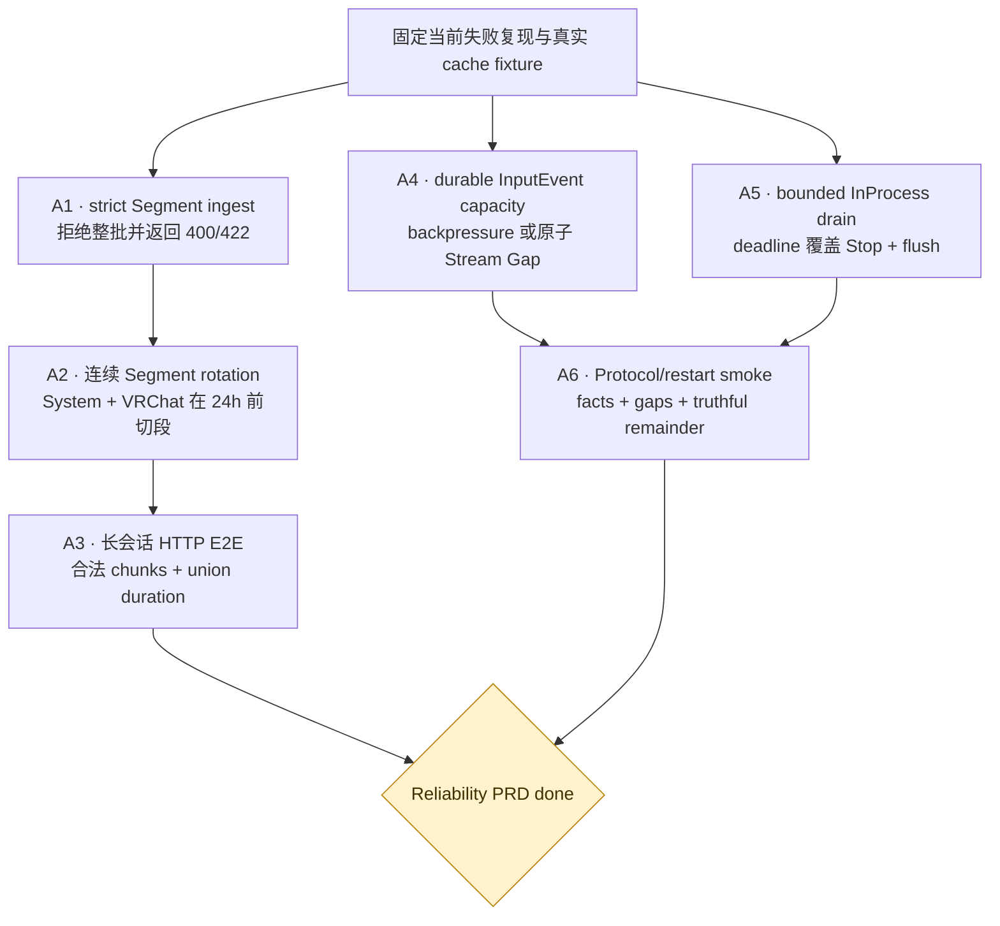
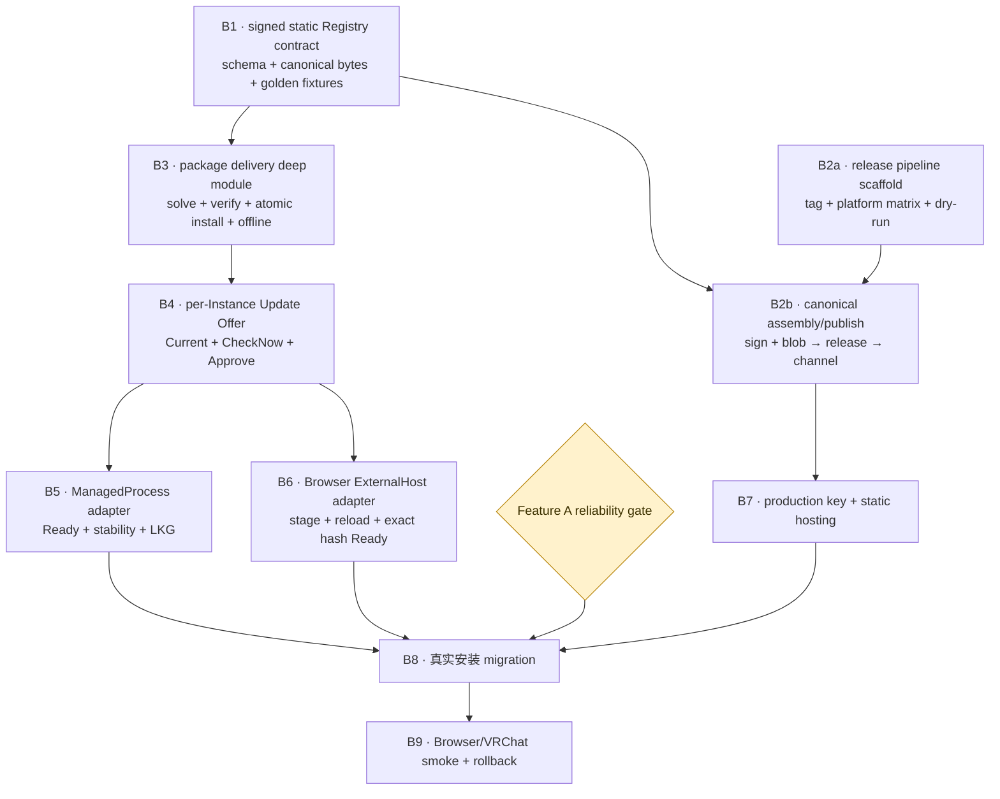
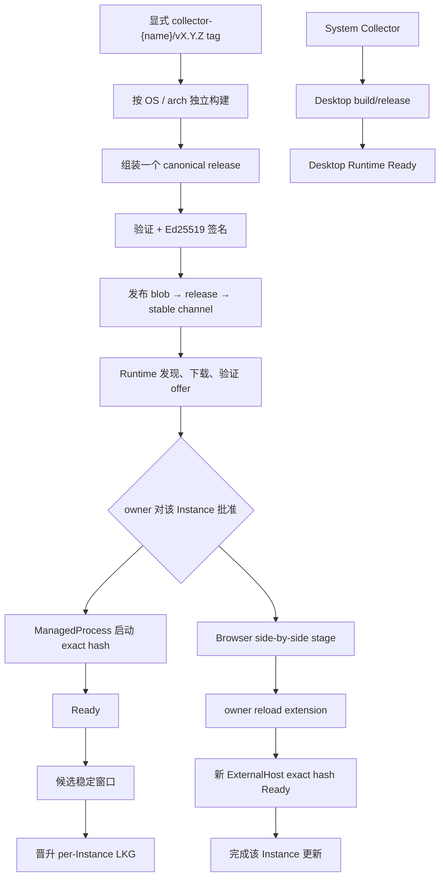

# Collector 独立交付实现路线图

本文把 [ADR-045](../adr/045-independent-web-delivery-for-collector-packages.md) 的实现拆成两个已有
tracker 的 feature，并固定它们之间与各自内部的依赖顺序：

- [Collector 数据可靠性收口](../../.scratch/collector-reliability-closeout/PRD.md)
- [Collector Package Registry](../../.scratch/collector-package-registry/PRD.md)

箭头表示“右侧开始或完成前必须满足左侧条件”，不是要求所有工作串行。没有依赖箭头的节点可以并行。
Analytics + Dashboard 原子发布、Headless production configuration 是扫描发现的独立应用/运维平面
风险，不塞进这两个 Collection feature；它们必须在对应平面实际发布前单独 closeout。

## Feature 之间的实现顺序

Registry contract、release tooling 和 Runtime delivery module 可以在可靠性修复期间开发；任何会改变
真实用户安装的 migration/rollout 必须等待 P1 reliability gate。System 始终走 Desktop BuiltIn
Delivery，不等待 Web Registry。

应用与运维平面的发布门禁与上图并行，不阻塞纯 contract/local implementation，但阻塞各自的生产发布：

这两条并行线目前是扫描结论，不冒充已建立的 implementation feature；开始实现时应分别建立 tracker，
并以真实 deployment state 为输入。

## Feature A：Collector 数据可靠性收口

数据真实性分成两条可并行 lane。Segment lane 先修服务端 truthful outcome，再用相同 strict contract
验证长时段旋转；Protocol lane 可以同时处理 InputEvent capacity 和有界 drain。四项全部完成后执行
跨进程 restart/replay smoke，才关闭 gate。

对应 tracker：

1. [strict Segment ingest](../../.scratch/repository-understanding/issues/05-strict-segment-ingest-outcomes.md)
2. [连续 Segment rotation](../../.scratch/collector-reliability-closeout/issues/01-rotate-continuous-segments.md)
3. [durable InputEvent capacity](../../.scratch/collector-reliability-closeout/issues/02-durable-input-capacity.md)
4. [bounded InProcess drain](../../.scratch/collector-reliability-closeout/issues/03-bounded-inprocess-drain.md)

其中 A1 → A2 是推荐的 tracer 顺序：先让下游拒绝结果可信，再证明上游永远生成合法 chunk。A4、A5
不依赖 Segment 代码，可以与 A1/A2 并行。

## Feature B：Collector Package Registry

Registry schema/golden fixtures 是发布方和 Runtime 的共同地基。Release pipeline 可以先搭矩阵框架，
但在签名/serialization contract 固定前不能发布 stable。Delivery module 完成后才向管理面暴露 offer；
ManagedProcess 与 Browser adapter 随后并行，最终共同进入人工 rollout。

issue 映射：B1 = issue 01；B2a/B2b = issue 02；B3 = issue 03；B4 = issue 04；B5 =
issue 05；B6 = issue 06；B7–B9 = issue 07。B1 与 B2a 可并行，B5 与 B6 可并行。

## 每个 Collector 的发布与更新路径

同一个 Registry feature 对不同 Execution Driver 有不同的真实成功判据；共享 Package publication，
不共享 Activation transaction 或 Last-Known-Good。

失败边界保持不变：发现、下载、验证或 Activation 失败不改写 Desired State；ManagedProcess 稳定窗口
失败只回滚该 Instance；Browser 在新 exact hash Ready 前继续把旧 Host/LKG 视为真实运行状态。

## 推荐落地批次

1. **Batch 1（并行）**：strict ingest；InputEvent capacity；bounded drain；Registry contract；release
   pipeline scaffold。
2. **Batch 2（并行）**：Segment rotation + 长会话 E2E；canonical release publish；delivery deep module。
3. **Batch 3**：per-Instance offer/approval；同时完成 reliability restart/replay gate。
4. **Batch 4（并行）**：ManagedProcess adapter；Browser ExternalHost adapter。
5. **Batch 5（人工门禁）**：production signing key、同域名静态 Registry、真实安装 migration、两类
   Collector smoke 与 rollback。

每个 batch 都应保持 main 可构建、可回滚；不得为了赶下一批把 `downloaded`、`approved`、`Ready` 或
`stable` 合并成一个状态。
