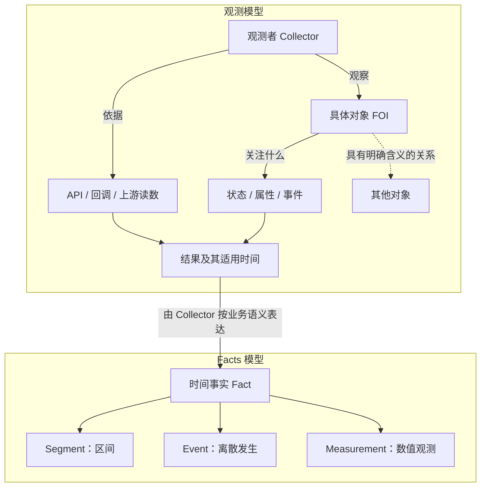
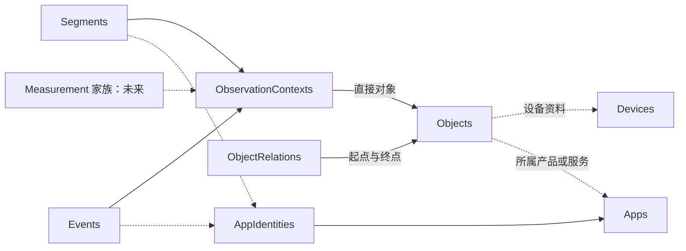

# 观测模型与 Facts 模型

状态：2026-09-10，观测模型保留；统一 Objects 登记与通用关系表退回待评估。
最新方向：**先在 Collector 运行时验证观测模型，保持当前存储；依据真实使用结果再评估存储改动。**
FOI 可以是临时对象：Browser 用窗口号维护并行活动，关闭后移除运行状态，已输出的活动独立保留。
观测模型与存储模型不一一对应，也不要求历史记录能够重建完整的临时 FOI。
用户最新反馈指出：承认对象和关系的业务语义，不等于需要统一登记全部可观测对象。
下文关于三表方案的确认记录是讨论历史，不再是当前实施基线；共享上下文也不必关联统一 Objects 表。
领域决定见 [ADR-056](../adr/056-observation-objects-and-contexts.md)；[存储候选](observation-storage-design.md)
保留字段推演和代码核对证据，代码及数据库未修改。

## 当前工作：运行模型验证

正式采集路径的第一步是 [观测模型改造：System](../../.scratch/observation-model-refactor/PRD.md)。
SystemActivityModel 判定本机桌面的活动转场，AppMonitorService 负责映射为现有 Segment；
对象身份由当前采集路径的设备绑定提供，不新增对象登记、协议字段或数据库实体。
自动验证与后续真机观察分别记录。以下 Browser 原型作为前置演练保留。

Browser 现有 `FoldState.open[windowId]` 已承担按临时窗口维护活动的职责，无需额外创建通用 FOI 类或登记服务。
2026-09-10 以现有 `fold.ts` 制作独立原型，纯逻辑演练验证双窗口并行、同窗口页面切换、关闭后另开窗口。
演练观察到关闭窗口移除运行状态，但最终 SegmentSnapshot 已输出；再次打开同页使用新的活动身份。
输出仍为现有 Browser 形状，未改主程序、SDK、协议或数据库。

原型与证据保存在 `codex/observation-runtime-prototype` 分支，入口见
[运行模型原型记录](../../.scratch/observation-runtime-prototype/PRD.md)。此验证只覆盖 Browser 的运行语义，
不冒充端到端持久化或完整跨 Collector 模型验收；页面交互因浏览器本地文件策略未验证。
后续沿运行实例与真实消费场景推进，不再以“完善模型”为由先扩展存储元数据。

## 已确认的设计方向

- 用户选择直接观测对象的业务模型：Browser 描述具体窗口的选中页面；Mac 是窗口的运行环境。
- 观测模型独立于 Facts 的存储模型推导。Subject 是旧术语；不以它的类型、归属粒度或一实例一 Subject 限制新模型。
- Stream 属于后续交付与组织设计，Payload 是事实内部的内容承载；两者不与观测对象作为同层概念竞争。
- 用户明确允许“先破后立”，本轮不再优先寻找兼容旧 Subject 的表示方案。
- 继续保留 Segment、Event、Measurement 三类 Facts 的基础方向；SDK 与协议设计暂停。本轮没有修改实现或数据库。
- 用户随后确认下文最小观测模型，进入对象引用与关系设计。对象、观测内容、观测者、来源、结果、时间是语义角色，不直接对应表或必填协议字段。
- 用户确认对象引用以作用域与对象标识辨认对象、用具体业务关系关联对象，并允许一条事实的结果引用其他对象；进入观测模型与 Facts 的连接设计。
- 用户确认每条 Fact 应能还原直接对象、观测内容、观测者及必要来源，并由家族表达时间与结果；进入具体存储关系设计。这不等于预先确认新增上下文表。
- 2026-09-10 曾讨论 Objects、ObjectRelations、ObservationContexts，以及家族事实经观测上下文关联对象；用户随后撤回统一登记与通用关系表的实施方向。该方案仅保留为历史候选，当前先运行 Collector 观测模型。

此前 AccountProfile、ReportingAccountSubjectId、每流一个 Subject 等字段提案退出当前候选基线。
它们试图先在旧结构上补齐场景，不能作为新模型的隐含要求。

## 两个模型的职责

观测模型回答：谁根据什么来源，观察哪个对象的什么状态或事件，得到了什么结果，结果适用于什么时间。

Facts 模型回答：怎样把需要保留的结果表达成具有时间语义的事实。
Segment 描述区间，Event 描述离散发生，Measurement 描述数值状态或窗口内的数值总体。
因此 Facts 不只是数据库布局，也规定时间及正常修订的语义；具体物理布局是它的实现。

两者的连接是“把观测结果表达为 Fact”。不在 Collector 与 Fact 之间强制增加一份持久化 Observation 记录。

## 已确认：最小的观测语义

以下是说明业务所需的角色，并非六张表、六个必填字段或新的格式注册协议。

| 角色 | 含义 | Browser 例子 |
| --- | --- | --- |
| 观测对象（FOI） | 事实直接描述的具体对象 | 浏览器上下文中的窗口 W1 |
| 观测内容 | 关注该对象的哪项状态、属性或事件 | 窗口的选中页面 |
| 观测者 | 执行获取和解释的 Collector | BrowserCollector |
| 依据/数据来源 | 信息通过什么途径取得 | 浏览器扩展 API 的事件与查询 |
| 结果 | 此次取得的业务内容 | URL 为 A，标题为 T |
| 时间 | 结果所描述的时刻或范围 | 09:00 起，当前已记录到 09:05 |

“观测内容”不要求建立通用属性目录；具体 Collector 可以用自己的业务词汇表达。
数据来源和观测者可以很简单，也可能不同：微信提供计步结果，Collector 负责读取；
读取微信结果不等于 Collector 自己计步。来源未提供的原始设备信息无需补造。

对象类型与 Fact 家族相互独立。例如同一个窗口，可以有“选中页面持续区间”的 Segment，
也可以有“窗口关闭”的 Event；若实际需要记录窗口数量等数值，则针对合适对象表达 Measurement。
同一个人也可以有活动 Segment、离散事件和步数 Measurement，不能把 Person 固定成 Measurement。

## 对象的身份与关系

对象是设备、具体窗口、服务账号或现实中的人等业务对象；FOI 是它在某次观测中扮演的角色。
App 产品、设备和账号不会因为关联在一起，就变成同一个对象。

判断对象身份的原则是：业务上需要独立追踪，且能在其有效作用域内辨认它。
引用身份以作用域和对象标识解释，具体编码稍后设计，不预先要求全局 UUID 或永久登记所有窗口。

- Mac1 与 Windows1 是不同设备；设备身份不取决于哪个 Collector 观察它。
- W1 与 W2 是两个窗口，即使属于同一浏览器、显示同一 URL，也需要独立追踪。
- 窗口号的含义依赖浏览器上下文及其有效生命周期，裸数字不代表全局窗口身份。
- 账号以服务及其实际标识作用域辨认；Collector 重装或迁移宿主本身不表示账号改变。
- 本人与我的微信账号、VRChat 账号是不同对象，可以建立明确的使用者关联。

关系按业务含义表达：设备承载应用运行上下文、运行上下文包含窗口、账号属于服务、
账号关联使用者。具有时间范围的关系，如某次使用 Quest3，需保留其时间含义。
不建立统一 Subject 父子树，也不把全部关系转换为永久属性。

关系可支持理解与查询，但不自动生成原始事实：窗口选中页面不证明系统前台；
账号位于世界 W 不证明使用 Quest3；多个来源关联本人不表示时长或累计步数可直接相加。

## 从观测到 Facts 的例子

| 观测对象 | 观测内容与依据 | 需要保留的事实 |
| --- | --- | --- |
| Mac1 | 系统提供前台应用状态 | Edge 在某个区间处于前台：Segment |
| 窗口 W1 | 浏览器提供选中页面状态 | 页面 A 在某个区间被选中：Segment |
| 窗口 W1 | 浏览器提供关闭事件 | 窗口在某时刻关闭：Event，若业务需要记录 |
| VRChat 账号 A | API 提供所在世界/实例 | 按 Collector 已明确的状态持续规则形成活动 Segment |
| 已明确归属的本人 | 微信提供某日累计步数 | 该日统计窗口的累计读数：Measurement，待真实来源落实 |

同一个窗口先看 A、再看 B、又看 A，是一个对象、三条 Segment；前后两段 A 可以有相同活动分组，
但不是同一条 Fact。进行中 Segment 的多次增长快照才是同一事实的修订。
一次读取也不必对应一条新 Fact；Collector 可以把多个读数折叠为区间事实，如何解释持续性属于业务语义。

步数读数保留来源的统计窗口及累计含义；3000 后更新为 4200 不表示共走 7200 步。
结果适用的日窗口与获取结果的时刻概念不同，这不自动要求新增 ObservedAt 存储列。



图中观测对象、内容与来源是结果的解释上下文；表示成 Fact 后仍需能够理解这些信息。
图不规定这些信息必须位于哪一张表、Stream 或 Payload，也不要求一份读数同时生成三类事实。

## 已确认：对象引用与关系的最小表示

用户已确认本节的概念方向。以下是用于逐个场景检验的概念表示，
不规定 JSON、数据库字段、UUID 算法或 SDK 接口。

### 引用回答“是哪一个”，资料回答“是什么”

对象引用的最小语义是 `(标识作用域, 对象标识)`。作用域说明标识在哪套命名规则及生命周期内有效，
不表示现实世界的父对象，也不表示由哪一个 Collector 拥有这个对象。
对象类型与显示名用于解释对象，不使用显示名判断对象相等。

| 示例引用（仅为说明） | 类型 | 展示名 | 身份含义 |
| --- | --- | --- | --- |
| `(本人的设备标识, d01)` | 设备 | Mac1 | 已辨认的设备；不随展示名或采集宿主改变 |
| `(浏览器运行 b07 的窗口标识, 17)` | 浏览器窗口 | 窗口 17 | 窗口号在对应浏览器上下文和有效生命周期内解释 |
| `(VRChat 的账号标识, usr_123)` | 服务账号 | 我的 VRChat 账号 | 服务标识账号；不随 Collector 重装或部署位置改变 |
| `(本人的人员标识, p01)` | 人 | 本人 | 显式建立的人员引用；不拿微信或 VRChat 的账号标识代替 |

表中的中文作用域与 b07 等名称是语义示意，不是拟定的协议字面值，也不要求新建目录服务。
设备/人员没有合适的原生标识时可以明确登记身份；具有可靠原生标识的对象按来源的标识作用域辨认。
窗口 scope 必须对应标识实际有效的上下文，不能简单用 Collector 每次启动作为窗口生命周期。

同一范围、同一标识引用同一对象；跨标识体系不按名字或产品自动合并。
不同 Collector 使用共同的对象引用时可关联各自事实，但对象相同不表示它们产生的是同一条 Fact。
目前没有共同标识时，保留各自引用；别名解析或跨来源身份匹配不作为通用接入前置系统。

对象资料只保留解释身份需要的信息。URL、标题变化、在线状态、当日步数属于观测结果，
不能通过修改“当前对象资料”替代历史事实。已关闭窗口的历史引用仍应可解释，
这不意味着必须存在独立的窗口生命周期管理服务。

### 关系直接表达业务含义

必要关系可先理解成 `(对象引用, 关系含义, 对象引用)`；每个关系使用明确含义，
不提供一个无差别的 parent，也不要求把所有对象放进某个根节点的子树。

| 关系例子 | 含义与依据 |
| --- | --- |
| 窗口 W1 → 运行于 → Mac1 | 窗口实际运行在哪台设备，由相应运行环境提供依据 |
| 窗口 W1 → 所属应用产品 → Edge | 解释窗口属于哪个应用产品；不把产品当成窗口身份 |
| VRChat 账号 A → 所属服务 → VRChat | 账号的服务归属 |
| 微信账号 B → 已确认使用者 → 本人 | 明确的使用者关联，不通过相同 Owner 自动推断 |

为了表达窗口所在设备，不强制构造“设备 → 安装实例 → 进程 → 窗口”整条对象链。
仅当一个中间对象需要被独立观察或区分时才引入它。
作用域也可以只是身份解释上下文，不必每个作用域都成为一个可观测对象。

### 随时间变化的关系本身可以是事实

设备与其窗口的运行关系在窗口生命周期内是结构背景；服务账号所属服务也是身份背景。
“本人 20:00–21:00 使用 Quest3”则是具有时间范围的业务内容，适合表达为区间事实。

该事实的直接对象可以是本人，观测内容是所用设备，结果引用 Quest3。
因此一条事实可以有一个直接描述对象，同时在结果中引用其他对象；多对象参与不要求多个直接对象。
类似地，VRChat 账号的所在世界作为结果引用世界，不需要修改账号资料的永久关系。
没有独立追踪世界的需求时，保留来源提供的 worldId 也足够，无需先登记世界对象。

由 Collector 观察到的设备使用可以形成采集 Fact；如果只有本人补充，则按人工说明保留时间和依据，
不把人工知识冒充 Collector 输出。本轮不扩展现有 Episode 的结构化关联能力。
账号使用者关联也不应被当成无条件、永久且覆盖全部历史的证明；历史解释只使用有依据的有效范围。
这些时间含义不要求此时实现通用关系历史表。

### 步数场景中的两个不同引用

“微信报告本人今天累计 4200 步”涉及：

- 直接观测对象：本人 p01。
- 获取来源：通过微信账号 B 获得的读数。
- Measurement 结果：对应日窗口的 4200 步，保留来源的累计语义。

账号 B 的作用是说明来源与归属依据，不能占掉本人作为直接对象的位置。
这说明对象引用既可以出现在直接对象位置，也可以在来源、结果或关系中出现；
并不因此决定采用 ReportingAccountSubjectId 或任何其他固定字段。

本节确定的概念是可解释的对象引用与必要的具体关系。
该轮未选择物理布局；后续已确认的存储关系见下文。别名匹配、传输 Stream 划分和 Payload 外壳不因该决定自动引入。

## 已确认：观测模型如何连接 Facts

本节业务含义已确认；此处只明确每条事实必须能解释的信息，已确认的存储关系方向见下一节。

### 一条 Fact 的完整含义

逻辑上可以理解为：

```text
Fact 的业务含义
  观测上下文：直接对象引用 + 观测内容 + 观测者及必要的数据来源
  家族表达：Segment / Event / Measurement 各自的时间语义与结果内容
```

“观测上下文”只是以上信息的合称，不是新增实体、表、ContextId 或需要提前创建的资源。
现有 FactId、Revision 继续表达具体事实的身份与正常修订，不承担观测对象或观测内容的身份。
Measurement 的具体记录身份与更新规则仍待真实来源设计，不能由这个概念式推导。

| 信息 | 业务职责 | 简化原则 |
| --- | --- | --- |
| 直接对象引用 | 说明本条事实直接描述谁 | 窗口、账号、本人使用同一种引用语义；结果或来源可另有对象引用 |
| 观测内容 | 说明关注该对象的哪项状态、属性或事件 | 使用 Collector 明确的业务词汇；无需属性目录或 Schema 注册 |
| 观测者 | 说明哪个 Collector 产生了这份事实 | 保留可辨认的生产者归属；运行机器不因此成为直接对象 |
| 必要的数据来源 | 说明取得结果的依据，以及影响解释的账号等上下文 | 能由该类采集方法明确解释的信息可共享；来源账号等会变化的信息须对应这条事实实际使用的来源 |
| 家族时间 | 说明结果适用于什么时刻或范围 | 沿用家族语义；发送时刻不自动成为业务时间 |
| 结果内容 | 保存具体读数、状态细节或事件详情 | Segment/Event 使用现有 Payload 承载业务内容；Measurement 随真实语义落实 |

观测内容不能只由对象类型、Source 或 Fact 家族猜测。同一个 BrowserCollector 可以描述
“选中页面”和“窗口关闭”，同一个对象也可以同时有不同属性的 Segment。
观测内容可以使用清楚的业务名称，但本轮不规定新增 Kind 枚举、schemaId 或固定 payload 外壳。

### 三个完整的事实示例

以下时间为同一已知日期下的简写；Event 是检验表达能力的例子，不表示当前 Browser 已输出窗口关闭 Event。
Measurement 是未来场景，未定义可执行存储或协议。

| 信息 | Browser 页面活动 | Browser 窗口关闭 | 微信累计步数 |
| --- | --- | --- | --- |
| 直接对象 | 窗口 W1 的引用 | 同一窗口 W1 的引用 | 本人 p01 的引用 |
| 观测内容 | 选中页面 | 窗口关闭 | 当日累计步数 |
| 观测者 | BrowserCollector B1 | BrowserCollector B1 | 微信步数 Collector C1 |
| 数据来源 | 浏览器 API 的状态/事件 | 浏览器关闭回调 | 通过微信账号 B 取得的上游读数 |
| 家族 | Segment | Event | Measurement |
| 适用时间 | 09:00–09:05 | 09:05 | 来源所定义的当天统计窗口，截至该读数对应时刻 |
| 结果内容 | URL、标题、适用的活动分组 | 若来源提供，可有关闭详情；无需捏造额外结果 | 4200、单位 step、累计含义 |

窗口关闭这条 Event 的事件含义及发生时刻已经构成有用事实，不强制再提供一个虚构的数值结果。
步数的统计日窗口、读数适用时刻与获取时刻要按来源实际语义区分；上述示例不新增通用 ObservedAt 列。

同一组观测上下文可以对应许多 Fact。例如同一窗口多次先后选择同一页面，会产生多条活动 Segment。
上下文相同不表示事实相同，也不构成跨 Collector 去重或直接相加的依据。

### 共享信息的条件

一条 Fact 必须能够直接或经稳定关联还原其观测含义，但不要求逐条复制 Collector 说明和所有对象资料。
历史事实不能依赖“Collector 当前正在登录哪个账号”解释来源，也不能把窗口当前 URL 当成旧 Segment 的结果。
这是语义保留要求，不预先决定把共享信息放 Stream、新建上下文表还是随记录携带。

对象资料、业务关系和 Fact 结果分别承担身份解释、对象关联和时间事实的职责。
静态对象资料可以共享；会改变历史解释的状态与关系，应保留相应的时间和依据。
不通过一份可随意改写的全局对象状态替代已保存的 Facts。

### 与已确定 Facts 核心的关系

Segment/Event 的家族、时间、单份 Payload、正常修订语义继续使用。
本节增加的是需要解释清楚的对象、观测内容和来源语义，不恢复通用 Facts 表或 Observation 表。
这些语义在物理上如何关联，是下文存储关系的变化点，不能宣称现有 Stream → Subject 已经满足新模型。

据此选择对象资料、关系及事实关联的存储布局；SDK 和传输设计继续后置。

## 历史候选：存储关系（统一登记与通用关系表已暂停）

用户曾接受本节方向，随后针对统一对象登记及通用关系表提出质疑。本节保留为历史候选。
当前先用真实存储/查询需求重新评估，不能按下列字段组直接实施。

### 选择共享的观测上下文

两个可行方向：逐条 Fact 保存对象、观测内容、生产者及来源；或把这些重复信息保存一次，Fact 引用它。
推荐后者：同一窗口选中页面、同一设备输入、同一账号状态可以分别产生很多事实，
共享信息可以减少逐条重复，并保持 Segment/Event 的家族表接近当前规模。
代价是增加关联查询，且引用的上下文必须保持历史含义。

这个取舍在存储讨论阶段得到确认：前面的业务模型只要求“能还原观测上下文”，存储选择才引入共享表。
表名沿用 ObservationContexts。它描述一组事实的共同业务含义，不是一次观测动作或一份额外结果。

### 三类元数据，各有一个用途

| 讨论阶段的候选表 | 用途 | 字段组（定稿见实施方案） |
| --- | --- | --- |
| Objects | 辨认并解释可引用的对象 | Id、OwnerId、Scope、Key、Kind、DisplayName；按实际资料关联可选 DeviceId、AppId |
| ObjectRelations | 保存对象之间需要查询的明确关系 | Id、OwnerId、FromObjectId、Relation、ToObjectId、可选 ValidFrom/ValidTo、依据说明 |
| ObservationContexts | 保存一组事实共享的观测含义 | Id、OwnerId、ObjectId、Observation、CollectorInstanceId、必要的来源说明 JSON |

候选命名仍可调整。Objects 取代 Subjects 的对象资料职责，ObservationContexts 取代 Streams
在存储里承担的观测归属职责；ObjectRelations 是新增关系存储。不是在旧链路旁并排建立另一套主路径。

Objects 的内部 Id 用于数据库关联；对外可解释身份仍是作用域及标识。
同一 Owner 的 Scope + Key 唯一，Owner 继续限定数据范围；关联不能串到其他 Owner 的私有对象。
对象与上下文的业务身份不使用内容哈希，不建立格式注册。

ObjectRelations 用来直接回答“Mac1 有哪些被记录的窗口”“哪些账号明确关联本人”等查询，
因此推荐独立关系表，而不是在每条事实中复制对象关系或依赖遍历任意 JSON。
关系依据可以是采集来源或明确的人工绑定；有效时间按已知信息记录。
尤其不能把缺失使用者关联有效时间解释为覆盖全部历史。
这不是通用图推理系统，也不自动推导关系传递或强制每个关系都产生事件。

生命周期内的结构关系和明确的身份绑定可放关系表；“本人这一小时使用 Quest3”这种活动
继续由时间事实表达，不同时在关系表维护另一份活动历史。

### 保留专门资料的含义

设备特有的运行资料继续由 Devices 承担，Objects.DeviceId 只在对象对应实际设备时关联。
App 与 AppIdentity 沿用产品及平台身份含义。Objects.AppId 可表达窗口所属产品、账号所属服务，
不为每个 Owner 复制一份全局 App 目录，也不把 App 产品强制登记成私有观测对象。
这是必要业务关系的专门外键表示；ObjectRelations 主要用于私有对象之间的联系。

逐条 Fact 的可选 AppIdentityId 继续保留。例如 System 以 Mac1 为直接对象，
当前观测到的应用可随不同 Fact 改变，不能移到固定设备对象资料中。
后续字段定稿选择窗口优先使用已有平台身份路径，AppId 主要用于服务账号，避免产品映射双份漂移。
账号或窗口的产品归属与一条事实的实际平台应用关联角色不同；来源账号所属微信
不自动进入微信前台时长统计。

### 上下文记录的具体例子

| 上下文 | 直接对象 | Observation（业务名称示例） | 观测者 | 必要来源说明 |
| --- | --- | --- | --- | --- |
| C1 | 窗口 W1 | browser.selected-page | BrowserCollector B1 | 浏览器 API |
| C2 | 窗口 W2 | browser.selected-page | BrowserCollector B1 | 浏览器 API |
| C3 | VRChat 账号 A | vrchat.account-location | VRChat Collector V1 | VRChat API |
| C4 | 本人 p01 | wechat.daily-steps | 步数 Collector S1 | 来源账号 B 的对象引用及实际计步来源说明 |

同一个 Collector 可以产生 C1、C2，观测对象不再由运行实例唯一决定。
C1 可以关联窗口 W1 的许多页面 Segment；URL、标题仍只在各自 Payload 中。
微信账号 B 是 C4 的来源信息，本人 p01 是直接对象，不预建 ReportingAccountSubjectId 专用列。
来源说明 JSON 只保留解释来源需要的共享信息，不复制逐条读数或凭据。

引用后的 ObjectId、观测内容、观测者及影响解释的来源保持原含义。
换成另一来源账号或另一个对象，应使用另一上下文；上下文不引入 Revision 或内容摘要体系。
Observation 使用业务名称；FactKind 由家族表表达，不为上下文强制一对一绑定一个家族。
是否共享一份上下文取决于业务含义相同，不意味着共享 Fact 身份或合并独立证据。

### 家族表上的精确变化点

候选方案将 Segments/Events 的 StreamId 关联替换为 ObservationContextId，
其他已确认核心字段继续保留：Id、OwnerId、FactId、Revision、Source、AppIdentityId、
家族时间与唯一一份 Payload。Source 继续在家族表中，不在新上下文中再加一份 Source 列。
所以 Segments 仍为 10 列，Events 仍为 9 列；Measurement 仍等待真实来源后建自己的家族表。

但这不是“核心模型完全没变”：事实关联及身份作用域从旧 Stream 改为观测上下文，
直接影响 ADR-055 的 Stream → Subject 路径与 (OwnerId, StreamId, FactId) 唯一身份。
目标使用 (OwnerId, ObservationContextId, FactId)，迁移必须保住旧事实身份对应关系，
不能因合并上下文导致两个原本不同的 Fact 撞到一起。后续实施方案已选择旧 Stream 到上下文
一一对应、UUID 原值保留，因此不拆分或合并历史事实；迁移代码尚未实施。

旧 Browser 的一条机器级 Stream 可能包含多个窗口，不能把该 Stream 原封不动改名为窗口上下文。
历史只按实际保存的窗口及来源信息映射；缺少完整身份作用域时不能编造全局窗口身份。
实施方案据此保留历史机器粒度；窗口粒度由具备身份依据的新观测开始，不用迁移补造。



本图没有恢复统一 Facts 表，也没有保留一张逐次 Observation 结果表。
SDK 后续可以用自己的交付组织，但传输连接或批次不再决定持久事实直接描述谁。
协议是否仍需要名为 Stream 的概念，暂不作决定。

## 旧实现与后续工作

现有 glossary 的 Subject、ADR-041 的“一实例一 Subject”、ADR-055 的 Stream → Subject
是旧实现与已记录决策的描述。本轮按用户要求重开观测归属设计，不将这些关系作为新概念模型的前提。
替代方向已由 ADR-056 记录，字段与映射已整理，但尚未修改运行中的实现或执行迁移。

对象引用、业务关系与 Fact 所需观测上下文的业务模型保留。
对旧三表候选已做过以下准备，但它们不构成继续建设统一对象库的理由：

1. 收敛元数据字段、必要约束与查询所需索引，明确每个字段的真实用途。
2. 给出旧 Subjects/Streams/家族事实到新关系的映射，处理 Browser 窗口身份与事实身份作用域，并同步替代的 ADR 条款。

以 System、Browser、VRChat 的完整记录检验映射；微信步数用于检验模型表达能力，仍不预建 Measurement 表。
下一步优先运行与验证 Collector 的观测过程；结合实际输出与查询，判断哪些信息需要保存。
统一对象登记、关系表、上下文外键替换及迁移暂停，SDK/协议不在本轮改动。

参考：[FOI 标准研究](feature-of-interest-research.md)、[SDK 讨论（暂停）](collector-sdk-design.md)。
