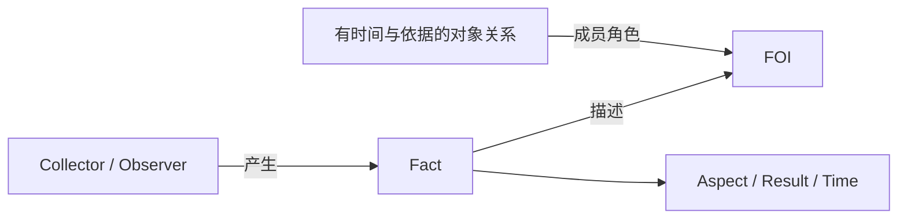

# Observations 与 Facts：当前模型基线

状态：2026-09-11，独立观测存储、通用保管、第一方生产者及查询/分析/Dashboard 的实现已整合。
本轮最终组合验收由 Ticket 09 承接；System/Browser/VRChat 的真实安装、权限、账号及兼容退出现场
证据仍由 Tickets 04–06 承接，不能据代码完成宣称全轮验收完成。业务库未迁移。DataSource 暂不纳入。
本文件汇总已确认的基础框架；术语见 [Shared Kernel](../../shared/CONTEXT.md)，
当前决策见 [ADR-059](../adr/059-observation-storage-five-tables.md)，
字段见[最小存储方案](observation-storage-minimal.md)。ADR-056 保留此前决策及实施背景。

## 存储的核心承诺

2026-09-11，用户确认：**多年后，仍能理解这是谁对什么对象、在什么时间、作出了什么观测。**

存储应保留足够的信息，解释 Observer、FOI、观测的 Aspect、结果及适用时间。
这一承诺作为后续存储设计的判断依据，不直接规定表结构，也不要求每个概念独立建表。
历史未保存的信息仍明确保持未知，不为满足承诺而补造观测依据。

## 两个模型

**Collector 对 FOI 产生 Fact，Fact 包含 Aspect、Result、Time。**

- Observer 是具体 Collector，不只是类型；身份跨停止、重启和更新保持。
- FOI 当前包括机器、App 产品、服务账号和个人；不要求窗口登记或应用上下文实体。
- 一个 Observer 可以观察多个 FOI，一个 FOI 也可以被多个 Observer 观察。

**Facts：Segment、Event、Measurement。**

- Aspect、Result、Time 共同表达完整事实；三个家族保留各自的时间和正常修订语义。
- Measurement 可适用于时刻或区间，不能把它一律当作点时间事实。
- 一次读取不必产生一条新 Fact，多次观测可以支撑同一条 Segment 的增长。

## 事实与对象

每条 Fact 引用具体 Collector 和一个 FOI，表达该对象的 Aspect、Result、Time。
机器、App、账号和个人可以独立存在，不以另一种对象存在为前提。
App 是跨设备产品；设备信息在有依据时通过明确关系表达，不要求创建应用上下文实体。
例如 Windows1 上的 VRChat 使用账号 A，是 device、app、account 三个角色共同参与的有时效关系。
只有账号观测时，保存账号 Fact；没有设备/App 运行证据，就不建立运行关系。
账号属于某服务不证明其运行设备，Collector 的宿主也不自动成为被观测设备。

用户确认同一 Fact 的 Observer、FOI、Kind、Aspect 在生命周期内固定；实际改变其中任一项时
产生新的 Fact Id。正常修订可以更新 Result、Segment 的结束时间及有依据的关系，
但保持 Segment 起点和 Event 发生时刻。App 产品目录身份解析与维护沿用既有独立规则，
不视为采集器更换实际观测对象。

用户确认保留 Revision，表示同一 Fact 的快照版本；新内容不以结束时间推导版本。Segment 持续增长即会产生新版本，
低版本重放不能覆盖高版本，旧快照的 ACK 不能确认仍待交付的新快照；未变化的 Event 可保持版本 1。

## 对象身份与关系

- 对象由稳定标识辨认，展示名称不参与身份判断。多个 Facts 指向同一对象不代表同一个 Fact。
- 对象关系有明确业务含义、成员角色、已确认适用范围及依据；缺少关系不阻止保存事实。
- 关系的空时间边界表示该方向无界，不能代替时间未知；不能用当前关联覆盖没有证据的历史。
- 使用者关联由 Heartbeat 在 Facts 外维护；补充或纠正关联不改写原始观测结果。
- 关系种类与角色按实际需求限定，不做任意关系推理。

## 本轮范围

目标核心表为 Collectors、Objects、Facts、Relations、RelationMembers。
DataSource 和计算口径暂不展开；Measurement 的具体数值业务约束待真实需求明确。
当前 Segment/Event 从 System、Browser、VRChat 实际生产者经 SDK/协议、Runtime 和 HTTP 传递
自身 Id、Kind 与完整观测。原生入口不要求 Subject/Stream，保存生产者 Id；完整性校验不借用旧输入
推断。旧 HTTP、缓存和进行中事实在明确兼容边界保留原身份，适配后汇入同一保存核心和唯一 Facts。
新旧独立身份碰撞明确拒绝，不能把一个旧 FactId 直接当作历史行 Id。

查询按 Object UUID 和准确 Fact 关系运行；应用上下文实体与本人关联旧表已由对象/关系替代。
分析和 Dashboard 按 Aspect 解释，Source 可空且如实未知，Result 的未知 JSON 无损保管。
此前“字段已贯通，但 FactStore 强制旧 Stream/Subject”的诊断是本轮实施起点，见
[实施交接的历史起点](observations-implementation-handoff.md#历史起点实施前静态诊断)，不再描述当前原生路径。

用户确认：本轮以 Observations 新模型在存储、Runtime 及所有相关代码中完整落地为完成标准。
范围覆盖第一方 Collector、SDK、协议、缓存、HTTP、持久化、查询、分析、Dashboard 与相关测试；
只新增服务端入口或完成部分层次不算解决根因。旧数据与旧缓存按既有保全规则转换，不能成为
新事实主路径对旧模型的持续依赖。

用户明确采集器填错 FOI 不属于业务场景，本轮不据此设计更换观测对象的纠错机制。
这不改变已有 App 产品目录身份解析与纠错规则。其余事实修订边界不由该回答隐含扩展。

业务库尚未迁移，暂停的完整副本资源/恢复演练未恢复。
此前方案保留在[历史讨论](collector-observation-model-proposal.md)、ADR-055/056 及
[上一轮切换记录](observation-target-cutover.md)；与五表目标冲突的选择以 ADR-059 为准。

显式 Aspect 已从第一方 Collector 贯通到存储、分析及 Dashboard；具体契约、旧缓存升级与协议切换见
[Fact 的观测语义边界](observation-semantics.md)。
本轮已核实的实现差异与编码验收见[实施交接](observations-implementation-handoff.md)。
