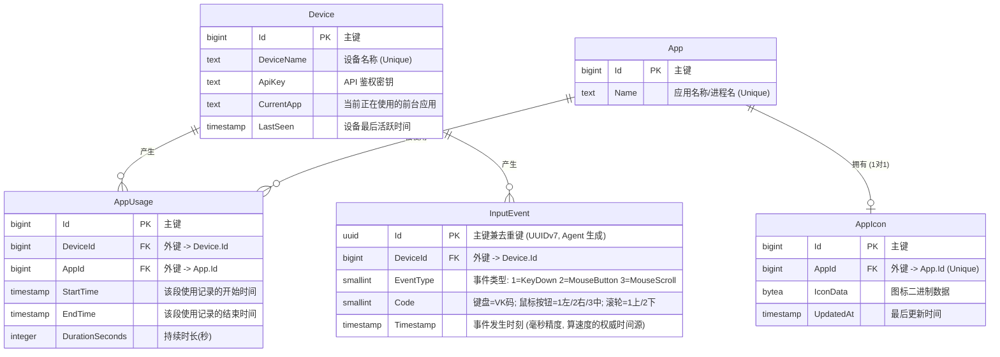

# Heartbeat 数据库设计

本项目使用 EF Core (PostgreSQL) 作为数据持久化方案。实体关系图如下：

## InputEvent 说明

原始输入事件流，一行一个键盘按下/鼠标操作事件，不做时间桶聚合或 delta 编码（详见 [ADR-012](adr/012-input-event-tracking.md)）。

- `Id` 为 UUIDv7，既是主键又是唯一去重键，服务端插入用 `ON CONFLICT (Id) DO NOTHING` 保证离线重传幂等。
- 推荐索引 `(DeviceId, Timestamp)`，支撑按设备 + 时间范围的计数查询。