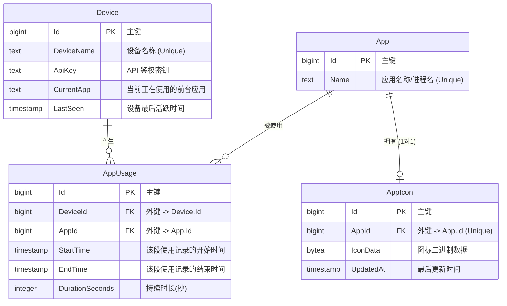

# Heartbeat 数据库设计

本项目使用 EF Core (PostgreSQL) 作为数据持久化方案。实体关系图如下：

```mermaid
erDiagram
    Device {
        bigint Id PK "主键"
        text DeviceName "设备名称 (Unique)"
        text ApiKey "API 鉴权密钥"
        text CurrentApp "当前正在使用的前台应用"
        timestamp LastSeen "设备最后活跃时间"
    }

    App {
        bigint Id PK "主键"
        text Name "应用名称/进程名 (Unique)"
    }

    AppIcon {
        bigint Id PK "主键"
        bigint AppId FK "外键 -> App.Id (Unique)"
        bytea IconData "图标二进制数据"
        timestamp UpdatedAt "最后更新时间"
    }

    AppUsage {
        bigint Id PK "主键"
        bigint DeviceId FK "外键 -> Device.Id"
        bigint AppId FK "外键 -> App.Id"
        timestamp StartTime "该段使用记录的开始时间"
        timestamp EndTime "该段使用记录的结束时间"
        integer DurationSeconds "持续时长(秒)"
    }

    Device ||--o{ AppUsage : "产生"
    App ||--o{ AppUsage : "被使用"
    App ||--o| AppIcon : "拥有 (1对1)"
```