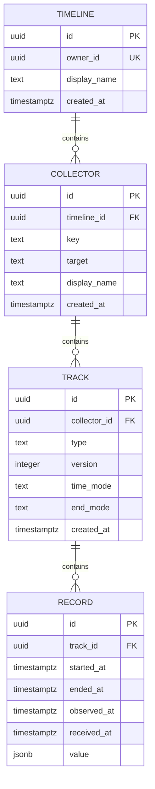

# 记录存储模型规范

状态：已确认

本文档记录逐表评审后确认的存储设计。`Timeline`、`Collector`、`Track` 和 `Record` 四张表的结构已经定案。

持续状态的区间续期规则已由 [ADR-0002](adr/ADR-0002-monotonic-record-extension.md) 确认，不增加表字段；续期写入和相关重放逻辑尚未实现。

## 关系



## Timeline

一行表示一个 Owner 的完整记录空间。更换设备、重新安装 Collector、进入新会话、切换项目或跨越时间范围，都不会创建新的 Timeline。

| 字段 | PostgreSQL 类型 | 可空 | 可修改 | 含义 |
| --- | --- | --- | --- | --- |
| `id` | `uuid` | 否 | 否 | Heartbeat 自己的身份，由应用生成 UUID v7。 |
| `owner_id` | `uuid` | 否 | 否 | Auth 签发令牌中经验证的 UUID `sub`。它是外部引用，不是数据库外键。 |
| `display_name` | `text` | 否 | 是 | Timeline 自己负责的显示名称。可以使用 Auth 显示名称初始化，但不要求与 Auth 保持同步。 |
| `created_at` | `timestamptz` | 否 | 否 | Heartbeat 创建 Timeline 的时间，由应用时钟提供。 |

约束：

- 主键：`id`。
- 唯一约束：`owner_id`；一个 Owner 只有一个 Timeline。
- `display_name` 去除首尾空格后不能为空。
- 删除 Timeline 是显式的数据清除操作；子表外键不级联删除。

不保存：

- 第二个通用 `name`。
- Owner 的用户名、邮箱或登录身份。
- Timeline 时区。
- `updated_at`。

## Collector

一行表示 Timeline 中一个 Collector 实现与一个 Target 的稳定绑定。它不是进程、安装实例、凭据或当前运行配置。

Collector 的稳定地址是：

```text
(timeline_id, key, target)
```

| 字段 | PostgreSQL 类型 | 可空 | 可修改 | 含义 |
| --- | --- | --- | --- | --- |
| `id` | `uuid` | 否 | 否 | Heartbeat 自己的身份，由应用生成 UUID v7。 |
| `timeline_id` | `uuid` | 否 | 否 | 所属 Timeline，是指向 `timelines.id` 的数据库外键。 |
| `key` | `varchar(255)` | 否 | 否 | 全局唯一且不包含版本的 Collector manifest ID。 |
| `target` | `varchar(255)` | 否 | 否 | 由对应 Collector 定义并规范化的稳定 Target 身份。 |
| `display_name` | `varchar(255)` | 否 | 是 | Collector 自己负责的显示名称。 |
| `created_at` | `timestamptz` | 否 | 否 | Heartbeat 注册 Collector 的时间，由应用时钟提供。 |

约束：

- 主键：`id`。
- 外键：`timeline_id` 指向 `timelines.id`，限制级联删除。
- 唯一约束：`(timeline_id, key, target)`。
- `key`、`target` 和 `display_name` 去除首尾空格后不能为空，且均不得超过 255 个字符。
- `key` 是小写、使用点号分段且不包含版本的标识，例如 `heartbeat.collector.desktop.macos`。

生命周期规则：

- 注册 Collector 要求 Timeline 已经存在，不隐式创建 Timeline。
- 注册按 `(timeline_id, key, target)` 幂等解析：地址尚不存在时创建 Collector，已经存在时返回原 Collector。
- 重复注册可以更新 `display_name`；并发更新时，以最后成功提交的值为准。
- `key` 和 `target` 不变时，重启、重新安装、程序升级、凭据轮换或重新连接都复用原 Collector。
- `timeline_id`、`key` 或 `target` 改变时，创建新的 Collector。
- Collector 负责提供规范化的 `target`；Heartbeat 不解释其内部格式，只去除首尾空格并按完整字符串精确比较。
- 本表不表示 Collector 是否已经安装、启用、连接或健康。
- 安装身份和运行身份与 Target 身份相互独立。

不保存：

- Collector 配置或凭据。
- 安装身份。
- 启用、连接或健康状态。
- 通用 JSON metadata。
- `updated_at`。

Payload 不能只根据 Collector 的 `key` 解码。一个 Collector 可以产生多种记录；具体的数据协议由 Track 的 `(type, version)` 标识。

## Track

一行表示 Timeline 上的一条同类数据轨道。它汇集一个 Collector 产生、由同一数据协议解释且具有相同时间行为的 Record。Track 是多条 Record 的容器和固定协议，不表示某一次具体观测。

确定结构：

```text
id uuid NOT NULL
collector_id uuid NOT NULL
type text NOT NULL
version integer NOT NULL
time_mode text NOT NULL
end_mode text NULL
created_at timestamptz NOT NULL
```

- `id` 是 Heartbeat 自己的身份，由应用生成 UUID v7。
- `collector_id` 是所属 Collector 的数据库外键，创建后不可修改；存在 Track 时限制删除 Collector。
- `type` 是 Record 数据协议的全局名称。不同平台和不同 Collector 可以产生相同 `type`，例如 Windows、macOS 和 Android Collector 可以共同产生焦点窗口类型。
- `version` 是该 `type` 的 Payload 格式版本。
- Payload 解码器由 `(type, version)` 选择，不依赖具体 Collector。
- 相同 `(type, version)` 的时间模式由应用中的全局类型注册表验证，不增加数据库类型定义表。
- `time_mode` 表示 Record 占据一个时间点还是一段时间区间，取值为 `point` 或 `range`。
- `end_mode` 只用于 `range`，取值为 `explicit` 或 `next_record`。
- `point` 的 `end_mode` 必须为空。
- `range + explicit` 的结束时间由本条 Record 明确给出。
- `range + next_record` 的结束时间由下一条 Record 的开始时间动态推导，不回写前一条 Record，因此迟到或乱序数据可以通过重新排序得到正确结果。
- 同一个 Collector 的同一个 `type` 和 `version` 只有一条 Track，不增加 `key`、`layer` 或其他分轨字段。多条 Point Record 可以具有相同时间，并在 Payload 中携带各自内容。
- 同一 Track 可以包含多个观测对象；Explicit Range Record 可以重叠，并按各自 Record ID 独立续期。窗口等对象身份由具体协议在 `value` 中表达，展示分组不要求存储分轨。该规则不为 `next_record` 增加按对象推导后继的能力。
- 桌面焦点等需要确认持续性的状态采集使用 `range + explicit`，按下文规则延长已确认区间，不依赖下一条 Record 跨越观测空白。`range + next_record` 保留，其适用协议和断采规则仍需另行确定。
- `created_at` 由应用时钟提供。
- 不保存通用 JSON metadata 或 `updated_at`。
- Track 的显示名称来自 `(type, version)` 的代码注册定义和本地化资源，不存入 Track。对应程序不可用时，界面回退显示原始 `type`。

约束：

- 主键：`id`。
- 外键：`collector_id` 指向 `collectors.id`，限制级联删除。
- 唯一约束：`(collector_id, type, version)`。
- `version` 必须大于零。
- `time_mode = point` 时，`end_mode` 必须为空。
- `time_mode = range` 时，`end_mode` 必须为 `explicit` 或 `next_record`。

## Record

一行表示符合所属 Track 数据协议的一份观测记录，可以表达一个时间点或一段已确认持续的观测。Collector 负责把平台数据规范化为 Track 的全局 `(type, version)` 协议；Record 不保存对人的活动解释，也不要求保存平台 API 返回的原始字节。

已经定案的字段：

```text
id uuid NOT NULL
track_id uuid NOT NULL
started_at timestamptz NOT NULL
ended_at timestamptz NULL
observed_at timestamptz NULL
received_at timestamptz NOT NULL
value jsonb NOT NULL
```

- `id` 由 Collector 在创建 Record 时生成 UUID v7。同一 Record 的续期和上传重试必须复用原 `id`；身份相同不代表请求内容必然相同，写入时仍需校验固定字段。
- `track_id` 是所属 Track 的数据库外键，创建后不可修改；存在 Record 时限制删除 Track。
- `started_at` 是 Record 在 Timeline 中的时间点或区间开始。
- `ended_at` 只在 `range + explicit` 中有值；`point` 和 `range + next_record` 中为空。
- `observed_at` 是 Collector 获得该信息的时间；为空时表示与 `started_at` 相同。
- `received_at` 是 Heartbeat 接收 Record 的时间，由 Heartbeat 应用时钟生成；续期和重试保留首次成功写入时的值。
- `value` 保存符合 Track `(type, version)` 协议的规范化 JSON 值。它可以是对象、数组、数字、字符串或其他协议允许的 JSON 值。
- 普通 Record 创建后不可修改。持续状态的 `range + explicit` Record 允许仅延长 `ended_at`，固定身份、起点和观测值；规则见下文。正常续期不提供区间缩短、内容替换或通用修正链。历史纠错与删除需要单独设计，包括防止删除后的旧重传恢复记录；不能仅凭删除和新增处于同一事务，就认为后续重传问题已解决。
- 不增加通用原始平台 Payload 字段。某种 Record 需要保留来源信息时，由该类型自己的协议把它放入 `value`。
- 跨平台应用身份不直接写入 Record 的观测值。Record 使用统一结构保存平台、标识种类和平台原生标识；读取或分析时，再由可更新的应用身份注册表把 Windows 可执行文件、macOS Bundle ID 和 Android Package Name 等解析为同一个 Application Identity。
- Record 保留 Timeline 时间、Collector 观察时间和 Heartbeat 接收时间三个时间维度。实时采集时，Timeline 时间与观察时间通常相同；历史导入时可以不同；离线上传时接收时间可以更晚。
- Collector 观察时间使用可空覆盖值。它为空时表示观察时间等于 Timeline 时间，只在二者不同时保存实际值。
- 不保存通用 `sequence`。默认按 `(track_id, started_at, id)` 获得稳定顺序；某种来源确实需要额外序号时，由自己的协议将序号放入 `value`。
- 不保存通用 `source_key`。Record 的网络重试通过复用同一个 `id` 实现幂等；少数增量拉取或历史导入 Collector 所需的游标、上游事件去重等状态，属于该 Collector 实现自己的同步机制，不进入通用 Record 模型。

约束：

- 主键：`id`。
- 外键：`track_id` 指向 `tracks.id`，限制级联删除。
- 检查约束：`ended_at IS NULL OR ended_at >= started_at`。
- `ended_at` 与 Track 时间模式是否一致，由写入代码根据所属 Track 验证，不使用跨表触发器，也不在 Record 中冗余 `time_mode` 或 `end_mode`。

索引：

- 初始只增加 `(track_id, started_at, id)` B-tree 索引，用于按 Track 稳定重放。
- 暂不为 `received_at`、`observed_at` 或 `ended_at` 建索引；出现实际查询需求后再增加。

## 持续状态的区间续期

以下规则用于持续状态的 `range + explicit` Record，不把所有记录类型都变成可修改的快照。

- Collector 首次确认状态时创建 Record；状态不变且持续观测时，复用 ID，延长 `ended_at`。Collector 可以在本地合并多次确认，按上传间隔发送最新的完整区间，不必为每次确认新增 Record。
- 状态变化时创建新的 Record。实际断采、重启或失去采集能力后，无法确认连续性时，也创建新的 Record；值相同不构成连接两段的依据。
- 同一 Record 的固定字段不一致时拒绝写入。合法续期在数据库中原子合并：`ended_at = max(已有 ended_at, 收到的 ended_at)`。重复、乱序和迟到上传不会使已确认区间缩短。
- 固定字段校验包括 `track_id`、`started_at`、规范化后的 `observed_at` 和 `value`。`value` 按 PostgreSQL jsonb 值相等判断，对象属性顺序和空白不同不构成内容变化。
- 不新增 `revision`、`is_final` 或 Record TTL 字段。普通上传不要求服务端永久封存旧 Record；Collector 停止延长旧 Record 即可。
- Collector 在上传前持久保存 Record ID 和待上传内容；服务端提交后确认。重试复用已有身份，待上传的新进度不能被较旧请求的确认清除。持久队列的具体实现仍待设计。

TTL 只用于判断是否仍有及时的观测确认。它根据 Collector 的上传间隔设置并留出延迟余量；具体配置位置和算法尚未确定。TTL 到期不修改 `ended_at`，也不阻止后续补传。历史区间只到最后确认的位置，后面的时间显示未知；有效补传可以补回此前未知的区间。收到旧的离线数据本身不证明 Collector 当前仍在正常观测。

Collector 在一段连续采集开始时同时记录系统时间和单调时钟读数，后续观测时间以基准时间加单调时钟经过的时长计算，避免每次续期直接使用可能跳变的系统时间。只有实际观测才能延长区间，计时器经过的时长本身不构成持续观测依据。跨重启、失去采集能力等边界不假定连续性。

该规则保证合法区间更新的合并结果，不保证设备的绝对时间准确。初始时间基准错误仍可能导致整段偏移；时钟异常检测、重新建立基准及跨设备对时需在 Collector 时间实现中明确。当前不承诺自动校正已存历史时间，也不借此开放任意区间回写。

## 跨 Collector 的设备身份

[ADR-0003](adr/ADR-0003-device-identity-across-reinstallation.md) 已确认：Device Identity 跨系统重装保留，重装后允许用户手动选择已有设备并重新关联。身份延续不表示观测连续，跨重装仍创建新的持续状态 Record。

该决定尚未实现，未改变本文四张表的结构。设备标识的生成与恢复、跨 Collector 配对方式、与 Target 的关系以及错误关联的修正方式仍待讨论。

当前先由需要设备信息的具体协议在 `value` 中携带设备标识，不新增设备表或通用关联结构。共享标识的传递与重装后恢复方式，留到桌面和浏览器采集流程中设计。

## 未决设计

- TTL 的具体配置、算法以及与迟到补传的实时状态判断。
- `range + next_record` 的适用协议和断采规则。
- 历史纠错、删除与旧重传的处理。
- Collector 的时钟异常检测、时间基准重建和持久上传队列。
- Track 的协议升级和跨 Collector 关联。
- 桌面 Collector 与浏览器 Collector 如何共享和恢复协议中的设备标识。
