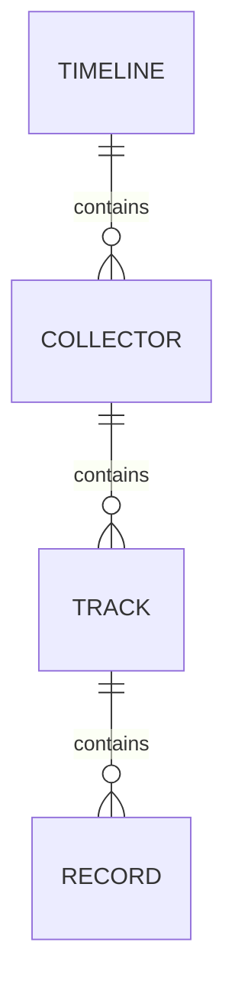

# 记录存储模型

状态：已确认

本文档是 `Timeline -> Collector -> Track -> Record` 持久模型及其不变量的权威来源。HTTP 契约见[记录接口](recording-api.md)。



所有 ID 均为应用生成的 UUID v7。外键使用限制删除，不级联清除下层数据。

## Timeline

一行表示一个 Owner 的完整记录空间。设备、安装、会话、项目或时间范围变化都不创建新 Timeline。

| 字段 | 类型 | 约束与含义 |
| --- | --- | --- |
| `id` | `uuid` | 主键，不可修改 |
| `owner_id` | `uuid` | 唯一；来自验签令牌的 UUID `sub`，不是数据库外键 |
| `display_name` | `text` | 可修改；去除首尾空格后非空 |
| `created_at` | `timestamptz` | 应用创建时间，不可修改 |

Timeline 不保存 Owner 的用户名、邮箱、时区或 `updated_at`。

## Collector

一行表示 Collector 实现与 Target 的稳定绑定，地址为：

```text
(timeline_id, key, target)
```

| 字段 | 类型 | 约束与含义 |
| --- | --- | --- |
| `id` | `uuid` | 主键，不可修改 |
| `timeline_id` | `uuid` | 指向 Timeline，不可修改 |
| `key` | `varchar(255)` | 小写点号分段、无版本的 manifest ID |
| `target` | `varchar(255)` | Collector 规范化的稳定 Target |
| `display_name` | `varchar(255)` | 可修改的展示名 |
| `created_at` | `timestamptz` | 应用创建时间，不可修改 |

`key`、`target` 和 `display_name` 去除首尾空格后非空。注册按稳定地址幂等；重复注册可更新 `display_name`，最后成功提交者生效。重启、重装、升级或凭据轮换不改变地址；地址任一部分变化时创建新 Collector。

Heartbeat 不解释 Target 的格式。Collector 不表示安装、进程、凭据、配置、连接或健康状态。

## Track

一行表示一个 Collector 产生、由同一协议解释且时间行为相同的一组 Record。

| 字段 | 类型 | 约束与含义 |
| --- | --- | --- |
| `id` | `uuid` | 主键，不可修改 |
| `collector_id` | `uuid` | 指向 Collector，不可修改 |
| `type` | `text` | 全局数据协议名 |
| `version` | `integer` | 正整数 Payload 版本 |
| `time_mode` | `text` | `point` 或 `range` |
| `end_mode` | `text` | Point 为空；Range 为 `explicit` 或 `next_record` |
| `created_at` | `timestamptz` | 应用创建时间，不可修改 |

唯一约束为 `(collector_id, type, version)`。已有 Track 的时间定义不能修改。

Payload 解码只依赖 `(type, version)`，不依赖 Collector。后端不维护协议注册表，也不解释或校验具体 Payload。

- `range + explicit` 的结束时间由本条 Record 给出。
- `range + next_record` 的结束时间由下一条 Record 的开始时间动态推导，不回写前一条 Record。
- 同一 Track 可以包含多个观测对象和重叠的 Explicit Range。
- Track 不保存展示名、metadata 或 `updated_at`。

## Record

一行表示一个时间点或一段已确认持续的观测。

| 字段 | 类型 | 约束与含义 |
| --- | --- | --- |
| `id` | `uuid` | Collector 生成；续期和重试复用 |
| `track_id` | `uuid` | 指向 Track，不可修改 |
| `started_at` | `timestamptz` | 时间点或区间开始 |
| `ended_at` | `timestamptz` | 仅 `range + explicit` 使用，且不早于开始时间 |
| `observed_at` | `timestamptz` | Collector 获得信息的时间；空表示等于 `started_at` |
| `received_at` | `timestamptz` | 后端首次成功接收时间 |
| `value` | `jsonb` | 协议定义的任意 JSON 值 |

后端按所属 Track 验证 `ended_at` 的形状。Record 不冗余时间模式，也不保存通用 `sequence`、`source_key`、原始 Payload 或 metadata。需要来源信息或上游序号时，由具体协议写入 `value`。

默认稳定顺序为 `(track_id, started_at, id)`，初始索引也只覆盖这三列。其他索引在出现实际查询需求后增加。

平台原生应用标识保存在协议 value 中，跨平台 Application Identity 由读取或分析阶段解析，不改写历史 Record。

## 持续区间续期

[ADR-0002](adr/ADR-0002-monotonic-record-extension.md) 规定 `range + explicit` 的持续状态按以下规则续期：

- 首次确认创建 Record；状态不变且持续确认时复用 ID，只延长 `ended_at`。
- 状态变化、断采、重启或能力丢失后创建新 Record；值相同不能跨 Observation Gap 连接。
- 数据库原子执行 `ended_at = max(已有值, 收到值)`。
- 同一 ID 的 `track_id`、`started_at`、规范化后的 `observed_at`、`value` 和时间形状必须一致。
- JSON 对象属性顺序和空白差异不构成 value 冲突。
- 重试和续期保留首次 `received_at`。

当前普通写入不支持区间缩短、value 替换或通用更正链。[ADR-0006](adr/ADR-0006-result-correction-semantics.md) 已确认未来模型需要支持结果更正，机制仍待设计。

TTL 只用于判断是否缺少及时确认，不修改 `ended_at`，也不阻止补传。Collector 使用系统时间建立基准，以单调时钟推进连续区间；只有实际观测才能续期。该规则不校正错误的初始绝对时间。

Collector 保存尚未交给 Hub 的快照；Hub 在 SQLite 事务提交后接管，再独立上传后端。当前 macOS Collector 的交接前缓冲仍在内存，见 [Hub 交付](hub-record-delivery.md)。

## Device Identity

[ADR-0003](adr/ADR-0003-device-identity-across-reinstallation.md) 规定 Device Identity 跨系统重装保留，并允许用户手动重新关联。该决定尚未实现，也不改变当前四张表。

当前由具体协议在 `value` 中携带设备标识。macOS Collector 暂以 Target 作为 `device_id`，不表示 Device Identity 注册表已经实现。

## 未决事项

TTL、`range + next_record`、结果更正、时钟异常、交接前数据保护和设备关联见[未决设计](recording-open-questions.md)。
