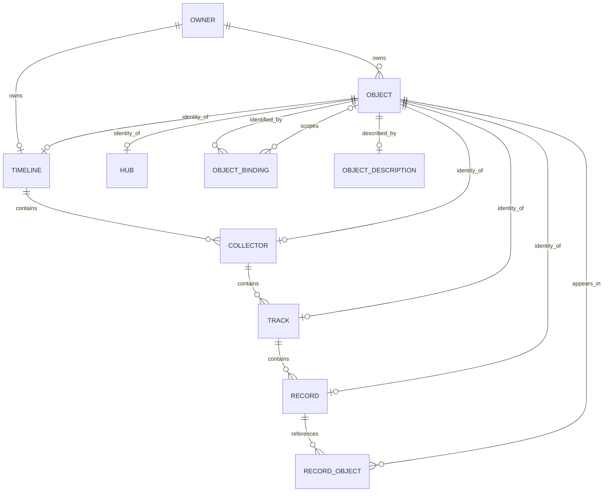

# 记录存储模型

状态：已确认

了解系统整体用途和各项业务，可先读[系统与业务总览](system-overview.md)。

本文档是记录归属、普通写入规则与持久结构的权威来源。先读关系、操作与不变量，再查后面的字段。术语见[领域语言](../CONTEXT.md)，HTTP 表达见[记录接口](recording-api.md)，对象引用格式与查询语义见[对象契约](record-objects.md)，交付责任与回执见[Hub 交付](hub-record-delivery.md)。

这是对已有决策和实现的轻量形式化描述。下文“已实现”指当前支持的操作；“已接受、未实现”表示领域需求已确认，尚无可用机制。普通写入的限制不能用来否定未来的结果更正语义。

## 关系与身份


```mermaid
erDiagram
    OWNER ||--o| TIMELINE : owns
    TIMELINE ||--o{ COLLECTOR : contains
    COLLECTOR ||--o{ TRACK : contains
    TRACK ||--o{ RECORD : contains
    OWNER ||--o{ OBJECT : owns
    OBJECT ||--o| TIMELINE : identity_of
    OBJECT ||--o| COLLECTOR : identity_of
    OBJECT ||--o| TRACK : identity_of
    OBJECT ||--o| RECORD : identity_of
    OBJECT ||--o| HUB : identity_of
    OBJECT ||--o{ OBJECT_BINDING : identified_by
    OBJECT |o--o{ OBJECT_BINDING : scopes
    OBJECT ||--o| OBJECT_DESCRIPTION : described_by
    RECORD ||--o{ RECORD_OBJECT : references
    OBJECT ||--o{ RECORD_OBJECT : appears_in
```

一个 Owner 使用一个 Timeline；首次注册 Collector 时才创建，所以尚未注册时数据库中可以没有 Timeline。每个 Collector 只属于一个 Timeline，每个 Track 只属于一个 Collector，每条 Record 只属于一个 Track。沿这条归属链能唯一确定 Record 的 Owner；写入和读取都必须按这个 Owner 隔离。

对象身份由 `objects` 统一保存。Timeline、Collector、Track、Record、Hub 共用对象主键，业务字段保留在各自表中；识别映射与当前描述分别保存。对象提供另一条关联路径：一条 Record 可以引用零到多个对象，一个对象可以被不同 Collector 的多条 Record 引用。`RECORD_OBJECT` 是引用的查询投影，不是新的领域层级。从设备、应用或账号入口查看同一 Record，身份与来源保持不变。

身份的判定依据见下方 [Collector](#collector)、[Track](#track) 和[对象与关联](#对象与关联)的唯一约束。展示名称、Hub、运行进程和页面路径均不参与这些身份。Record 使用生产者分配的 ID，同值、同时或同对象均不足以断言两条 Record 是同一份结果。

Hub 属于一个 Owner，承担交付责任，不是 Record 的归属层级。交接前 Collector 使用逻辑声明标识来源，Hub 接管后负责解析后端身份；身份归属和交付进度是两个独立问题。

图中的 Owner 由外部认证标识，不是本地表。本地资源 ID 使用应用生成的 UUID v7，其中 Record ID 由 Collector 生成。外键限制删除，不级联清除下层数据。

## 操作与实现边界

| 操作 | 对记录与责任的影响 | 当前支持 |
| --- | --- | --- |
| 新建观测 | 新 ID 表示一份新的独立结果；声明来源、时间、内容及对象引用 | 已实现 |
| 持续确认 | 有新的连续观测依据时，以原 ID 提交更大的结束时间；详见[续期规则](#持续区间续期) | 已实现，仅 Range |
| 断采或状态变化后再观测 | 创建新 Record；旧段停在已确认的位置，两个 ID 不会仅因值相同而合并 | 已实现，由 Collector 判断连续性 |
| 重传 | 重交同一 ID 的快照；可以晚到或重复，不增加独立结果数量，也不倒退已保存的结束位置 | 已实现 |
| Hub 接管 | 事务持久保存提交快照后确认；Collector 核对确认后才可释放对应快照，后续交付由 Hub 负责 | 已实现，接管前数据保护仍待设计 |
| 后端接收 | 按 Owner 校验并原子写入 Record 与对象投影，返回首次接收时间；Hub 核对回执后清理已确认的待上传快照 | 已实现；不等同于 Hub 接管确认 |
| 按对象查看 | 从同一 Owner 的记录中选择符合对象、时间等条件的结果；保留原 ID 与来源 | 已实现，不产生新的 Record |
| 更正历史结果 | 保持同一份结果的逻辑身份，允许内容替换、时间移动或区间缩短 | [已接受、未实现](adr/ADR-0006-result-correction-semantics.md)；当前普通写入不能表达 |
| 删除结果 | 删除后的可见性及旧重传如何处理必须一致定义 | [未设计、未实现](recording-open-questions.md#历史纠错与删除) |

“停止采集”不会给已有 Record 增加永久结束标记。断采后的新观测使用新 ID，断采前已确认但尚未交付的旧快照仍能补传。重试旧快照与跨空白续期是不同的操作。

## 核心不变量与检查依据

以下是不应因新增 Collector 或页面而改变的约束。测试链接是已有的检查入口；实现状态不代表真实平台、第三方服务或所有故障方式均已验收。

| 不变量 | 约束及适用范围 | 检查依据 |
| --- | --- | --- |
| 归属唯一且隔离 | 关系图中的每级只有一个上级；同一 Record ID 不能换 Track 或 Owner。来源重命名不改变身份 | [注册与重命名](../tests/Heartbeat.Integration.Tests/CollectorRegistrationTests.cs)、[跨 Owner 与固定字段冲突](../tests/Heartbeat.Integration.Tests/ContinuousStateStorageTests.cs) |
| 时间形状明确 | Point 没有结束时间；Range 的结束不早于开始，允许零长度。时间位置、获知时间和首次接收时间各有含义，不能相互替代 | [时间字段与形状](../tests/Heartbeat.Domain.Tests/RecordTests.cs) |
| 普通写入不会改变已有结果的固定部分 | 在本节所述已实现操作中，重传与续期遵循下文的规范化比较和合并规则；这不是对未来结果更正的限制 | [乱序、并发、幂等与首次回执](../tests/Heartbeat.Integration.Tests/ContinuousStateStorageTests.cs) |
| 连续性需要观测依据 | 相同值、Hub 在线或相邻 Record 都不构成连续性证据；只有 Collector 的有效观测才能续期 | [延迟确认、能力丢失与恢复空白](../tests/Heartbeat.Collector.Desktop.Mac.Tests/DesktopRecordProjectorTests.cs)；后端无法证明来源观测是否真实 |
| 关联由被接受的观测声明 | Record 内的对象引用是权威；拒绝写入不能发现对象或修改名称。同一对象多入口查看不复制 Record，迟到观测不覆盖较新的目录名称 | [对象与历史名称、拒绝写入无副作用](../tests/Heartbeat.Integration.Tests/ObjectStorageTests.cs) |
| 对象条件作用于同一条 Record | 设 `O(r)` 为记录显式引用及其 Record、Track、Collector、Timeline 结构身份的集合，`C` 为本次全部对象条件；在 Owner 与时间等限制之外，必须满足 `C ⊆ O(r)`。不能用另一条记录的关联补足条件 | [各读取入口的上下文交集](../tests/Heartbeat.Integration.Tests/ObjectStorageTests.cs) |
| 确认只覆盖被确认的快照 | 持久提交前不能确认接管；回执丢失允许重试；旧回执不能清除交接期间出现的新续期。规则与原子批次边界以 [Hub 契约](hub-record-delivery.md)为准 | [接管失败与并发续期](../tests/Heartbeat.Hub.Tests/RecordOutboxTests.cs)、[发送快照确认](../tests/Heartbeat.Hub.Tests/PendingHubSubmissionsTests.cs)、[丢回执与重启交付](../tests/Heartbeat.Integration.Tests/HubDeliveryTests.cs) |

例如：设备 A 上某应用的记录已确认到 10:05，旧快照随后补传到 10:03，保存的结束位置仍是 10:05；10:05–10:08 断采后重新看到相同应用，应从 10:08 新建记录。从设备页和应用页分别查看前一段，应得到同一个 Record ID。把前一段改成 10:01–10:04 则属于尚未实现的结果更正，不能用普通续期完成。

下面给出上述模型的持久字段与普通写入定义。

## Timeline

一行表示一个 Owner 的完整记录空间。设备、安装、会话、项目或时间范围变化都不创建新 Timeline。

| 字段 | 类型 | 约束与含义 |
| --- | --- | --- |
| `id` | `uuid` | 主键，同时指向 `objects.id`；不可修改 |
| `owner_id` | `uuid` | 唯一；来自验签令牌的 UUID `sub`，不是数据库外键 |
| `display_name` | `text` | 可修改；去除首尾空格后非空 |
| `created_at` | `timestamptz` | 应用创建时间，不可修改 |

Timeline 不保存 Owner 的用户名、邮箱、时区或 `updated_at`。

## 对象身份

`objects` 是全应用对象身份的权威，只保存 `id`（UUIDv7 主键）和 `owner_id`（认证数据归属），并为 owner_id 建索引。Timeline、Collector、Track、Record、Hub 及观测涉及的对象均共用它。身份不要求名称、namespace/key 或类型字段；UUID 时间部分不表示观测时间。

Timeline 的 owner_id 保留一行对应一个 Owner 的唯一约束，创建时与对象归属一致；Hub 从对象表读取 Owner。决策见 [ADR-0030](adr/ADR-0030-unified-object-identity.md)。

## Collector

一行表示 Collector 实现与 Target 的稳定绑定，地址为：

```text
(timeline_id, key, target)
```

| 字段 | 类型 | 约束与含义 |
| --- | --- | --- |
| `id` | `uuid` | 主键，同时指向 `objects.id`；不可修改 |
| `timeline_id` | `uuid` | 指向 Timeline，不可修改 |
| `key` | `varchar(255)` | 小写点号分段、无版本的 manifest ID |
| `target` | `varchar(255)` | Collector 规范化的稳定 Target |
| `display_name` | `varchar(255)` | 可修改的展示名 |
| `created_at` | `timestamptz` | 应用创建时间，不可修改 |

`key`、`target` 和 `display_name` 去除首尾空格后非空。注册按稳定地址幂等；重复注册可更新 `display_name`，最后成功提交者生效。重启、重装、升级或凭据轮换不改变地址；地址任一部分变化时创建新 Collector。

Heartbeat 不解释 Target 的格式。Collector 不表示安装、进程、凭据、配置、连接或健康状态。

## Track

一行表示一个 Collector 产生、由同一协议解释且时间行为相同的一组 Record。

| 字段 | 类型 | 约束与含义 |
| --- | --- | --- |
| `id` | `uuid` | 主键，同时指向 `objects.id`；不可修改 |
| `collector_id` | `uuid` | 指向 Collector，不可修改 |
| `type` | `text` | 全局数据协议名 |
| `version` | `integer` | 正整数 Payload 版本 |
| `time_mode` | `text` | `point` 或 `range` |
| `created_at` | `timestamptz` | 应用创建时间，不可修改 |

唯一约束为 `(collector_id, type, version)`。已有 Track 的时间定义不能修改。

Payload 解码只依赖 `(type, version)`，不依赖 Collector。后端不维护协议注册表，也不解释或校验具体 Payload。

- `range` 的结束时间由本条 Record 给出。
- 同一 Track 可以包含多个观测对象和重叠的 Range。
- Track 不保存展示名、metadata 或 `updated_at`。

## Record

一行表示一个时间点或一段已确认持续的观测。

| 字段 | 类型 | 约束与含义 |
| --- | --- | --- |
| `id` | `uuid` | Collector 生成，同时指向 `objects.id`；续期和重试复用 |
| `track_id` | `uuid` | 指向 Track，不可修改 |
| `started_at` | `timestamptz` | 时间点或区间开始 |
| `ended_at` | `timestamptz` | 仅 `range` 使用，且不早于开始时间 |
| `observed_at` | `timestamptz` | Collector 获得信息的时间；空表示等于 `started_at` |
| `received_at` | `timestamptz` | 后端首次成功接收时间 |
| `value` | `jsonb` | 协议定义的任意 JSON 值 |
| `objects` | `jsonb` | 规范化后的对象引用与历史名称快照，必须为数组，允许为空 |

后端按所属 Track 验证 `ended_at` 的形状。Record 不冗余时间模式或来源 Collector ID；来源沿 Track 与 Collector 唯一确定。协议特有的来源属性或上游序号由具体协议写入 `value`，不增加通用 `sequence`、`source_key`、原始 Payload 或 metadata。

默认稳定顺序为 `(track_id, started_at, id)`，Record 时间索引覆盖这三列；对象查询通过下述关联索引定位。

## 对象与关联

`object_bindings` 保存技术行号 `id`（bigint）、`owner_id`、可空的 `scope_id`、`object_id`、`identity_namespace`（128）及 `identity_key`（512）。scope_id 与 object_id 均引用对象表。唯一地址是 `(owner_id, scope_id, identity_namespace, identity_key)`，NULL scope 也参与唯一约束。一个对象可有多个识别地址；技术行号不是业务对象身份。

`object_descriptions` 以 `object_id` 为主键，保存可空 `name`（512）、`observed_at`、`record_id`。后两项记录当前名称的观测依据。没有名称的显式引用也能进入对象目录，后续有效名称可补充它。

`record_objects` 保存 `record_id`、`reference_index`、`object_id`、`role`（64），主键为前两列。reference_index 对应 records.objects 规范化数组的位置，多个别名不会互相覆盖；反向索引 `(object_id, record_id)` 支持对象查询。

每条 Record 的身份、记录、识别绑定、当前描述与引用在一个数据库事务内完成，只保存冲突解析后最终使用的身份。拒绝和冲突回滚整条修改，重复与并发发现不留下多余候选。`records.objects` 是观测声明权威，其余是查询投影。名称与指认规则见[对象契约](record-objects.md)。

Hub 的对象身份与首次有效联络原子登记。Owner 从对象表读取；hubs 表仅保存会话、最近联络、退役与展示快照，详见[Hub 管理](hub-management.md)。

## 持续区间续期

[ADR-0002](adr/ADR-0002-monotonic-record-extension.md) 规定持续状态的续期。对同一 ID 的已存 Record `r` 和传入快照 `x`，定义固定部分：

```text
F(r) = (track_id, started_at, normalized(observed_at), value, objects, time_mode)
```

这里 `time_mode` 从 Track 取得，不在 Record 中重复存储。比较前时间转换为 UTC，等于 `started_at` 的 `observed_at` 规范化为空；JSON 对象的属性顺序与空白差异不构成 value 冲突，objects 按[对象契约](record-objects.md)规范化。对象引用中的历史名称也属于固定部分。

已通过身份、Owner、字段和时间形状校验的输入按以下规则处理：

```text
ID 不存在：创建记录，设置首次 received_at
ID 已存在且 F(r) != F(x)：冲突，不修改已有记录或对象投影
ID 已存在且 F(r) == F(x)：
    Point：保留已有记录
    Range：ended_at := max(r.ended_at, x.ended_at)
    两者均保留首次 received_at
```

数据库原子执行上述比较与合并。对于同一 ID、固定部分一致的合法 Range，结束位置的合并满足：

```text
max(e, e) = e                                      重复无额外影响
max(e1, e2) = max(e2, e1)                          乱序不改变最终结束位置
max(max(e1, e2), e3) = max(e1, max(e2, e3))        分批不改变最终结束位置
```

这些性质只适用于同一记录的结束位置；首次 `received_at` 取决于首次成功接收，固定内容互相冲突的首次写入也不能用取最大值解决。一次业务事件若被生产者分配了两个 ID，系统不会自动判断其重复。

连续确认时 Collector 复用 ID。状态变化、断采、重启或能力丢失后新建 Record；值相同不能跨 Observation Gap 连接。当前普通写入不能缩短区间、替换 value 或 objects，也没有通用更正链；这些能力的领域含义由 [ADR-0006](adr/ADR-0006-result-correction-semantics.md) 定义，机制仍待设计。

TTL 只用于判断是否缺少及时确认，不修改 `ended_at`，也不阻止补传。Collector 使用系统时间建立基准，以单调时钟推进连续区间；只有实际观测才能续期。该规则不校正错误的初始绝对时间。

Collector 保存尚未交给 Hub 的快照；Hub 在 SQLite 事务提交后接管，再独立上传后端。当前 macOS Collector 的交接前缓冲仍在内存，见 [Hub 交付](hub-record-delivery.md)。

## Device Identity

[ADR-0003](adr/ADR-0003-device-identity-across-reinstallation.md) 规定 Device Identity 跨系统重装保留，并允许用户手动重新关联。跨重装及手动关联机制尚未实现。

当前 macOS Collector 通过公共 objects 的 device 引用携带配置 Target。多个 Collector 共用该原生身份即可进入同一设备页；对象表不等于设备重装身份恢复机制。

## 未决事项

TTL、结果更正、时钟异常、交接前数据保护和设备关联见[未决设计](recording-open-questions.md)。
