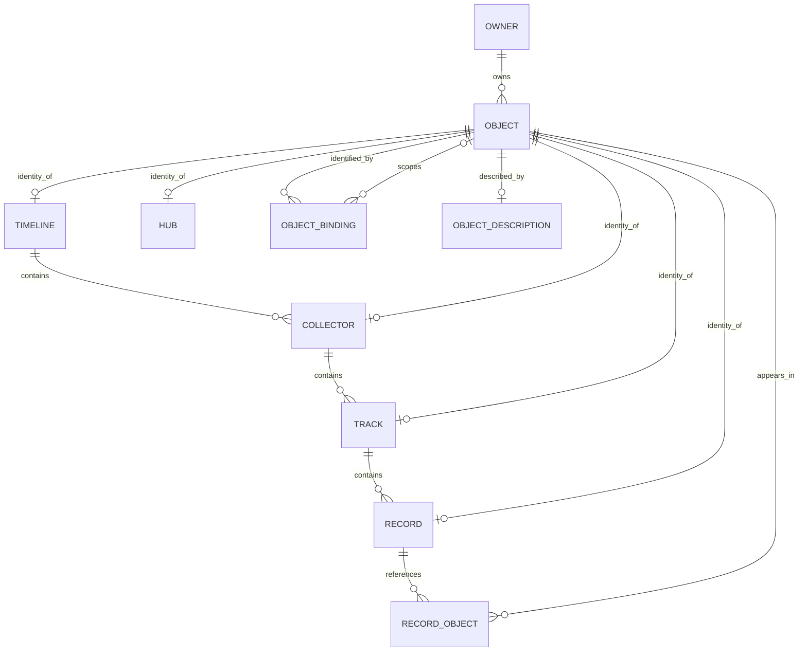

# 记录存储模型

状态：已确认

本文档是对象身份、记录归属、普通写入与持久结构的权威来源。HTTP 契约见[记录接口](recording-api.md)。

对象身份、识别与描述分开保存，Timeline、Collector、Track、Record、Hub 共用对象主键。公共引用与同一 Record 上的对象条件见[对象契约](record-objects.md)，设计决策见 [ADR-0030](adr/ADR-0030-unified-object-identity.md)。


```mermaid
erDiagram
    TIMELINE ||--o{ COLLECTOR : contains
    COLLECTOR ||--o{ TRACK : contains
    TRACK ||--o{ RECORD : contains
    OWNER ||--o{ OBJECT : owns
    OBJECT ||--o| TIMELINE : identity_of
    OBJECT ||--o| COLLECTOR : identity_of
    OBJECT ||--o| TRACK : identity_of
    OBJECT ||--o| RECORD : identity_of
    OBJECT ||--o| HUB : identity_of
    OBJECT ||--o{ OBJECT_BINDING : identified_by
    OBJECT |o--o{ OBJECT_BINDING : scopes
    OBJECT ||--o| OBJECT_DESCRIPTION : described_by
    RECORD ||--o{ RECORD_OBJECT : references
    OBJECT ||--o{ RECORD_OBJECT : appears_in
```

所有 ID 均为应用生成的 UUID v7。外键使用限制删除，不级联清除下层数据。

## Timeline

一行表示一个 Owner 的完整记录空间。设备、安装、会话、项目或时间范围变化都不创建新 Timeline。

| 字段 | 类型 | 约束与含义 |
| --- | --- | --- |
| `id` | `uuid` | 主键，同时指向 `objects.id`；不可修改 |
| `owner_id` | `uuid` | 唯一；来自验签令牌的 UUID `sub`，不是数据库外键 |
| `display_name` | `text` | 可修改；去除首尾空格后非空 |
| `created_at` | `timestamptz` | 应用创建时间，不可修改 |

Timeline 不保存 Owner 的用户名、邮箱、时区或 `updated_at`。

## 对象身份

`objects` 是全应用对象身份的权威，只保存 `id`（UUIDv7 主键）和 `owner_id`（认证数据归属），并为 owner_id 建索引。Timeline、Collector、Track、Record、Hub 及观测涉及的对象均共用它。身份不要求名称、namespace/key 或类型字段；UUID 时间部分不表示观测时间。

Timeline 的 owner_id 保留一行对应一个 Owner 的唯一约束，创建时与对象归属一致；Hub 从对象表读取 Owner。决策见 [ADR-0030](adr/ADR-0030-unified-object-identity.md)。

## Collector

一行表示 Collector 实现与 Target 的稳定绑定，地址为：

```text
(timeline_id, key, target)
```

| 字段 | 类型 | 约束与含义 |
| --- | --- | --- |
| `id` | `uuid` | 主键，同时指向 `objects.id`；不可修改 |
| `timeline_id` | `uuid` | 指向 Timeline，不可修改 |
| `key` | `varchar(255)` | 小写点号分段、无版本的 manifest ID |
| `target` | `varchar(255)` | Collector 规范化的稳定 Target |
| `display_name` | `varchar(255)` | 可修改的展示名 |
| `created_at` | `timestamptz` | 应用创建时间，不可修改 |

`key`、`target` 和 `display_name` 去除首尾空格后非空。注册按稳定地址幂等；重复注册可更新 `display_name`，最后成功提交者生效。重启、重装、升级或凭据轮换不改变地址；地址任一部分变化时创建新 Collector。

Heartbeat 不解释 Target 的格式。Collector 不表示安装、进程、凭据、配置、连接或健康状态。

## Track

一行表示一个 Collector 产生、由同一协议解释且时间行为相同的一组 Record。

| 字段 | 类型 | 约束与含义 |
| --- | --- | --- |
| `id` | `uuid` | 主键，同时指向 `objects.id`；不可修改 |
| `collector_id` | `uuid` | 指向 Collector，不可修改 |
| `type` | `text` | 全局数据协议名 |
| `version` | `integer` | 正整数 Payload 版本 |
| `time_mode` | `text` | `point` 或 `range` |
| `created_at` | `timestamptz` | 应用创建时间，不可修改 |

唯一约束为 `(collector_id, type, version)`。已有 Track 的时间定义不能修改。

Payload 解码只依赖 `(type, version)`，不依赖 Collector。后端不维护协议注册表，也不解释或校验具体 Payload。

- `range` 的结束时间由本条 Record 给出。
- 同一 Track 可以包含多个观测对象和重叠的 Range。
- Track 不保存展示名、metadata 或 `updated_at`。

## Record

一行表示一个时间点或一段已确认持续的观测。

| 字段 | 类型 | 约束与含义 |
| --- | --- | --- |
| `id` | `uuid` | Collector 生成，同时指向 `objects.id`；续期和重试复用 |
| `track_id` | `uuid` | 指向 Track，不可修改 |
| `started_at` | `timestamptz` | 时间点或区间开始 |
| `ended_at` | `timestamptz` | 仅 `range` 使用，且不早于开始时间 |
| `observed_at` | `timestamptz` | Collector 获得信息的时间；空表示等于 `started_at` |
| `received_at` | `timestamptz` | 后端首次成功接收时间 |
| `value` | `jsonb` | 协议定义的任意 JSON 值 |
| `objects` | `jsonb` | 规范化后的对象引用与历史名称快照，必须为数组，允许为空 |

后端按所属 Track 验证 `ended_at` 的形状。Record 不冗余时间模式或来源 Collector ID；来源沿 Track 与 Collector 唯一确定。协议特有的来源属性或上游序号由具体协议写入 `value`，不增加通用 `sequence`、`source_key`、原始 Payload 或 metadata。

默认稳定顺序为 `(track_id, started_at, id)`，Record 时间索引覆盖这三列；对象查询通过下述关联索引定位。

## 对象与关联

`object_bindings` 保存技术行号 `id`（bigint）、`owner_id`、可空的 `scope_id`、`object_id`、`identity_namespace`（128）及 `identity_key`（512）。scope_id 与 object_id 均引用对象表。唯一地址是 `(owner_id, scope_id, identity_namespace, identity_key)`，NULL scope 也参与唯一约束。一个对象可有多个识别地址；技术行号不是业务对象身份。

`object_descriptions` 以 `object_id` 为主键，保存可空 `name`（512）、`observed_at`、`record_id`。后两项记录当前名称的观测依据。没有名称的显式引用也能进入对象目录，后续有效名称可补充它。

`record_objects` 保存 `record_id`、`reference_index`、`object_id`、`role`（64），主键为前两列。reference_index 对应 records.objects 规范化数组的位置，多个别名不会互相覆盖；反向索引 `(object_id, record_id)` 支持对象查询。

每条 Record 的身份、记录、识别绑定、当前描述与引用在一个数据库事务内完成，只保存冲突解析后最终使用的身份。拒绝和冲突回滚整条修改，重复与并发发现不留下多余候选。`records.objects` 是观测声明权威，其余是查询投影。名称与指认规则见[对象契约](record-objects.md)。

Hub 的对象身份与首次有效联络原子登记。Owner 从对象表读取；hubs 表仅保存会话、最近联络、退役与展示快照，详见[Hub 管理](hub-management.md)。

## 持续区间续期

[ADR-0002](adr/ADR-0002-monotonic-record-extension.md) 规定 `range` 的持续状态按以下规则续期：

- 首次确认创建 Record；状态不变且持续确认时复用 ID，只延长 `ended_at`。
- 状态变化、断采、重启或能力丢失后创建新 Record；值相同不能跨 Observation Gap 连接。
- 数据库原子执行 `ended_at = max(已有值, 收到值)`。
- 同一 ID 的 `track_id`、`started_at`、规范化后的 `observed_at`、`value`、`objects` 和时间形状必须一致。
- JSON 对象属性顺序和空白差异不构成 value 冲突。
- 重试和续期保留首次 `received_at`。

当前普通写入不支持区间缩短、value 替换或通用更正链。[ADR-0006](adr/ADR-0006-result-correction-semantics.md) 已确认未来模型需要支持结果更正，机制仍待设计。

TTL 只用于判断是否缺少及时确认，不修改 `ended_at`，也不阻止补传。Collector 使用系统时间建立基准，以单调时钟推进连续区间；只有实际观测才能续期。该规则不校正错误的初始绝对时间。

Collector 保存尚未交给 Hub 的快照；Hub 在 SQLite 事务提交后接管，再独立上传后端。当前 macOS Collector 的交接前缓冲仍在内存，见 [Hub 交付](hub-record-delivery.md)。

## Device Identity

[ADR-0003](adr/ADR-0003-device-identity-across-reinstallation.md) 规定 Device Identity 跨系统重装保留，并允许用户手动重新关联。跨重装及手动关联机制尚未实现。

当前 macOS Collector 通过公共 objects 的 device 引用携带配置 Target。多个 Collector 共用该原生身份即可进入同一设备页；对象表不等于设备重装身份恢复机制。

## 未决事项

TTL、结果更正、时钟异常、交接前数据保护和设备关联见[未决设计](recording-open-questions.md)。
