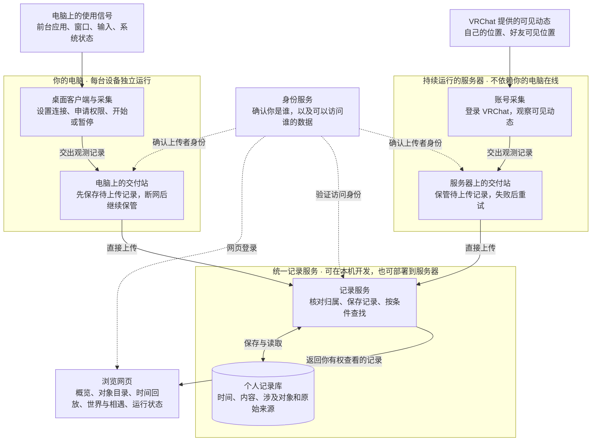
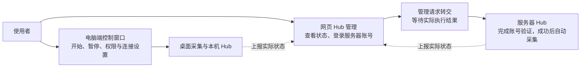

# Heartbeat 系统与业务总览

Heartbeat 把你在电脑和线上空间中留下的可观测痕迹保存下来，让你按时间回看，也能围绕某台设备、某个应用、某个账号或某个世界查看相关记录。例如：某个应用在哪些设备上出现在前台、某段时间系统是否锁屏、VRChat 中哪些世界有可见停留，以及哪些好友曾被观测到同场。

本文面向产品和非技术读者，解释系统由谁做什么、用户如何使用、数据如何流转，以及当前能力的边界。它是现有功能的阅读入口；具体规则由各节链接的契约维护。当前项目仍在重写开发阶段，功能已实现与可以正式发行是两回事。

## 系统架构图

先沿实线看一条记录怎样进入你的历史，再看虚线上的身份确认。图中所有节点都对应当前已有组件；电脑端和服务器端可以分别运行。

图中的“交付站”就是项目中的 **Hub**。它在自己所在的电脑或服务器上保存待上传数据；电脑上的 Hub 和服务器上的 Hub 分别直接上传，不经过彼此中转。“先由交付站保管”和“已经进入个人记录库”是两个步骤。

### 各部分负责什么

| 部分 | 用日常语言理解 | 负责的业务 |
| --- | --- | --- |
| 采集器 | 观察一种具体来源并整理结果的人 | 判断读到了什么、时间是否连续、何时开始一条新记录；桌面和 VRChat 各有自己的观察方法 |
| 桌面客户端 | 电脑端控制窗口 | 保存连接、申请系统权限、开始或暂停采集、显示运行情况，并承载电脑上的 Hub |
| Hub | 带本地存储的交付站 | 接住记录、保管未上传部分、自动重试、核对上传确认；采集暂停后仍可继续交付 |
| 记录服务与记录库 | 按人分开的历史档案 | 检查归属和公共记录规则、保存数据、关联对象、提供查询；具体内容由来源协议解释 |
| 浏览网页 | 查看历史和运行状况的入口 | 组织对象、画时间线和统计图、显示原始详情；转交服务器账号登录操作 |
| 身份服务 | 访问身份的确认者 | 确认登录者和上传者，帮助记录服务隔离不同人的数据；VRChat 账号登录另外由 VRChat 验证 |

系统中一个人的全部记录归入同一个记录空间。换设备、增加账号或从另一个页面查看，不会创建第二份个人历史。工程中的对应术语是：数据主体 Owner、记录空间 Timeline、采集来源 Collector、同类记录分组 Track、单条记录 Record。设备、应用、账号和世界称为“对象”。详细关系见[记录模型](recording-storage-model.md)。

## 开始使用与账号归属

使用者有两个相互配合的入口：电脑端负责本机采集，网页负责登录后查看历史及管理服务器账号。

首次使用桌面客户端时，设置连接地址和接入凭据，验证并保存后开始采集。再次启动会恢复保存的连接并自动采集。网页单独完成登录，只展示当前登录者有权查看的记录和 Hub；退出网页会清除当前应用会话及已缓存的查询结果，认证服务本身的单点登录会话可能仍然存在。

VRChat 登录发生在网页的“Hub 管理”中。成功验证的 VRChat 账号决定该采集来源观察哪个账号；其记录仍进入这个 Hub 所属使用者的个人记录空间。重新登录已有来源时不能悄悄换成另一个 VRChat 账号；另一个账号使用“添加其他账号”入口。

行为依据：[桌面客户端](../src/Desktop/README.md)、[网页登录](../src/Frontend/Heartbeat.Web/README.md)、[账号登录与归属](hub-management.md)。

## 电脑上的采集业务

电脑端提供以下五类记录。macOS 与 Windows 共用整理规则，各自从操作系统取得读数。

| 记录类别 | 用户可以了解什么 | 如何理解它 |
| --- | --- | --- |
| 前台应用 | 某段已确认时间里，系统前台是哪个应用 | 可以据此查看应用出现的时间；不能直接等同于注意力、工作时长或娱乐时长 |
| 前台窗口标题 | 某段时间前台窗口显示什么标题 | 与应用记录独立；标题权限失败时仍可继续记录应用。标题短暂抖动先等待稳定，减少连续变化产生的碎片 |
| 物理输入 | 何时发生按键按下、鼠标按钮按下和滚动 | 保存物理键位、按钮或滚动量，不记录输入的字符含义；按住产生的重复按键被过滤，鼠标移动不产生记录 |
| 系统离开信号 | 锁屏、会话失活、显示器或系统休眠的已知区间 | 是系统信号，可以重叠；无法单凭它判断人是否离开，也不把“没有输入”当成离开 |
| 观察能力状态 | 应用、标题、输入观察能力何时可用、需要权限或发生故障 | 帮助解释为什么某段时间缺少记录；显示可用也不保证捕获了全部事件 |

macOS 的窗口标题需要辅助功能权限，物理输入需要输入监控权限。用户从客户端发起授权，系统设置决定是否允许；Windows 则受当前会话、系统权限和企业策略等条件限制。恢复可靠观测后从新的一段开始，空白时间保持未知。

日常控制在本机完成：暂停停止新的采集，并尝试交出最后的快照；已经被 Hub 接管的记录继续上传。关闭窗口只是隐藏到菜单栏或系统托盘，选择退出才结束进程。停止之后再恢复，即使前台应用一样，也不会把中间空白补成连续使用。

窗口标题按原文保存，可能含文件名、网页标题或聊天对象。这项数据与“按键不保存文本”是两个不同的范围。当前没有通用的自动脱敏或隐私过滤设置。

协议依据：[前台应用](protocols/desktop-application-foreground-v1.md)、[窗口标题](protocols/desktop-window-foreground-v1.md)、[物理输入](protocols/desktop-input-event-v1.md)、[系统信号](protocols/desktop-system-away-v1.md)、[观察能力](protocols/desktop-observation-status-v1.md)。平台条件见[桌面客户端](../src/Desktop/README.md)。

## 服务器上的 VRChat 业务

服务器可以在你的电脑关闭后继续观察 VRChat 对当前账号公开的信息。前提是服务器在运行，账号会话有效，并且 VRChat 提供了相应的可见信息。

首次接入的过程是：打开“Hub 管理” → 选择在线的服务器 Hub → 登录 VRChat → 如有需要完成验证码 → 验证成功后自动开始采集。登录未完成不会建立新的采集账号。服务器重启后使用已保存的会话恢复；确认会话失效时，网页提示重新登录，成功后自动恢复。

目前有两类业务记录：

| 业务 | 记录的内容 | 依据与限制 |
| --- | --- | --- |
| 世界停留 | 自己的账号在哪个可见世界、哪个实例中，以及已确认的持续区间 | 从 VRChat 的事件和周期核对获得；时间表示被系统获知和确认的位置，不保证等于真实进入或离开的时刻 |
| 可见同场 | 自己和某个好友在同一世界的同一实例中出现的已确认区间 | 必须同时有足够接近的有效位置依据；同一个世界的不同实例不算同场，同场也不能直接理解为交谈 |

私密位置、正在传送、离线或缺少有效位置都会使相关依据不足。系统不会从传送目的地推定已经抵达，也不会保存好友在其他实例中的完整位置历史。一个采集接口拒绝请求时会进一步核验会话；只有确认需要重新认证时才要求登录，暂时的网络故障保留会话后重试。

位置记录可以同时关联“我的账号”和“世界”，同场记录还关联“好友”。这些对象都能成为后续查看的入口；同一条记录的身份保持不变。

行为依据：[VRChat 采集](../src/Collectors/Heartbeat.Collector.VRChat/README.md)、[服务器运行](../src/Server/README.md)。PC 和 Quest 的本地游戏日志目前未接入；真实账号、可见性和外部事件仍需按[人工验收](validation/vrchat-server-events.md)检查。

## 从一次观测到可查询的历史

记录的交付可以分成三步理解：

1. **采集器形成记录。** 给这份观测分配稳定编号，写明时间、内容和涉及对象。连续确认同一状态时，可以继续延长同一编号的结束时间。
2. **Hub 确认接管。** 先保存到所在机器的本地存储，再告诉采集器已接住。之后即使后端不可达，也由 Hub 保管并重试。采集器收到匹配的确认，才释放对应的待交接快照。
3. **记录服务确认接收。** 核对访问归属，保存记录及对象关联。Hub 收到匹配的确认后，才清理对应的待上传快照。此时网页可以通过查询查看它。

这里的稳定编号用于避免重传制造重复记录。上传成功但确认丢失时，Hub 可以重发原编号；旧快照晚到，也不会让已保存的结束时间倒退。更新期间收到旧确认，仍保留尚未确认的新进展。这并不自动合并两个来源独立报告的相似事件。

Hub 接管前仍有数据只保存在采集进程的内存里，崩溃可能使这部分丢失；接管后的重启恢复由 Hub 的本地存储保障。本机与服务器各有自己的数据目录，中心服务上的运行状态不能替代这些目录，也不能从状态报告重建它们。

详细规则见[记录交付](hub-record-delivery.md)与[记录模型的操作表](recording-storage-model.md#操作与实现边界)。

## 查看历史和理解统计

网页按“先找到关心的对象，再选择时间和细节”组织使用路径。

| 入口或操作 | 可以看到或完成什么 | 统计与解释边界 |
| --- | --- | --- |
| 概览首页 | 设备的每日已确认时长；VRChat 账号的集中入口；选择快捷或自定义时间范围 | 只有具备适用记录的设备才展示时长；未知类型保留对象入口，不捏造零时长 |
| 对象目录 | 找到已在记录中出现的设备、应用、账号、世界等对象 | 对象随记录被发现，不需要用户先维护一个目录 |
| 对象时间线 | 查看直接涉及该对象的各来源记录；调整时间范围、拖动或缩放，查看重叠区间 | 同一对象可以有多个采集来源；每条记录仍保留原始来源，观测空白不补齐 |
| 逐层查看 | 从某台设备进入某个应用，再查看同时满足这些条件的记录；返回恢复上一层条件 | 各条件必须出现在同一条记录中。移除设备条件后，才扩大到其他设备上的同一应用 |
| 记录详情 | 查看名称、来源、开始与结束、持续时间、内容及原始数据 | 熟悉的数据类型提供专门展示；新类型仍可查看原始结构化内容，不要求先做专门页面 |
| 输入密度 | 先看一段时间内的事件数量分布，再选中局部范围读取明细 | 计数说明收到多少事件，不等同于工作强度或有效活动时间 |
| 世界与相遇 | 世界停留、到访世界、可见同场好友，以及常去世界、活动节奏和同场明细 | 反映可见观测；记录被断采分成多段，不代表真实访问了同样多次 |
| 查看今天与历史 | 今天可以随当前时间推进；操作时间线或查看记录后保留手动位置，“回到现在”恢复跟随 | 历史日期聚焦已有活动，自定义范围按用户选择显示；刷新不应把正在查看的位置拉走 |

例如，从“电脑 A”进入“应用 X”，看到的是明确同时涉及 A 和 X 的记录。清除 A 的条件后，可以查看其他设备上的同一应用。相同原生应用身份可以跨设备关联；不同平台或不同身份之间的自动认定仍未实现。打开网页、应用处于前台和某个游戏账号正在活动，也不会仅因时间重叠就自动关联。

每日时长只统计适用且已确认的时间区间，按所选时间裁剪、跨日拆分，重叠部分只算一次。原始记录保留各自来源；不同含义的区间不会全部加在一起当成“总活动时间”。没有记录、尚在读取、读取失败和内容无法解析分别呈现，避免把故障显示成零。

对象入口可以显示较新观测提供的名称，历史记录保留当时名称；晚到的旧记录不会把目录名称改回旧值。页面还提供明暗主题、键盘操作、窄屏布局和减少动态效果的适配。

业务依据：[网页概览与回放](../src/Frontend/Heartbeat.Web/README.md)、[对象关联与查询](record-objects.md)。

## 查看运行状态和处理账号登录

管理操作与记录上传走不同的流程。下面的虚线只表示状态报告，实线表示用户控制或登录请求。

图中的报告经记录服务汇总后由网页读取。网页目前只查看桌面状态，电脑上的开始与暂停由本地客户端执行；服务器账号提供首次登录、添加其他账号和重新登录，没有通用的网页启停、配置或移除按钮。

运行页把三个问题分别展示：

| 问题 | 页面信息的含义 |
| --- | --- |
| Hub 联系得上吗 | 最近是否收到有效联络；失联后展示的采集信息是最后一次上报的快照 |
| 采集正在工作吗 | 各采集来源当前的实际状态，是否需要登录或遇到错误 |
| 记录交付了吗 | 待上传、失败情况，以及最近接受和成功上传的记录快照数量 |

“最近收发”曲线反映快照交接数量。同一条记录续期或再次提交可以多次计数，所以它不是新增事件数；恢复旧积压时上传数量也可能高于本次运行接收量。是否还有积压应看专门的队列信息。

登录请求若超时，表示尚未得到执行结果，不能直接当作失败后无限重发。刷新实际状态，再决定下一步。离线时不能操作；中心服务重启会丢弃尚未完成的管理请求，已接管记录的重试则继续遵守持久交付规则。

管理接口支持退役已离线的 Hub；这不等于远程结束进程、删除历史或撤销上传凭据，目前网页未提供退役按钮。同一采集来源迁移到另一处运行前，应先停止旧处；当前没有自动迁移或跨机器强制排他机制。

行为依据：[Hub 管理](hub-management.md)和[桌面使用](../src/Desktop/README.md)。

## 异常时用户会看到什么

| 情况 | 系统已有的处理 | 用户应怎样理解 |
| --- | --- | --- |
| 后端暂时不可达 | 正在运行的 Hub 保留已接管记录，恢复后重试 | 历史页面可能滞后，不表示本地一定没有记录；也不承诺可以无限积压 |
| Hub 重启 | 读取自己的持久目录，继续交付已接管快照 | 保留本地数据目录是恢复的前提；并非靠网页状态恢复 |
| Hub 存储写入失败或容量不足 | 不确认接管，已有快照按各自策略等待重试 | “正在采集”仍不能证明新记录已安全保存 |
| 收到无法自动解决的记录错误 | 暂停对应失败记录，保留诊断；其他来源仍可推进 | 目前缺少失败项的人工重试、纠错和删除入口 |
| 采集权限丢失或观察器故障 | 报告能力状态，停止延长缺少依据的区间 | 相关时间保持未知；恢复后开始新段 |
| VRChat 会话真正失效 | 标明需要重新登录，成功后恢复采集 | 网络暂时出错或单次采集拒绝不直接等于账号失效 |
| 网页读取失败 | 显示失败或汇总不完整，允许刷新重试 | 失败不能解释为当天没有活动 |
| 管理操作等待超时 | 返回结果未知，等待实际状态确认 | 这类操作不会像记录上传一样自动持久重放 |

## 新来源如何接进来

开发者增加一个采集器，描述它观察谁、产生哪些类型的记录，以及什么情况下能确认持续时间。接入现有 Hub 后，交付站负责后端注册、保存待上传数据和重试；记录服务按公共规则保存，网页至少能显示时间位置和原始内容。

记录还可以指明涉及的对象，使新来源进入已有对象目录和跨来源查询。若需要新的业务摘要，再添加对应展示。例如，专门的世界与相遇页面建立在通用时间记录和对象关联之上。

仓库已经提供[可运行的接入示例](../src/Hub/Heartbeat.Hub.Client/README.md)，演示时间点、持续区间、断采、重传和退出交接。当前服务器只运行已经组合进应用的采集器，尚无面向普通用户的插件商店或任意采集器安装入口。

## 当前边界与后续能力

| 范围 | 当前边界 |
| --- | --- |
| 历史更正 | 已确认需要支持同一结果的内容与时间更正，机制未实现；普通上传目前只允许合法区间续期 |
| 删除与撤回 | 尚未定义删除后如何处理旧重传，也未提供完整产品入口 |
| 对象身份延续 | 已支持同一原生身份跨记录、跨来源关联；跨系统重装恢复、手动关联设备和跨平台应用身份统一尚未实现 |
| 多来源融合 | 已能共同查询明确关联的记录并对适用区间去重计时；来源之间的事实合并、冲突裁决和缺失互补尚未实现 |
| 新业务来源 | 当前有桌面采集与服务器 VRChat；浏览器专用采集、微信步数、PC/Quest 游戏日志等仍未接入 |
| 数据保护与运维 | Hub 接管前的持久保护、积压策略、备份恢复产品流程和记录库内容加密仍有待建设。第三方密码和验证码不保存为记录，账号会话在服务器本地加密保存；这些措施不等于所有记录均已加密 |
| 发行与平台验收 | 已有本地开发与打包入口；发行安装器、正式签名、公证和自动更新尚未完成。Windows 原生行为、真实 VRChat 事件及系统权限等仍需相应实机验收 |

这张表说明当前边界，不承诺上述能力的实施时间或先后顺序。详细未决项见[记录模型未决设计](recording-open-questions.md)，实现与实测范围见[业务验证覆盖](validation/business-coverage.md)。本地环境、数据目录维护与打包操作见[开发指南](development.md)。
