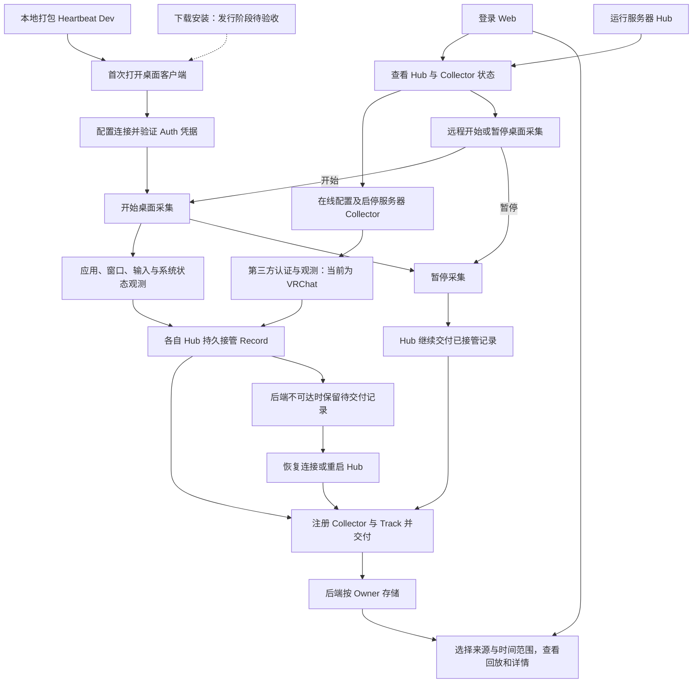
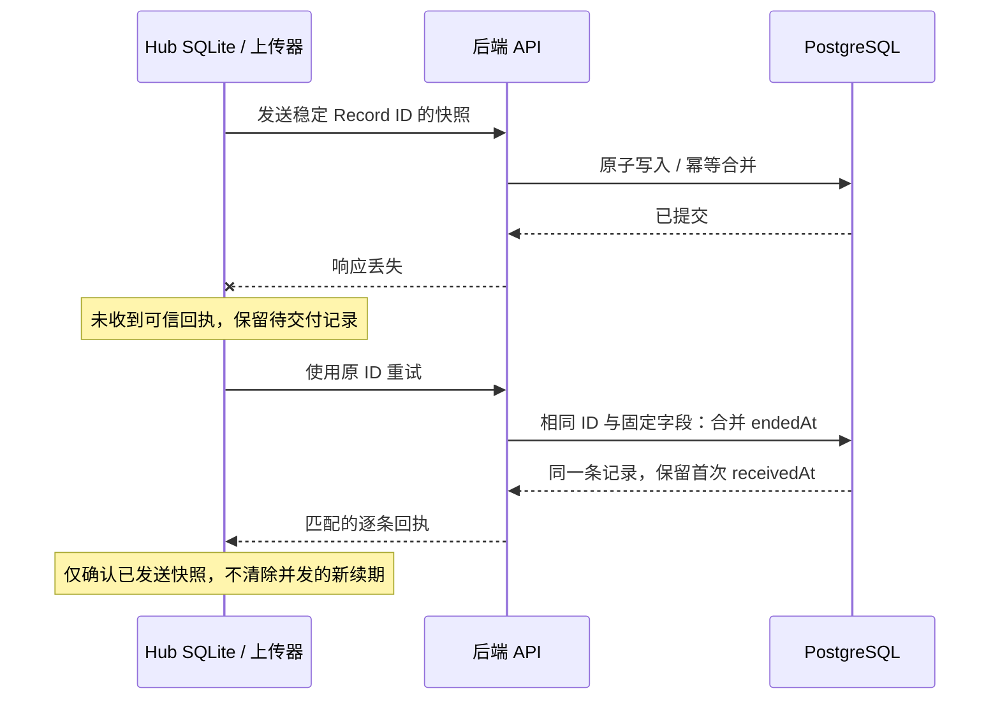

# 业务流程与验证覆盖

核对日期：2026-09-26。实现基点：`36ed028e`。本文是业务承诺与验证证据的索引，具体语义以链接的契约为准；不增加新承诺，也不定义测试调度框架。

## 从开始使用到回放

实线表示当前已有使用路径，虚线表示发行阶段尚未验收的入口。桌面与服务器是两种采集入口，可以独立运行。

图中的“各自 Hub”不是一个中央 Hub：Desktop 和服务器各用自己的本地 SQLite，分别直接向 API 交付，没有 Hub 间转发。桌面首次保存连接后由使用者开始采集；保存连接的 Desktop 在进程重启后自动开始，服务器则恢复保存的启停选择。依据：[宿主责任](../adr/ADR-0014-hub-desktop-and-server-hosting.md)、[桌面客户端](../../src/Desktop/README.md)、[服务器](../../src/Server/README.md)。

两条链路应分开理解：

- **记录链路**：观测 → Collector 规范化 Record → Hub 持久接管 → 注册/映射/交付 → PostgreSQL → Web 查询展示。
- **管理链路**：Web 操作 → API 临时中继 → Hub 所在宿主执行 → 回报实际状态。Hub 在线、Collector 正在采集、Record 已交付是三种不同事实。

管理操作超时表示结果未知，刷新实际状态后再决定操作；它不采用 Record 的持久化自动重传语义。API 重启会丢弃未完成管理操作。依据：[管理契约](../hub-management.md)。

## 业务承诺—失败方式—验证证据

“已有测试”表示代码中存在对应断言；“实测”另外链接带日期的运行产物。局部替身、浏览器 fixture 与真实主链不互相替代。以下缺口表示本次审计未找到相应证据，不表示已确认存在产品缺陷。

| 环节 | 当前承诺或验收目标 | 关键失败方式 | 已有验证 | 仍未证明或不在当前承诺内 |
| --- | --- | --- | --- | --- |
| 获取与启动 | 本地应用包包含可执行文件，可以启动 | 空包被误报成功、打包失败覆盖旧包 | [打包失败边界](../../tests/Heartbeat.Dev.Tests/DesktopPackagerTests.cs)；[桌面主链实测](#运行证据) | 下载、安装器、发行签名、公证、更新；Windows 真实启动 |
| 首次接入 | 真实 Auth 确认 Owner，保存连接后可采集，重启可重读凭据 | 无效凭据、错 Owner、保存失败、凭据泄漏 | 桌面主链真实 Auth/UI/Dev 凭据；[DesktopTests](../../tests/Heartbeat.Desktop.Tests/DesktopTests.cs)、[令牌检查](../../tests/Heartbeat.Hub.Tests/ApiKeyTokenProviderTests.cs) | 普通 macOS Keychain、Windows Credential Manager 的完整实机流程；更换构建后的授权恢复 |
| Web 登录与隔离 | 登录后只访问本 Owner 数据，退出清理会话和缓存 | 错签名/发行者/过期令牌、跨 Owner 查询、退出后看到旧缓存 | [认证管线](../../tests/Heartbeat.Integration.Tests/RealAuthenticationPipelineTests.cs)：真实验证器、受控签发者；[查询隔离](../../tests/Heartbeat.Integration.Tests/RecordReplayHttpTests.cs)；[登录](../../src/Frontend/Heartbeat.Web/tests/e2e/auth.spec.ts)及[退出](../../src/Frontend/Heartbeat.Web/tests/e2e/replay.spec.ts)为 fixture | 本次真实主链使用短期令牌建立浏览器会话，没有验收交互 OIDC；可用 `--interactive-login` 单独运行 |
| 开始、暂停、退出 | 暂停不停止 Hub 交付；正常停止尝试最终交接；进程启动按宿主规则恢复 | 重复初始化撤销暂停、配置与启停竞争、退出遗漏最终交接 | [DesktopTests](../../tests/Heartbeat.Desktop.Tests/DesktopTests.cs)；桌面主链真实 UI 启停、退出和重启 | 隐藏/重开、菜单栏/托盘、辅助技术与 Windows UI 的完整实机验收 |
| 观测变成 Record | 遵守各协议；应用与窗口分开，Observation Gap 表达未知，输入不保存文本 | 标题抖动、权限丢失、通知迟到、锁屏休眠被补成连续活动 | [投影行为](../../tests/Heartbeat.Collector.Desktop.Mac.Tests/DesktopRecordProjectorTests.cs)、[采集会话](../../tests/Heartbeat.Collector.Desktop.Mac.Tests/DesktopCollectorSessionTests.cs)、[Windows 翻译](../../tests/Heartbeat.Collector.Desktop.Windows.Tests/WindowsObservationTests.cs)；主链证明真实前台应用记录可回放 | 受控真实应用/窗口切换、物理键鼠、权限切换、锁屏休眠的组合证据；单条前台应用见证不能证明所有采集能力 |
| Hub 接管 | `accepted` 只在 SQLite 事务提交后返回；容量不足或写入失败不确认接管 | 半批写入、磁盘错误、容量满仍确认成功、错误回执释放快照 | [RecordOutboxTests](../../tests/Heartbeat.Hub.Tests/RecordOutboxTests.cs)：事务、容量、写入失败；[交接快照](../../tests/Heartbeat.Collector.Desktop.Mac.Tests/PendingHubSubmissionsTests.cs) | Collector 接管前仍为内存缓冲，崩溃可能丢失；真实断电/文件系统损坏未验收 |
| 注册与身份映射 | 同一逻辑 Collector/Track 重试后身份稳定；不用显示名称决定身份 | 离线首次提交、重启丢映射、错误 Owner 或时间定义 | [HubDeliveryTests](../../tests/Heartbeat.Integration.Tests/HubDeliveryTests.cs)、[注册](../../tests/Heartbeat.Integration.Tests/CollectorRegistrationTests.cs)、[Track](../../tests/Heartbeat.Integration.Tests/TrackHttpTests.cs)；主链真实首次接入 | 通用 Device Identity 跨重装关联尚未实现，不等同于当前 Target |
| 重复与乱序交付 | 同一 Record 幂等写入；当前合法 Explicit Range 续期只增大结束位置 | 提交已落库但回执丢失、乱序重试、部分提交、新续期被旧回执清除 | [真实存储组合测试](../../tests/Heartbeat.Integration.Tests/HubDeliveryTests.cs)已覆盖丢响应；[上传 API](../../tests/Heartbeat.Integration.Tests/RecordUploadHttpTests.cs)、[上传期间续期](../../tests/Heartbeat.Hub.Tests/RecordUploaderTests.cs) | 不是“请求只执行一次”；任意历史内容/时间更正与删除尚未实现 |
| 离线与崩溃恢复 | Hub 已接管数据在重启后继续交付；核对身份、内容、时间和归属 | 重启丢队列、换 Hub 身份、误投路由、队列清空但未落库 | [HubCrashTests](../../tests/Heartbeat.Hub.Tests/HubCrashTests.cs)；`desktop-replay --recovery` 两次真实主链实测 | 主链在暂停采集、冻结已接管快照后强制退出；不证明任意指令时刻崩溃、机器断电或接管前无丢失 |
| 交付失败可处理 | 暂时失败保留重试；识别出的永久错误暂停，其他来源仍可推进 | 一个来源阻塞全队列、永久错误无限重试、错回执误清除 | [RecordUploaderTests](../../tests/Heartbeat.Hub.Tests/RecordUploaderTests.cs)、[队列公平性](../../tests/Heartbeat.Hub.Tests/RecordOutboxTests.cs) | 暂停项的人工重试/纠错/删除入口尚未实现；不承诺所有记录最终都能成功交付 |
| 查询与回放 | 正确 Owner、范围、顺序和分页；已存 Record 可追溯到 UI 详情 | 分页漏重、单 Track 失败拖垮全部、未知协议崩溃、区间空白被补齐 | [查询](../../tests/Heartbeat.Integration.Tests/RecordReplayHttpTests.cs)、[Point 计数](../../tests/Heartbeat.Integration.Tests/PointRecordCountsHttpTests.cs)、[回放 fixture](../../src/Frontend/Heartbeat.Web/tests/e2e/replay.spec.ts)；主链真实同一 Record API/UI 对账 | 真实多设备、多协议长时间窗组合；`range + next_record` 派生结束位置尚未实现 |
| Hub 在线管理 | 在线、采集、交付分别呈现；操作执行后确认，超时显示未知 | 离线仍可操作、跨 Owner 控制、旧会话覆盖、API 重启误重放命令 | [HubManagementTests](../../tests/Heartbeat.Integration.Tests/HubManagementTests.cs)、[管理运行](../../tests/Heartbeat.Hub.Tests/ManagementRuntimeTests.cs)、[Web fixture](../../src/Frontend/Heartbeat.Web/tests/e2e/hubs.spec.ts) | 当前主链未覆盖真实 Web → API → Desktop 远程启停；多 API 副本与网络分区下严格单实例不在当前设计内 |
| 服务器独立采集 | Desktop 离线不妨碍服务器 Collector；保存配置、认证、启停后可回放 | 第三方凭据失效、验证码、重启丢会话或启停选择、凭据进入公开状态 | [ManagedVRChatTests](../../tests/Heartbeat.Integration.Tests/ManagedVRChatTests.cs)：真实管理/存储链路，VRChat 替身；[VRChat 行为](../../tests/Heartbeat.Hub.Tests/VRChatCollectorTests.cs) | 真实 VRChat 账号与线上 API 的完整业务链；当前只有已安装的具体 Collector，不包含任意来源 |
| 持续使用与维护 | 资源、性能、权限和恢复在约定运行条件内可接受 | 队列长期积压、磁盘耗尽、句柄/内存增长、休眠恢复、备份不可恢复 | [前端生产性能基准入口](../../src/Frontend/Heartbeat.Web/README.md#活动泳道拖动基准)；局部容量和崩溃测试 | 本次没有新的长期运行/性能实测，也尚未确定完整稳定性预算、备份恢复及发行验收标准 |

## 已提交但响应丢失：当前已有的解决方案

这是持久化重试与幂等写入的组合，已有成熟实践，可参考 [AWS 幂等接口说明](https://aws.amazon.com/builders-library/making-retries-safe-with-idempotent-APIs/)。Heartbeat 的具体契约以 [Hub 交付](../hub-record-delivery.md)和 [ADR-0002](../adr/ADR-0002-monotonic-record-extension.md)为准。

[PostgresRecordStore](../../src/Backend/Heartbeat.Infrastructure/Persistence/PostgresRecordStore.cs)以 Record ID 冲突执行原子合并，检查 Track、起点、观测时间及 value 等固定字段；不一致时返回冲突，不能静默覆盖。合法 Explicit Range 的结束时间取较大值。Hub 在核对逐条回执前保留快照。

对应测试 `HubDeliveryTests.OfflineFirstSubmissionResolvesAfterRestartAndSurvivesLostBackendReceipt` 调用真实 API 与 PostgreSQL，写入完成后由 `DelegatingHandler` 丢弃响应；确认数据库已存在该 ID、Hub 仍保留队列，再重开 SQLite、续期和重传，最后确认回放仍只有同一 Record 且队列清空。认证及传输故障受控，没有真实网络代理断流或真实 Auth；不能据此宣称整个发布环境的网络路径已经验证。这条风险已有有效覆盖，不应仅为增加 E2E 数量再复制一套测试。

## 运行证据

以下为 2026-09-26、实现 `36ed028e` 对应的本地记录。证据目录按仓库保留策略可能被清理；目录缺失时按命令重跑，不把链接存在与否当作新的通过结果。

| 验证 | 命令 | 当次证据与结论 |
| --- | --- | --- |
| 首次使用与恢复，第一轮 | `dotnet run --project tools/Heartbeat.Dev -- scenario desktop-replay --recovery` | [manifest](../../.artifacts/verification/20260926T094108Z-scenario-desktop-replay-59dc17ac027f4b82978fde9d68fe2368/manifest.json)、[恢复对账](../../.artifacts/verification/20260926T094108Z-scenario-desktop-replay-59dc17ac027f4b82978fde9d68fe2368/reconciliation.json)：通过 |
| 新 profile 重复验收 | 同上 | [manifest](../../.artifacts/verification/20260926T094835Z-scenario-desktop-replay-849eac8d50a6459aadbc9f4e540c3245/manifest.json)、[正常回放](../../.artifacts/verification/20260926T094835Z-scenario-desktop-replay-849eac8d50a6459aadbc9f4e540c3245/normal-replay.json)、[恢复回放](../../.artifacts/verification/20260926T094835Z-scenario-desktop-replay-849eac8d50a6459aadbc9f4e540c3245/recovered-replay.json)：通过 |
| 自动回归与结构收口 | `dotnet run --project tools/Heartbeat.Dev -- verify closeout --base d78108925212d94eb662a6e2990467d55a2288a3` | [closeout](../../.artifacts/verification/20260926T094600Z-verify-closeout-4c140743a3e34f08a0fc493708a43381/closeout.json)、[quality](../../.artifacts/verification/20260926T094600Z-verify-closeout-4c140743a3e34f08a0fc493708a43381/quality.json)：.NET、CLI、前端与质量通过；前端 `verify` 不包含 fixture 浏览器执行 |

2026-09-26 后续逐环节复验：同一实现的首次运行在 `first-collection` 超时（[失败 manifest](../../.artifacts/verification/20260926T104651Z-scenario-desktop-replay-1e9c5641da824e83990530ffcb48492a/manifest.json)）；未改代码，增加 `--keep-environment-on-failure` 重跑完成整条链路（[通过 manifest](../../.artifacts/verification/20260926T104938Z-scenario-desktop-replay-f7cceee8540d4304a5017cd320ace8e2/manifest.json)、[恢复对账](../../.artifacts/verification/20260926T104938Z-scenario-desktop-replay-f7cceee8540d4304a5017cd320ace8e2/reconciliation.json)）。后一轮正常回放与恢复回放通过、接管记录完整交付且队列清空；它不能覆盖前一轮失败。失败轮次缺少前台、队列及落库的分段诊断，根因未定，不能据此宣称主链验收已稳定。

| 本轮逐项检查 | 结果及证据 |
| --- | --- |
| 打包 → 空 profile → UI 配置 → 真实 Auth | 两轮均到达首次采集；第二轮完成后续流程，见上述 manifest |
| 开始采集 → 正常交付 → API/UI 回放 | 第一轮等待受控应用 Record 超时；第二轮[正常回放报告](../../.artifacts/verification/20260926T104938Z-scenario-desktop-replay-f7cceee8540d4304a5017cd320ace8e2/normal-replay.json)通过 |
| 停 API → 接管 → 强制退出 → 重启 → 恢复交付 | 第二轮通过，Hub 身份与接管内容对账通过；见上述恢复对账 |
| 恢复后的 API/UI 回放 → 正常退出 → 环境清理 | 第二轮[恢复回放报告](../../.artifacts/verification/20260926T104938Z-scenario-desktop-replay-f7cceee8540d4304a5017cd320ace8e2/recovered-replay.json)、`journey.json` 及 manifest 均通过 |
| 接管、身份、幂等/乱序、丢响应、Owner 隔离、查询、管理、投影等已有边界测试 | `verify closeout --base d78108925212d94eb662a6e2990467d55a2288a3`：[closeout](../../.artifacts/verification/20260926T105110Z-verify-closeout-fc0228ed2c5e4858b97dadb3555ce79a/closeout.json)、[quality](../../.artifacts/verification/20260926T105110Z-verify-closeout-fc0228ed2c5e4858b97dadb3555ce79a/quality.json)通过；实际依赖范围见上表，不等同于全部真实端到端 |
| 回放与管理浏览器交互 | `scenario replay-fixture`、`scenario hubs-fixture`：[回放 manifest](../../.artifacts/verification/20260926T105343Z-scenario-replay-fixture-83ceaa79de7b43a1a40f0e398f48fa11/manifest.json)、[管理 manifest](../../.artifacts/verification/20260926T105343Z-scenario-hubs-fixture-3c6168a34d4c4b14b7c70846076f1bbf/manifest.json)通过；Auth/API 为替身 |

同日补充分段诊断、阶段标识和显式产物交接后，验证如下：

- **受控失败**：启动 `scenario desktop-replay --recovery`，在 `first-collection/collection.json` 的首个无见证采样后执行 `osascript -e 'tell application "Finder" to activate'`。场景按预期超时并清理；[注入结果](../../.artifacts/verification/20260926T110725Z-scenario-desktop-replay-8426f6421dd749e18b947c4e5af54269/foreground-interruption-result.json)、[采集诊断](../../.artifacts/verification/20260926T110725Z-scenario-desktop-replay-8426f6421dd749e18b947c4e5af54269/first-collection/collection.json)说明受控进程仍存在、应用失去前台，匹配到目标记录但持续时长不足。该反例证明诊断能力，不为之前的自然超时归因。
- **正常恢复主链**：不注入故障条件之外的前台切换，执行 `scenario desktop-replay --recovery`，首次使用、正常回放、离线重启、恢复对账与回放全部通过：[manifest](../../.artifacts/verification/20260926T111002Z-scenario-desktop-replay-f1bf73f475b2427a808f389b54e979d1/manifest.json)、[阶段索引](../../.artifacts/verification/20260926T111002Z-scenario-desktop-replay-f1bf73f475b2427a808f389b54e979d1/journey.json)、[恢复对账](../../.artifacts/verification/20260926T111002Z-scenario-desktop-replay-f1bf73f475b2427a808f389b54e979d1/delivery-recovery/reconciliation.json)。
- **变更收口**：`verify closeout --base 36ed028ea58f53ff6c8b82c4108353f3ef533f9e` 的 CLI、前端检查与结构质量均通过：[closeout](../../.artifacts/verification/20260926T111248Z-verify-closeout-5612c5ad76964ae68d6cf4b4cf38346f/closeout.json)、[quality](../../.artifacts/verification/20260926T111248Z-verify-closeout-5612c5ad76964ae68d6cf4b4cf38346f/quality.json)。本轮没有交互 OIDC 人工登录或 Windows 实机验收。

### 2026-09-26 后台与原生入口分离

基点 `7785fd9a` 上的后台入口运行 `dotnet run --project tools/Heartbeat.Dev -- scenario runtime-replay`：[manifest](../../.artifacts/verification/20260926T135317Z-scenario-runtime-replay-cdcbee04e9324a8b84043abc34c48280/manifest.json)、[阶段索引](../../.artifacts/verification/20260926T135317Z-scenario-runtime-replay-cdcbee04e9324a8b84043abc34c48280/journey.json)、[恢复对账](../../.artifacts/verification/20260926T135317Z-scenario-runtime-replay-cdcbee04e9324a8b84043abc34c48280/delivery-recovery/reconciliation.json)。正常与恢复后的真实 API/Web 回放、Hub 活动曲线检查均通过，恢复后队列清空、接管记录逐项一致；重启没有再次注入 API key。

取消复验使用同一命令的已构建 CLI，在 `first-collection/collection.json` 首次出现后向父进程发送 SIGINT：[取消 manifest](../../.artifacts/verification/20260926T135521Z-scenario-runtime-replay-cd1c8484802c460086f7084b5664229b/manifest.json)、[清理检查](../../.artifacts/verification/20260926T135521Z-scenario-runtime-replay-cd1c8484802c460086f7084b5664229b/cancellation-check.json)。退出码为 130，已观察到的运行时子进程、临时 profile 和隔离容器均已删除。CLI 参数测试覆盖缺少 `--foreground` 时拒绝原生 UI，以及后台入口拒绝前台/交互登录选项。本轮未运行原生 UI。

`dotnet run --project tools/Heartbeat.Dev -- verify closeout --base 7785fd9a4a5d47606ef1c07f1b91d739963666af` 的 .NET、CLI、前端检查和结构质量均通过：[closeout](../../.artifacts/verification/20260926T135434Z-verify-closeout-1100e40fe4a245f09f183ea47106f85a/closeout.json)、[quality](../../.artifacts/verification/20260926T135434Z-verify-closeout-1100e40fe4a245f09f183ea47106f85a/quality.json)。

## 沿主链组合验证

日常使用 `scenario runtime-replay` 在后台运行配置、采集投影、正常回放与离线崩溃恢复；系统观测输入与临时凭据适配受控。原生首次使用另用 `scenario desktop-replay --foreground`，恢复可加 `--recovery`。两者共用业务步骤及对账，后台结果不替代原生 UI、系统采集或系统凭据证据，见 [ADR-0025](../adr/ADR-0025-background-and-native-acceptance.md)。

组合单位是有明确前置条件、动作、可观察结果和资源归属的业务步骤。下一段消费上一段的真实产物；分别运行两个独立测试不能证明两段之间的交接成立。按 [ADR-0013](../adr/ADR-0013-scenarios-compose-implementations.md) 用普通代码连接，当前不引入图执行器。

| 步骤 | 输入与前置条件 | 输出与交接断言 | 当前实现或缺口 |
| --- | --- | --- | --- |
| 打包与首次接入 | 本轮隔离服务、有效 Auth、空 profile | 可启动的应用；UI 保存的 Owner 和目的地址与输入一致 | `DesktopPackageStep`、`MacDesktopDriver.ConfigureAsync` |
| 产生观测 | 已配置桌面、明确的用户操作序列或受控观测输入 | 对应来源、值及允许时间范围内的 Record | 原生等待 Heartbeat 前台应用见证；后台由 `RuntimeScenarioPlatform` 提供观测，经过真实投影；真实应用/窗口切换序列待补 |
| 暂停与冻结接管 | 正在采集的同一桌面实例 | 暂停后稳定的 Hub 接管快照，包含 Hub ID 和 Record 身份、路由、内容、时间 | `DesktopScenarioSession.PauseAsync`、`HubCustodySnapshot`；不是 Collector 内存快照 |
| 故障与恢复 | 故障前接管快照、同一 profile、隔离 API | 强制退出后 Hub ID 不变，已接管记录仍存在；恢复交付后逐条落库 | `DesktopReplayScenario.RecoverAsync`、`RecordReconciliation.RequireSameRecords` |
| 查询与展示 | 实际交付的记录集合与选定见证 ID | API 集合对账；真实 UI 能找到该记录并核对详情 | `DesktopReplayBrowser`、`verifyReplay`；UI 见证不代表逐条展示全部记录 |
| 清理与留证 | 本轮拥有的进程、profile、Compose 项目与浏览器 | 无论通过、失败、取消均清理；保留脱敏报告与失败阶段 | `ScenarioEnvironment`、`DesktopScenarioSession`、浏览器 `finally` |

这些步骤的代码形状不必统一。只有出现第二个实际调用者且语义相同时才抽取共享步骤；独立运行某段时用专属准备过程建立前置条件，不能依赖另一条测试先跑过。主链模式必须消费真实上游结果，不能重新造一份看起来相同的数据绕过交接。

预期结果按承诺选择独立来源：观测正确性来自事先安排的操作及协议；恢复完整性来自故障前已接管快照；查询展示一致性可以来自已经验证的存储结果。当前正常回放使用数据库结果核对 API/UI，不能因此声称所有用户操作都已被采集。恢复对账则有故障前快照作为丢失检测依据。

组合时遵守以下边界：

- 同一轮沿用 Owner、Target、Hub/Record ID；凭据只经临时受控通道传递，报告只留脱敏元数据。
- 一个步骤只修改明确拥有的资源；同一桌面实例、窗口或数据库上的状态操作顺序执行。独立场景使用独立 profile 和服务项目。
- 用有期限的状态等待和业务断言决定步骤完成，不靠固定休眠或内部调用次数；故障注入以明确边界为准，例如真实提交后丢弃回执。
- 场景负责生命周期，失败时后续业务步骤停止，清理仍执行。步骤复用不等于可以从任意中间阶段重跑；恢复运行必须先重新确认资源和状态。
- 正常、API 离线后进程重启、提交后丢响应分别覆盖不同风险；复用真实实现及已有验证函数，按缺口选择组合，不枚举所有排列。

## 下一步按业务缺口选择

1. **真实桌面观测序列**：应用/窗口切换 → 暂停/恢复 → 锁屏休眠及权限变化 → Web 回放。按[系统验收步骤](system-acceptance.md#仍需人工验收)保存受控操作与预期区间，先明确哪些操作可自动化。
2. **真实管理闭环**：Web 开始/暂停 Desktop → 看到实际状态变化 → 观察采集与交付各自结果；复用已有启动、身份和回放步骤。
3. **服务器业务与发布验收**：真实 VRChat 账号链路按独立边界选择；下载安装、系统凭据、升级、长时间运行在对应环境就绪后验收。

这是风险排序建议，不代表上述新增测试已经实现。测试是否保留，取决于它能否抓住表中具体失败；是否使用图执行器，取决于之后是否出现实际的编排复杂度。
