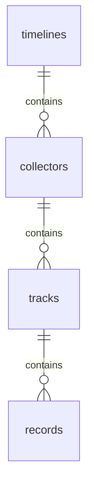

# 记录模型持久化

本目录将记录领域模型映射到 PostgreSQL。领域术语以根目录的 [`CONTEXT.md`](../../../../CONTEXT.md) 为准；模型选择的原因见 [`ADR-0001`](../../../../docs/adr/ADR-0001-time-ordered-observation-tracks.md)；完整结构见[记录存储模型](../../../../docs/recording-storage-model.md)。

## 表关系



四张表依次表示一个人的完整记录空间、Collector 实现与 Target 的稳定绑定、固定协议和时间行为的数据轨道，以及一个时间点或一段已确认持续的观测。所有外键均使用 `ON DELETE RESTRICT`，删除上层对象前必须显式处理其下层数据。

## 物理结构

```text
timelines
  id uuid PK
  owner_id uuid NOT NULL UNIQUE
  display_name text NOT NULL
  created_at timestamptz NOT NULL

collectors
  id uuid PK
  timeline_id uuid NOT NULL FK
  key varchar(255) NOT NULL
  target varchar(255) NOT NULL
  display_name varchar(255) NOT NULL
  created_at timestamptz NOT NULL
  UNIQUE (timeline_id, key, target)

tracks
  id uuid PK
  collector_id uuid NOT NULL FK
  type text NOT NULL
  version integer NOT NULL
  time_mode text NOT NULL
  end_mode text NULL
  created_at timestamptz NOT NULL
  UNIQUE (collector_id, type, version)

records
  id uuid PK
  track_id uuid NOT NULL FK
  started_at timestamptz NOT NULL
  ended_at timestamptz NULL
  observed_at timestamptz NULL
  received_at timestamptz NOT NULL
  value jsonb NOT NULL
  INDEX (track_id, started_at, id)
```

## 映射约定

- 业务 ID 均由应用生成 UUID v7，EF 使用 `ValueGeneratedNever`。
- Collector 的 `key`、`target` 和 `display_name` 使用 `varchar(255)`；其余不限定长度的字符串使用 PostgreSQL `text`。
- 所有时间使用 `timestamptz`；领域对象在创建时规范化为 UTC。
- `time_mode` 保存 `point` 或 `range`。
- Point 的 `end_mode` 必须为空；Range 的 `end_mode` 保存 `explicit` 或 `next_record`。
- `ended_at` 不得早于 `started_at`。它与 Track 时间模式的一致性由领域写入入口验证，数据库不使用跨表触发器。
- `observed_at` 为空表示 Collector 观察时间等于 `started_at`。
- Record 的 `value` 保存符合 Track `(type, version)` 协议的规范化 JSON 值。
- Record 不保存通用 `sequence`、`source_key`、原始 Payload、metadata 或修正链。
- [ADR-0002](../../../../docs/adr/ADR-0002-monotonic-record-extension.md) 已确认持续状态通过原子 `max(ended_at)` 续期，不新增 `revision`、`is_final` 或 Record TTL 字段。[PostgresContinuousStateStore](PostgresContinuousStateStore.cs) 已实现内部写入入口，批量 HTTP 上传已接入；重放尚未实现。
- 持续状态首次写入与续期使用单条 SQL，先限制到 Owner 所属 Track，再通过 `ON CONFLICT` 校验固定字段并取最大结束时间。冲突不改动已有记录，`received_at` 保留首次成功写入时的值。入口仅供持续状态协议使用，Payload 模式校验和服务端接收时间由调用方负责。
- [PostgresTrackStore](PostgresTrackStore.cs) 使用带 Owner 限制的 `INSERT ... ON CONFLICT DO NOTHING` 和后续独立读取获取稳定 Track。重复获取不更新已有行；默认 Read Committed 隔离级别下，读取可以看到冲突期间等待提交的并发创建。时间行为由 Application 从代码协议定义取得，并检查已存 Track 是否匹配。
- 批量上传通过 `PostgresTrackStore.FindAsync` 读取所属 Track，由 Application 按协议校验载荷后逐条调用原子存储；各条独立提交，没有整批事务。未预期的失败可能发生在部分条目提交之后，重试需要复用原 Record ID。

## Migration

当前模型仍处于首次落地阶段，仓库只保留一条完整创建四张表的初始 migration。

```bash
dotnet ef database update \
  --project src/Backend/Heartbeat.Infrastructure \
  --startup-project src/Backend/Heartbeat.Api
```

修改 EF 模型后，应先生成或更新 migration，再检查模型是否仍有未迁移变更：

```bash
dotnet ef migrations has-pending-model-changes \
  --project src/Backend/Heartbeat.Infrastructure \
  --startup-project src/Backend/Heartbeat.Api
```
